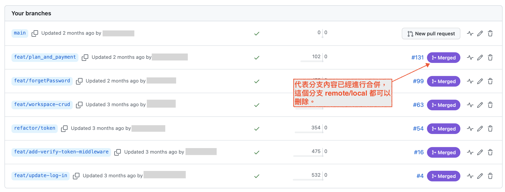
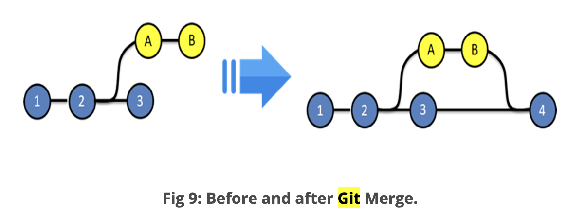
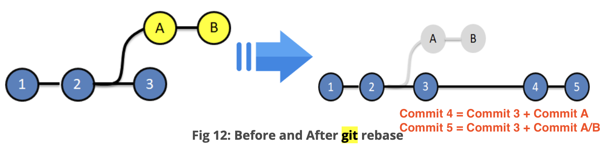

# 與多人團隊協作 GitHub
*紀錄協作專案時會用到的執行步驟與筆記。*

### (一) 組長在 GitHub 上建立一個 repository，並在Setting/Collaborators 加入協作成員。
### (二) 組員 Clone 到本地端，建立一去寫 code。

**分支名稱大致規範參考**
- 開發: dev/feature/細項
- 測試: test/功能/細項
- 正式: prod/功能/細項
- 一個 `/` 代表一資料夾的概念，所有名稱不能有空白鍵。

### (三) 組員把本地更新內容 push 到 remote 端。
- `git status`
- `git add .`
- `git commit -m "..."`
- `git push origin 組員建立的分支名稱`

**在 remote 端可以看到，push 到 remote 端 的所有分支。**

### (四) 如果要將分支內容合併到某分支，要進行 New pull request (PR)
**在合併到主要分支前，可能會有另一個組員幫忙進行 code review**

- 發 PR 的組員要確保自己的 code 已檢查完畢，功能測試正常，發 PR 後 GitHub 自動檢測正常。（有問題要先自行修正好。）
- 如果有寫單元測試，自動化測試先跑過。
- 請組員幫忙 code review，沒問題才會點擊確認合併。
    - code review 的那方，如果想要拉到本地端執行檢查：
    - `git pull`: 將遠端最新資料合併到本地端，等於執行 `git fetch` + `git merge`。
    - `git fetch`: 將遠端最新資料放到自動建立的新分支上。
    - `git merge`: 在當前分支合併其他分支內容，`git merge <其他分支>`
    **有時候只是想確認遠端數據庫的內容卻不是真的想合併，在這種情況下，請使用 `git fetch`，檢查完再 `git merge`**

- 如果更新內容需要重新部署，記得更新(或設定自動部署)。

---

### `git merge` 與 `git rebase` 差異？
**兩者皆用於合併分支commits，差別在於合併後的紀錄差異。**

|git command |相同          |相異|
|--          |--            |--|
|`git merge` |合併分支commits|詳實紀錄分支內容與建立、合併時間。|
|`git rebase`|合併分支commits|看不出來哪些commits來自分支，分支建立、合併時間也不清楚。|

#### `git merge`

[圖片來源](https://www.edureka.co/blog/git-rebase-vs-merge/#What-is-Merging?)

#### `git rebase`

[圖片來源](https://www.edureka.co/blog/git-rebase-vs-merge/#What-is-Merging?)

---
