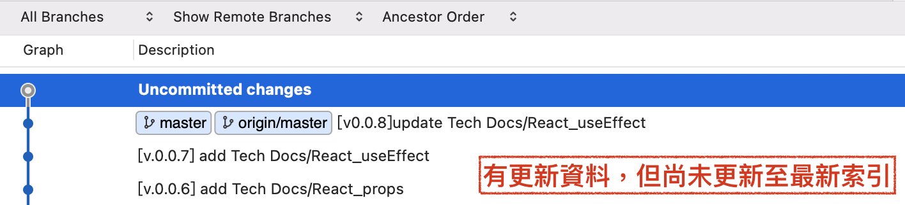

# Git
*將更新的歷史紀錄留存起來，之後有需要都可以返回或參考。*
### 專案管理：版本控管。
  - Git: 本地端 (local)，方便個人使用。
  - Github: (remote)，方便多人共享協作。
### 常見指令圖

[參考圖片來源：Jenifer.Code.World - Git 入門 (一)：介紹和基本指令](https://jenifers001d.github.io/2019/11/24/Git/Git-intro-1/)

---
## Git 本機端專案管理的基本操作
### 1. 初始化 : Git Repository
  ```
    git init
  ```

### 2. 觀察 Repository 檔案追蹤狀況
  ```
    git status
  ```
  #### 回傳訊息：（沒有資料要更新）
  ```
    On branch master

    No commits yet

    nothing to commit (create/copy files and use "git add" to track)
  ```
:::note
  - 目前位置：`master`
  - 更新資料狀態: 
    - 還沒有 `commits`: local repository 尚未有紀錄。<br/>
  **搭配上面的指令圖，很清楚知道 目前 `master` 更新內容停留在 `index/staging area`。**
:::
  #### 回傳訊息：（有資料要更新）
  ```
    On branch master

    No commits yet

    Untracked files:
      (use "git add <file>..." to include in what will be committed)
            admin/
            connection/
            css/
            img/
            index.php
            js/
            uploads/
            web/

    nothing added to commit but untracked files present (use "git add" to track)
  ```
:::note
上面很清楚告知：
  - 目前位置：`master`
  - 更新資料狀態: 
    - 還沒有 `add`: untracked files 尚未加入 索引（index）。
    - 還沒有 `commits`: local repository 尚未有紀錄。<br/>
  **搭配上面的指令圖，很清楚知道 目前 `master` 更新內容停留在 `working tree`。**
:::

### 3. 將檔案加入追蹤 `Index/Stage` 清單: 有新增修改內容的情況
  ```
    git add 檔名
    // 指定存放置暫存的檔名

    git add . 
    // 將所有新增修改內容都加入追蹤清單
    // add 與 小數點之間 會有空格
    // 沒有出現任何錯誤訊息代表成功
  ```
:::info
  加入索引後，在 Sourcetree 可以看到 `HEAD`指標，指向目前分支最新的索引位置。
  
:::
:::caution
  沒有加入索引的資料，不能提交至 Repository。（git 是將索引資料狀態提交給Repository）
:::

### 4. 建立一組版本更新(Commitment): 送一個commit
**程式撰寫到一個段落，完成某些功能，想要做個紀錄。** 
  ```
    git commit -m "版本更新訊息"
    // -m 前後都要補上空格
  ```
  回傳訊息：
  ```
    [master (root-commit) 5e445e5] First Commit
    799 files changed, 129282 insertions(+)
    create mode 100644 admin/css/bootstrap.min.css
  ```

### 5. 再次 確認 檔案追蹤狀況
  ```
    git status
  ```
  回傳訊息：（所有內容在 local repository都有紀錄）
  ```
    On branch master
    nothing to commit, working tree clean
  ```
:::info
  **沒有問題，就可以上 remote。(push 上 github 要再更改會有點麻煩，多做確認少麻煩!)**
:::

  回傳訊息：（部分內容在 local repository還沒有紀錄）
  ```
    On branch master
    Changes not staged for commit:
      (use "git add <file>..." to update what will be committed)
      (use "git restore <file>..." to discard changes in working directory)
            modified:   index.php

    Untracked files:
      (use "git add <file>..." to include in what will be committed)
            textforgit.php

    no changes added to commit (use "git add" and/or "git commit -a")
  ```
:::note
  - 目前位置：`master`
  - 更新資料狀態: 
    1. `index.php`: 有索引紀錄，但沒有最新版本。
      - 如果要更新內容： `git add <file>`，更新索引，並 `commit` 做紀錄。
      - 如果不要更新內容： `"git restore <file>`，忽略這次更新內容。（working area會回覆到原本索引位置）
    2. `textforgit.php`: 完全全新的資料，沒有索引紀錄。
      - 如果要更新內容： `git add <file>`，更新索引，並 `commit` 做紀錄。
      - 如果不要更新內容： 直接刪掉就好了。
:::

### 6. 新增分支(Branch)
**在開發程式的時候，想要把某一功能從專案內切割出來。**<br/>
**不想要動到主程式的情況下，去開一個分支下工作。等到做到差不多，再併到專案內。**

  ```
    git branch 分支名稱
  ```

### 7. 查看分支(Branch)
  ```
    git branch
  ```
  回傳訊息：列出所有分支，`*` 開頭為目前位置
  ```  
    Joanna-PI
  * master
    test_authority
  ```

### 9. 切換分支(Branch)
  ```
    git checkout 分支名稱
  ```
  回傳訊息：
  ```
    Switched to branch 'Joanna-PI'
    Your branch is up to date with 'origin/Joanna-PI'.
  ```
:::caution
  寫程式碼之前，留意一下目前 `git branch` 位置，避免拿錯分支更新資料!
:::

### 10. 合併分支(Branch)：誰併誰 123
<!-- master合併branch -->
### 10. 合併分支(Branch)：誰併誰
:::warning
**特別留意：目前所在位置，**
:::
  ```
    git checkout master // HEAD 指向 master
    git merge 分支名稱   // master 合併 分支更新內容
  ```
This is git master/
### 11. 刪除分支(Branch)：
  ```
    git checkout master
    git merge 分支名稱
  ```
---
### (補充) 名詞解釋
- work directory(area):工作目錄
- index/staging area: 索引（暫存區）
- repository : 數據庫（本地、遠端）

