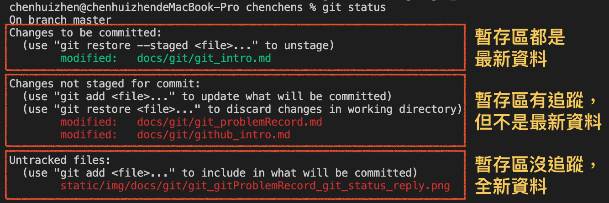
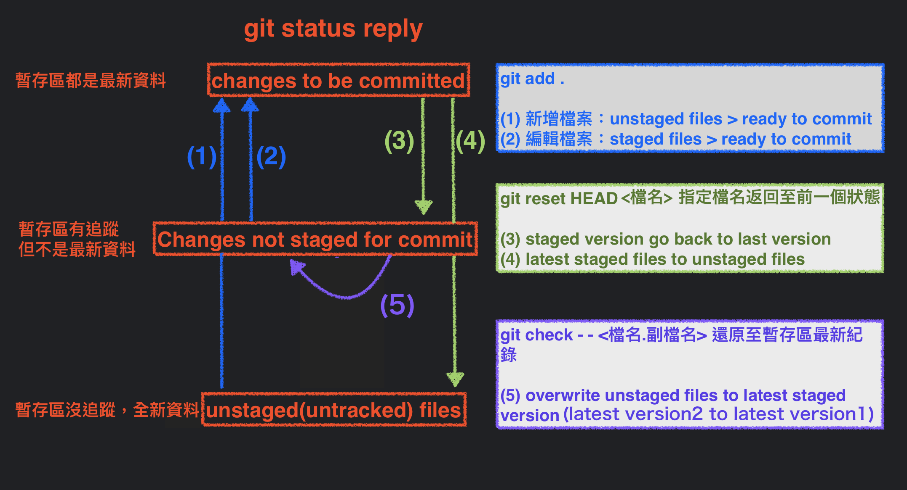

# 狀況題 與 其他
*紀錄曾經的犯錯，還是有辦法重新來過。*

## (一) 執行 `git add`，但是後悔想改
- ** `git add` 只存在本地端，還沒 `push` 上遠端都好解決。**
- ** 先來看 `git status` 有幾個情況：**



- ** 對應資料狀態與指令圖：**


整理以下就是：
<details>
  <summary>
    <strong>(1-1) 只有執行過一次 <code>git add</code> 的情況，想要還原回至上一個狀態: <code>git reset</code></strong>
  </summary>

```
   git reset HEAD <檔案名稱.副檔名>  // 還原檔案狀態 staged files to unstaged files
```

</details>

<details>
  <summary>
    <strong>(1-2) 已有索引追蹤，想拿掉最後一次 <code>git add</code> 的情況: 
      <code>git checkout</code>、
      <code>git restore</code>
    </strong>
  </summary>

```
  git checkout -- <檔案名稱.副檔名>  // 還原內容 至 暫存區最後一次的版本（剛修改的內容就掰掰了）
  git checkout .                   // 還原全部檔案 至 暫存區最後一次的版本（剛修改的內容就掰掰了）
```

```
  git restore --staged <檔案名稱.副檔名>  // 將 暫存區指定檔案 回覆 到 工作目錄的狀態 （staged file => unstaged file）
  git restore <檔案名稱.副檔名>           // 將 工作目錄的狀態 回覆 到 沒有更新內容的狀態 （unstaged file => discard changes in working directory剛修改的內容就掰掰了）
```

:::caution `git checkout` 有兩個意思
> **`git-checkout` - Switch branches or restore working tree files** <br />
>   from [git 官網](https://git-scm.com/docs/git-checkout)
>
> ---
>
> Git 2.23 introduces two new commands meant to replace two common uses of git checkout: <br />
> **`git switch` to switch to a new branch after creating it if necessary**<br />
> **`git restore` to restore changes from a given commit**.<br />
>   from [Git 2.23 Adds Switch and Restore Commands](https://www.infoq.com/news/2019/08/git-2-23-switch-restore/)
>
> ---
>
> 1. 切換分支: `git checkout 分支名稱` => `git switch 分支名稱`
> 2. 還原內容: `git checkout -- <檔案名稱.副檔名>` => `git restore <檔案名稱.副檔名>`

:::

</details>

- 保留更新內容，狀態返回: 
- 不保留更新內容，狀態返回: `git checkout`

---

## (二) 執行 `git commit`，但是後悔想改 
### 在本地端，還沒上遠端的情況

<details>
  <summary>
    <strong>(2-1) 修改最後一次 本地版本（commit）: <code>git commit</code></strong>
  </summary>

```
    git commit --amend -m "修改的commit內容"
```

回傳訊息參考
```
    [master 42f24fb] [v0.1.3] - update Tech Docs/Git & Github/git_problemRecord
    Date: Fri Feb 25 15:36:25 2022 +0800
    2 files changed, 88 insertions(+), 27 deletions(-)
    create mode 100644 static/img/docs/git/git_problemRecord_git_reset_risk.png
```

:::success 提醒
使用 `--amend` 來修正 commit內容，會往前增加一新版本 `commit id`。

舉例：
```
    git commit -m "[v0.1.3] - update git_problemRecord"
    git commit --amend -m "[v0.1.3] - update Tech Docs/Git & Github/git_problemRecord"
```

**`git log --pretty=oneline` : 看不到修正前的commit內容。**
```
    42f24fbbc442061acef19345c4a1e03c55e2f15c (HEAD -> master) [v0.1.3] - update Tech Docs/Git & Github/git_problemRecord
    61400f70a01b8f5bbf141f258907856770a685ae (origin/master) [v0.1.2] - init Tech Docs/Git & Github/git_problemRecord
    699657431f609c1307a6a53bd1c9dbd0fd31727c [v0.1.2] - add Tech Docs/Git & Github/Github
```
**`git reflog` : 紀錄所有commit動作，包含之前key錯的commit內容**（這裡第二行可以看到，`commit id` 有更新。）
```
    42f24fb (HEAD -> master) HEAD@{0}: commit (amend): [v0.1.3] - update Tech Docs/Git & Github/git_problemRecord
    90dd2da HEAD@{1}: commit: [v0.1.3] - update git_problemRecord
    61400f7 (origin/master) HEAD@{2}: commit: [v0.1.2] - init Tech Docs/Git & Github/git_problemRecord
```
:::

</details>

<details>
  <summary>
    <strong>(2-2) 修改其中一次 本地版本（commit）: <code>git rebase</code></strong>  
  </summary>
  <h4>首先，要先找到： 目前位置、想要退回的目標版本（<code>commit id</code>）</h4>
  <h4>再來，下指令告知退回的版本 （<code>commit id</code>）</h4>

  ```
    git rebase
  ```

</details>


### 已經上遠端的情況：

<details>
  <summary>
    <strong>(2-3) 修改指定 遠端版本（commit）: 個人專案<code>git reset</code>、協作專案<code>git revert</code></strong>
  </summary>
   <h4>(2-3-1) 專案只有自己在做的情況</h4>
   <div>我會直接在本地端更新，返回目標版本，然後 <code>push</code> 強迫遠端更新同本地端。</div>
   <div>(補充：當我本地返回目標版本，本地端的版本落後遠端版本，需要執行強制覆蓋，遠端版本才會更新)</div>

   ```
        git reflog                   // 查詢 commit id
        git reset --hard 版本Id       // 返回目標版本
        git push origin master -f    // 強迫更新遠端資料庫同目前本地端
   ```
---
   <h4>(2-3-2) 專案還有其他協作的情況</h4>
   <div>回退版本的風險：其他協作已提交的版本有可能也被我退回去。</div>

   

   <div>這時候，我會使用 <code>revert</code> 提交新的修改同目標版本，正常 <code>push</code> 到遠端。</div>
   <div>(補充： <code>revert</code> 會新增一新提交版本，故協作同仁可以正常 <code>pull</code> 下來。)</div>

   ```
        git reflog                   // 查詢 commit id
        git revert 版本Id             // 更新資料同 目標版本的那份資料
        git push origin master       // 更新至遠端資料庫
   ```
</details>

:::note 補充說明
- [#（五）git-log、git-reflog 差在哪裡？](#五-git-loggit-reflog-差在哪裡)
- [#（四）git-reset、git-revert、git-rebase 差在哪裡？](#四-git-resetgit-revertgit-rebase-差在哪裡)

- 指定目標版本的寫法，除了`版本Id`，還可以寫成`HEAD前幾個版本`，例如：
    ```
        git reset --hard HEAD^
    ```
    - 目前版本：`HEAD` `HEAD~0`
    - 上一個版本：`HEAD^` `HEAD~1`
    - 上上個版本：`HEAD^^` `HEAD~2`
    - 上十個版本：`HEAD~10`
:::

---


## (三) 要切換 `branch`，但更新資料還沒有存到資料庫（`Repository`）
:::info 還好，`git`本身會做出提醒不讓切換：
```
    error: Your local changes to the following files would be overwritten by checkout:
    docs/git/git_intro.md
    Please commit your changes or stash them before you switch branches.
```
**只要好好把目前分支更新內容好好完成步驟： `git add` `git commit`，再 `git branch 其他分支` 即可。**
:::

---


## (四) `git reset`、`git revert`、`git rebase`、`git restore` 差在哪裡？

|指令|官網敘述|用途|是否會新增commit|適用時機|如果反悔資料救得回來嘛|
|--|--|--|--|--|--|
|`reset`|Reset current HEAD to the specified state|--|--|--|`reset`的三種模式都救得回來（`--mixed` `--soft` `--hard`）|
|`rebase`|Reapply commits on top of another base tip|修正歷史紀錄|--|--|--|
|`revert`|Revert some existing commits|復原至某版本|Ｏ|已放上遠端，而且與他人協作|--|
|`restore`|Restore working tree files|--|--|--|--|

---
 

## (五) `git log`、`git reflog` 差在哪裡？

<details>
  <summary><strong>git log</strong></summary>

    ```
        git log // 查看目前分支 commit 歷史紀錄：不包含其他分支、退回 commit 紀錄
        q       // 跳出 git log
    ```

回傳訊息參考


對應 source tree 顯示


**`git log --pretty=oneline`**
```
    42f24fbbc442061acef19345c4a1e03c55e2f15c (HEAD -> master) [v0.1.3] - update Tech Docs/Git & Github/git_problemRecord
    61400f70a01b8f5bbf141f258907856770a685ae (origin/master) [v0.1.2] - init Tech Docs/Git & Github/git_problemRecord
    699657431f609c1307a6a53bd1c9dbd0fd31727c [v0.1.2] - add Tech Docs/Git & Github/Github
```

</details>

<details>
  <summary><strong> git reflog：只顯示 本地端</strong></summary>

    ```
        git reflog  // 查看
        q           // 跳出 git log
    ```

    回傳訊息
    ```
        6996574 (HEAD -> master) HEAD@{0}: commit: [v0.1.2] - add Tech Docs/Git & Github/Github
        f1206c6 (origin/master) HEAD@{1}: commit: [v0.1.1] - finish Tech Docs/Git & Github/Git
        e6eb481 (test) HEAD@{2}: merge test: Fast-forward
    ```

對應 Sourcetree 顯示


</details>

#### 整理一下
|指令|用途|關鍵字|
|--|--|--|
|`git log`|--|--|
|`git reflog`|--|--|

---

### 名詞整理
> - amend: 修正
> - revert: 還原、返回
> - rebase: 

---

### 參考資源
- [【狀況題】剛才的 Commit 後悔了，想要拆掉重做…](https://gitbook.tw/chapters/using-git/reset-commit)
- [檔案狀態](https://zlargon.gitbooks.io/git-tutorial/content/file/status.html)
- [[CLI] Git 指令](https://pjchender.dev/app/cli-git/)
- [Git 2.23 Adds Switch and Restore Commands](https://www.infoq.com/news/2019/08/git-2-23-switch-restore/)


