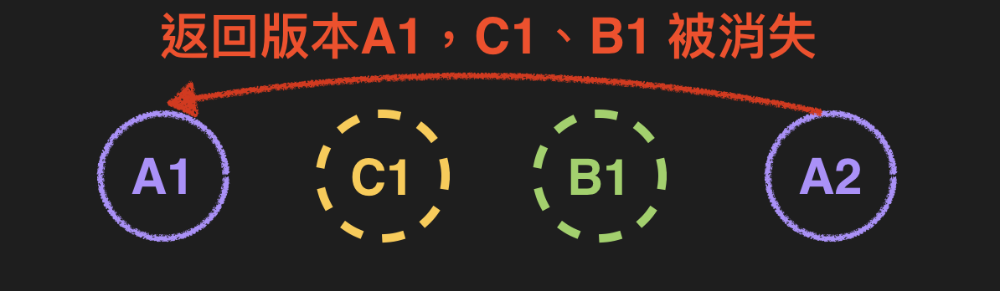
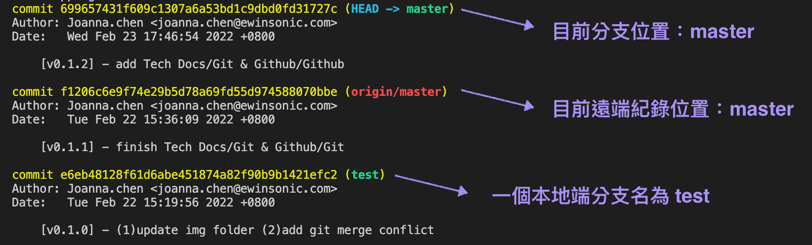
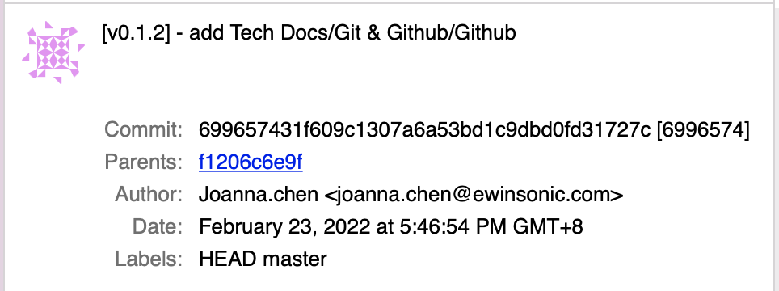
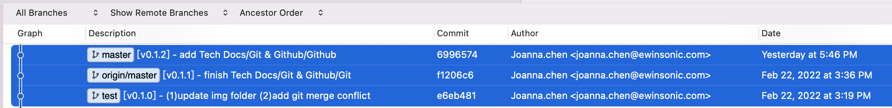

# 狀況題 與 其他
*紀錄曾經的犯錯，還是有辦法重新來過。*

## (一) 執行 `git add`，但是後悔想改
** `git add` 只存在本地端，還沒 `push` 上遠端都好解決。**
```

```
---


## (二) 執行 `git commit`，但是後悔想改 
### 在本地端，還沒上遠端的情況

<details>
  <summary><strong>(2-1) 修改最後一次 本地版本（<code>commit</code>）:</strong></summary>

```
    git commit --amend -m "修改的commit內容"
```

回傳訊息
```

```

:::success 提醒
使用 `--amend` 來修正 commit內容，會往前增加一新 `commit`。
:::

</details>

<details>
  <summary><strong>(2-2) 修改其中一次 本地版本（<code>commit</code>）:</strong></summary>
  <h4>首先，要先找到： 目前位置、想要退回的目標版本（<code>commit id</code>）</h4>

  <h4>再來，下指令告知退回的版本 （<code>commit id</code>）</h4>

</details>


### 已經上遠端的情況：
<details>
  <summary><strong>(2-3) 修改最後一次 遠端版本（<code>commit</code>）:</strong></summary>
   <h4>(2-3-1) 專案只有自己在做的情況</h4>


---
   <h4>(2-3-2) 專案還有其他協作的情況</h4>


</details>

<details>
  <summary><strong>(2-4) 修改其中一次 遠端版本（<code>commit</code>）:</strong></summary>
   <h4>(2-4-1) 專案只有自己在做的情況</h4>
   <div>我會直接在本地端更新，返回目標版本，然後 <code>push</code> 強迫遠端更新同本地端。</div>
   <div>(補充：當我本地返回目標版本，本地端的版本落後遠端版本，需要執行強制覆蓋，遠端版本才會更新)</div>

   ```
        git reflog                   // 查詢 commit id
        git reset --hard 版本Id       // 返回目標版本
        git push origin master -f    // 強迫更新遠端資料庫同目前本地端
   ```
---
   <h4>(2-4-2) 專案還有其他協作的情況</h4>
   <div>回退版本的風險：其他協作已提交的版本有可能也被我退回去。</div>

   

   <div>這時候，我會使用 <code>revert</code> 提交新的修改同目標版本，正常 <code>push</code> 到遠端。</div>
   <div>(補充： <code>revert</code> 會新增一新提交版本，故協作同仁可以正常 <code>pull</code> 下來。)</div>

   ```
        git reflog                   // 查詢 commit id
        git revert 版本Id             // 更新資料同 目標版本的那份資料
        git push origin master       // 更新至遠端資料庫
   ```
</details>

:::note 補充說明
- [git reflog 是什麼](#五-git-loggit-reflog-差在哪裡)
- [git revert 是什麼](#四-git-resetgit-revertgit-rebase-差在哪裡)

- 指定目標版本的寫法，除了`版本Id`，還可以寫成`HEAD前幾個版本`，例如：
    ```
        git reset --hard HEAD^
    ```
    - 目前版本：`HEAD` `HEAD~0`
    - 上一個版本：`HEAD^` `HEAD~1`
    - 上上個版本：`HEAD^^` `HEAD~2`
    - 上十個版本：`HEAD~10`
:::

---


## (三) 要切換 `branch`，但更新資料還沒有存到資料庫（`Repository`）
:::info 還好，`git`本身會做出提醒不讓切換：
```
    error: Your local changes to the following files would be overwritten by checkout:
    docs/git/git_intro.md
    Please commit your changes or stash them before you switch branches.
```
**只要好好把目前分支更新內容好好完成步驟： `git add` `git commit`，再 `git branch 其他分支` 即可。**
:::

---


## (四) `git reset`、`git revert`、`git rebase` 差在哪裡？

|指令|用途|是否會新增commit|適用時機|
|--|--|--|--|
|reset|--|--|--|
|rebase|--|--|--|
|revert|--|是|--|
---
 

## (五) `git log`、`git reflog` 差在哪裡？

<details>
  <summary><strong>git log</strong></summary>

    ```
        git log // 查看目前分支 commit 歷史紀錄：不包含其他分支、退回 commit 紀錄
        q       // 跳出 git log
    ```

回傳訊息參考


對應 source tree 顯示


</details>

<details>
  <summary><strong> git reflog：只顯示 本地端</strong></summary>

    ```
        git reflog  // 查看
        q           // 跳出 git log
    ```

    回傳訊息
    ```
        6996574 (HEAD -> master) HEAD@{0}: commit: [v0.1.2] - add Tech Docs/Git & Github/Github
        f1206c6 (origin/master) HEAD@{1}: commit: [v0.1.1] - finish Tech Docs/Git & Github/Git
        e6eb481 (test) HEAD@{2}: merge test: Fast-forward
    ```

對應 Sourcetree 顯示


</details>

#### 整理一下


## 名詞整理
> - amend: 修正
> - revert: 還原、返回
> 