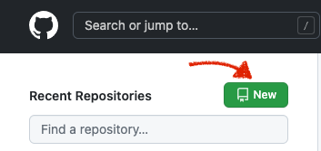
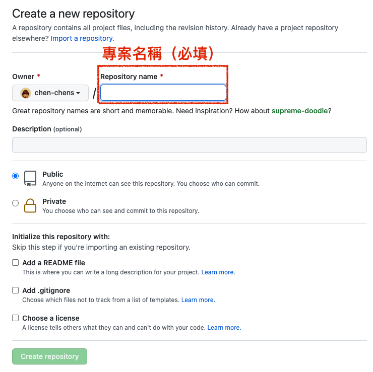

# Github
*多人共同開發專案，將 `local Repository` 上傳至 `remote Repository`，其他人可以取得更新的雲端資料，並拉到 本地端做使用。*

## Github 雲端專案管理
### (一) 前置準備
#### 1. 申請 [Github](https://github.com/)帳號。
#### 2. 建立專案: 要將本地Git上傳到原端，需要先有一遠端空間 (該專案網址)。<br/>




### (二）回到本地端該專案，開啟 VS code Terminal
### 1. 查詢有無關聯的遠端專案空間:
```
    git remote     // 回傳 遠端專案名稱
    git remote -v  // 回傳 遠端專案名稱 與 專案網址
```
回傳訊息：沒有關聯 `Repository` 的情況
```
    fatal: not a git repository (or any of the parent directories): .git
```
回傳訊息：有關聯專案 `Repository` 的情況: 顯示依序為 `git remote` `git remote -v`
```
    origin
```
```
    origin  https://github.com/chen-chens/project-music-app.git (fetch)
    origin  https://github.com/chen-chens/project-music-app.git (push)
```

### 2. 加入遠端的 Repository
```
    git remote add 遠端空間的名稱 遠端專案網址
```
如果名字取錯，想要刪除重新加
```
    git remote remove 遠端名稱
```
回到 1. 查詢確認關聯是否建立

### 3. 本地端資料上傳至遠端空間
:::success 提醒一下
要上傳資料之前，要先確認本地端資料已經存到 `local Repository`。<br/>
也就是說：所有更新都執行完 `git add` 與 `git commit`<br/>
[傳送Git指令圖](./git_intro.md#常見指令圖)
:::
```
    git push 遠端空間的名稱 指定分支
```

### 4. 重新整理 Github，應該會看到資料。
