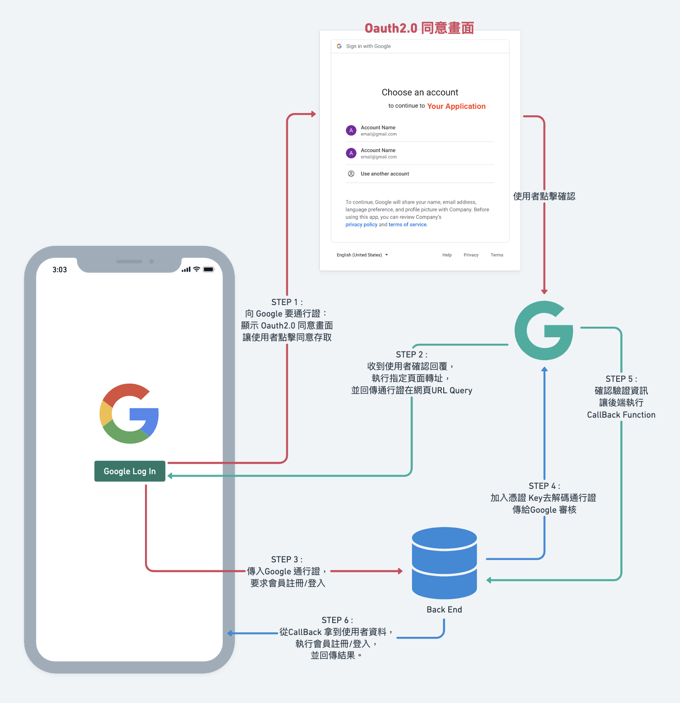

# 第三方登入：Google

*在應用程式中，加入第三方登入的選擇。*

### 事前準備
- 前、後端平台
- 依賴：
    - [passport](https://github.com/jaredhanson/passport): 用 Express.js 撰寫的驗證 middleware。
    - [dotenv](https://github.com/motdotla/dotenv): 後端存取敏感資訊使用。
- [註冊好 GCP 專案、Oauth2.0 憑證](./google_oauth2#註冊-google-cloud-platform-gcp)

---

### 流程圖

---

### 實作

---

### 參考資源
