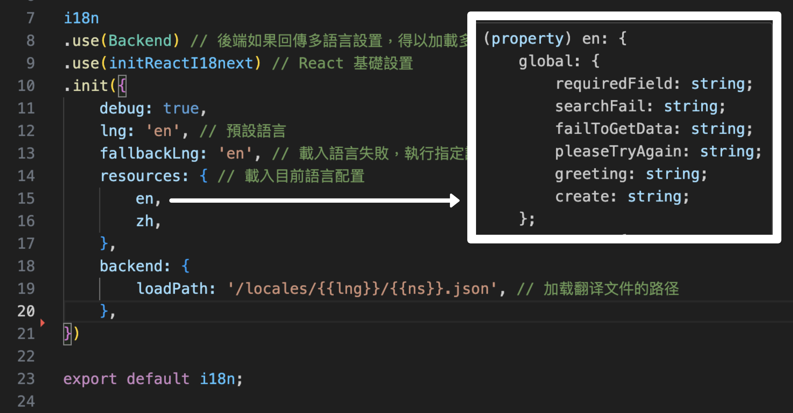

*i18next 是用來切換多語系的一個依賴，本章節紀錄 React 專案設定 i18n 快速上手的步驟。*

## 主要步驟
- [(一) 安裝依賴](./i18n_quickStart#一-安裝依賴)
- [(二) 建立多語系配置 json 檔](./i18n_quickStart#二-建立多語系配置-json-檔)
- [(三) 在根目錄 新建 i18n 配置檔](./i18n_quickStart#三-在根目錄-新建-i18n-配置檔)
- [(四) 在所有 JS 的入口檔 加入 I18nextProvider](./i18n_quickStart#四-在所有-js-的入口檔-加入-i18nextprovider)
- [(五) 在 Component 內 使用 `useTranslate()` 取得對應 多語系配置內容](./i18n_quickStart#五-在-component-內-使用-usetranslate-取得對應-多語系配置內容)
- [(六) 切換多語系方法：`changeLanguage()`](./i18n_quickStart#六-切換多語系方法changelanguage)

### (一) 安裝依賴
- `i18next`: 主要套件。
- `react-i18next`: 跟 React 相關的配置。
- `i18next-http-backend`: 若有後端回傳的多語系配置。

```
    yarn add i18next react-i18next i18next-http-backend
```

---

### (二) 建立多語系配置 json 檔 
- 範例分別建立：中英文雙語配置。**記得多語系的 key 要一致，才能找到多應的切換內容**。
- 範例用物件寫法區個不同分類，方便做管理。


```json title="/src/locales/en.json"
{
    "global": {
        "requiredField": "Required Field",
        "failToGetData": "Fail to get Data!",
        "pleaseTryAgain": "Please Try Again!",
        "create": "Add"
    },
    "theme": {
        "darkMode": "Dark Mode",
        "lightMode": "Light Mode"
    }
}
```

```json title="/src/locales/zh-TW.json"
{
    "global": {
        "requiredField": "必填欄位",
        "failToGetData": "取得資料失敗！",
        "pleaseTryAgain": "請重新輸入！",
        "create": "新增"
    },
    "theme": {
        "darkMode": "深色模式",
        "lightMode": "淺色模式"
    }
}
```

---

### (三) 在根目錄 新建 i18n 配置檔 
- 檔名自定義，例：`i18n.ts`

```js title="i18n.ts"
import i18n from 'i18next';
import { initReactI18next } from 'react-i18next';
import Backend from 'i18next-http-backend';
import en from './locales/en.json';
import zh from './locales/zh-TW.json';

i18n
.use(Backend) // 後端如果回傳多語言設置，得以加載多語言文件
.use(initReactI18next) // React 基礎設置
.init({
    debug: true,
    lng: 'en', // 預設語言
    fallbackLng: 'en', // 載入語言失敗，執行指定語言
    resources: { // 載入目前語言配置
        en,
        zh,
    },
    backend: {
        loadPath: '/locales/{{lng}}/{{ns}}.json', // 加载翻译文件的路径
    }
})

export default i18n;
```

---

### (四) 在所有 JS 的入口檔 加入 I18nextProvider 
- 所有 JS 的入口檔: 像是 `App.tsx` 或 `index.tsx`
- 透過 `<I18nextProvider i18n={}>`，將i18n 配置檔設定傳遞到所有頁面。

```js title="index.tsx"
import { I18nextProvider } from 'react-i18next';
import i18n from './i18n';

ReactDOM.render(
    // highlight-start
    <I18nextProvider i18n={i18n}>
    // highlight-end
        <App />
    // highlight-start
    </I18nextProvider>
    // highlight-end
    ,document.getElementById('root')
)
```

---

### (五) 在 Component 內 使用 `useTranslate()` 取得對應 多語系配置內容

```js title="/src/components/AddButton.tsx"
export const AddButton = (props: ButtonProps) => {
    // highlight-start
    const { t } = useTranslation("global"); // 相當於取得多語系配置 global 下的內容
    // highlight-end

    return(
        <Button type="primary" {...props}>
            // highlight-start
            {t("create")} // 相當於取得多語系配置 global.create 的值
            // highlight-end
        </Button>
    );
}
```

---

### (六) 切換多語系方法：`changeLanguage()`

```js
import i18n from './i18n';

export default function ChangeLanguage(){
    const handleChangeLanguage = (e: RadioChangeEvent) => {
        // highlight-start
        i18n.changeLanguage(e.target.value);
        // highlight-end
    }

    return(
        <Radio.Group
            options={[
                { label: 'En', value: 'en' },
                { label: '中文', value: 'zh' },
            ]}
            onChange={handleChangeLanguage}
            // highlight-start
            value={i18n.language}
            // highlight-end
            optionType="button"
            buttonStyle="solid"
        />
    )
}
```

---

## (補充) 錯誤訊息記錄

錯誤訊息如下：
```
    i18next::translator: missingKey en translation playLists.myPlayList 
```

- **i18next** 找不到對應的 多語系配置。
- 透過 IDE 提示訊息，目前 `i18n` 配置 `resources`: 我的配置是沒有預設 **translation** (defaultNS) 這一層。



