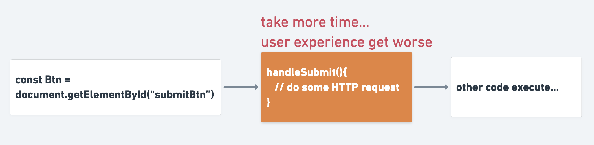
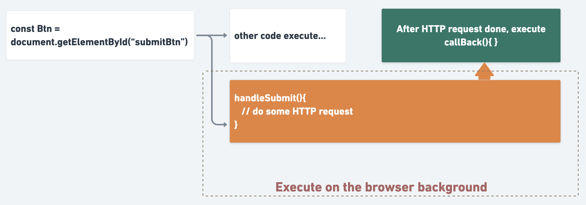
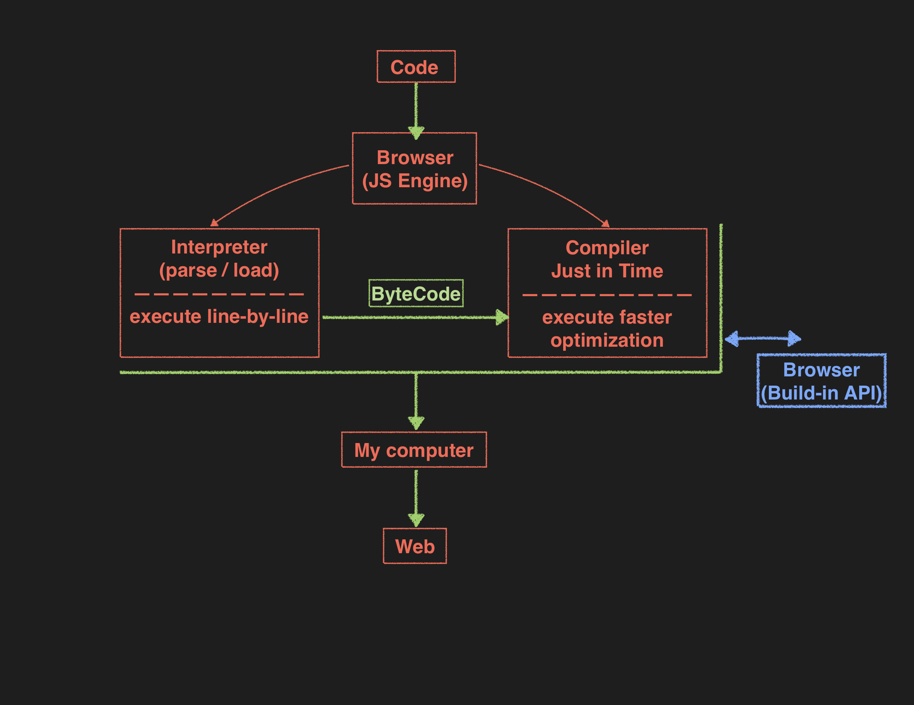
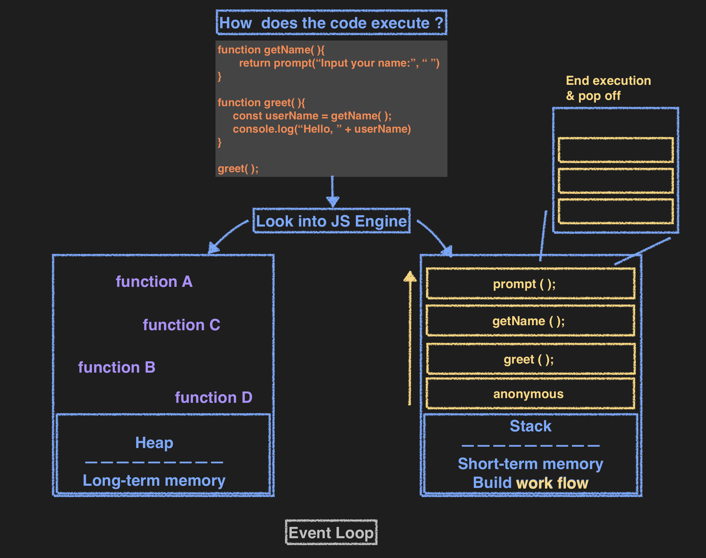
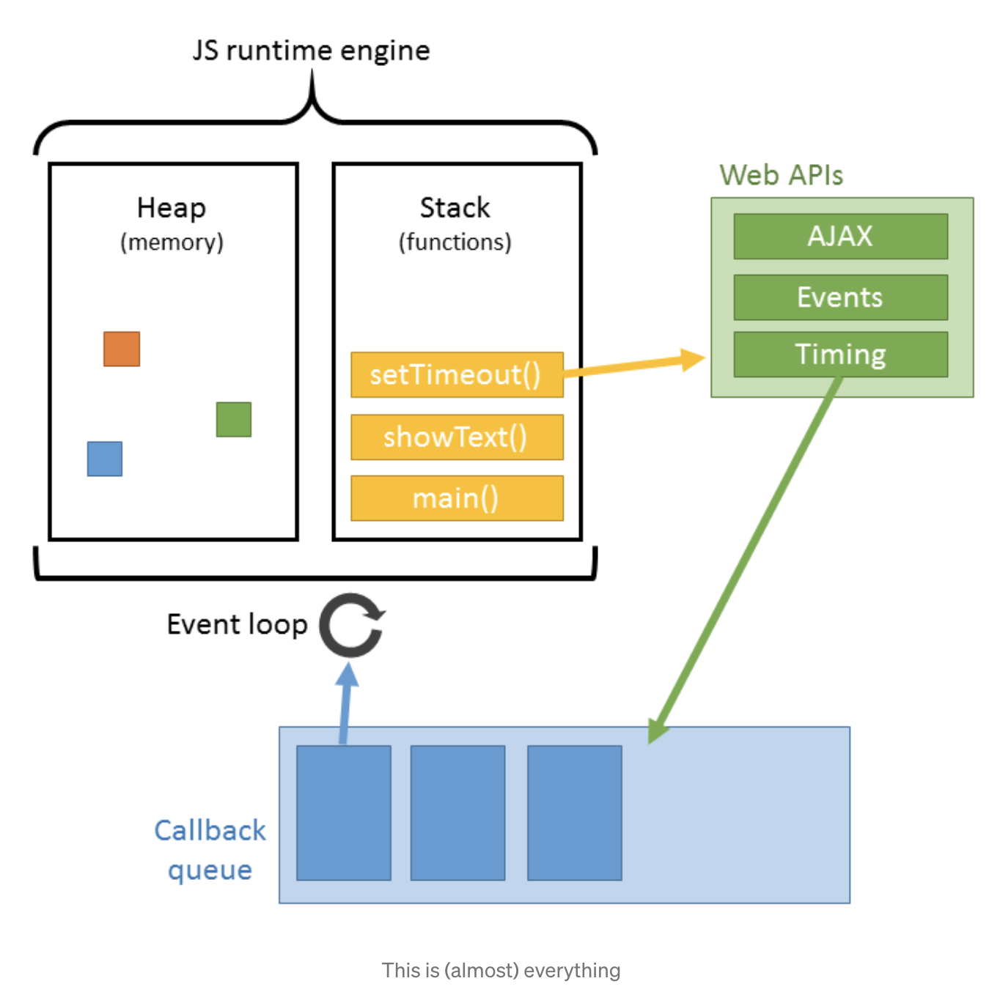
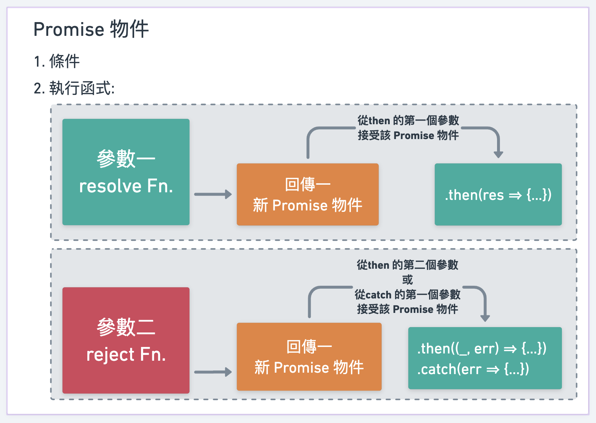

# async Func.

## Q: 為了解決什麼問題？
### 先來了解 Synchronous Code Execution
- Javascript特性：執行項目是檔案由上往下，一個執行完才執行下一個（single thread: one-by-one）。
- 情境：使用者瀏覽網頁，點擊內容後向server要資料。在server回傳資料與渲然網頁之前，使用者無法執行其他操作，只能原地乾等。
    （使用者以為當機，但其實是在等待回傳資料）**(Blocking Code)**



為了解決上述情境遇到的問題，我們可以使用 瀏覽器提供的 API，讓我們可以同一時間執行多樣動作。
（當使用者點擊內容時，向server要資料要資料的動作躲在瀏覽器背景執行。 等待server回傳同時，使用者可以繼續瀏覽網頁，或點擊更多request）



:::note 補充
web API 包含 DOM、HTTP request、setTimeout() ....
:::

---
### How Code is Parsed & Compiled - JavaScript Engine (概觀)


### Inside the JavaScript Engine - How the CodeExecutes (深究)


### Call Api processure - queque & event loop (深究)
#### Processure:
1. parse code
2. store in heap memory
3. execute in call stack
4. async function go to browser background, waiting for server response.
5. when server response, moving async function to callback queue. At the same time, functions in stack is running.
6. event loop will check all functions are done in stack. When the stack is empty, moving async function to the stack.
7. execute the callback function, and pop out(return to heap memory).
8. done.

[圖片來源](https://www.itread01.com/content/1544934003.html)

---
## Promise
### Q: What's a Promise in JavaScript?
#### Promises are objects which "wrap" asynchronous code to make working with it easier.
___

在上面可以看到：當我們呼叫 web 提供的 API，同時會附上 callBack() 待API完成後執行（callBack queue --> event loop --> stack）。
- 如果寫成一般 callback function，程式碼會難以閱讀或維護。

```js
    doA(function() {
        doB();

        doC(function() {
            doD();
        });

        doE();
    });

    doF();

    // 執行順序：doA --> doF --> doB --> doC --> doE --> doD
```

### 用 關鍵字 `new` 建立 一promise 來試試：

```js
    const promise = new Promise((resolveFn, rejectFn) => {
        // 我的條件是：...

            // 條件成立，要執行的動作: 使用 resolve function

            // 條件不成立，要執行的動作: 使用 reject function
    })

    // 呼叫 promise
    promise
    .then((res, err) => {
        // 可以執行 resolve function ＆ reject function
    }).catch(err => {
        // 可以執行 reject function
    }).finally(() => {
        // 無論 成功或失敗，都要執行的動作
    })
```

```js
     const promise = new Promise((resolveFn, rejectFn) => {
         const condition = Math.random();

         if(condition > 0.5){
             resolveFn("成功！")
         }else{
             rejectFn("失敗！")
         }
     });

     console.log("promise: ", promise);

```

### 也可以用 function 把 promise 包起來，再 return 出來使用：
```js
    // 我想接收兩的值做加總比較，大於100執行 resolveFn，小或等於100執行 rejectFn

    function sumCompare(num1, num2){
        const sum = num1 + num2;
        const promise = new Promise((resolve, reject) => {
            if(sum > 100){
                resolve("成功！")
            }else{
                reject("失敗！")
            }
        })

        return promise;
    }

    // 呼叫 sumCompare
    sumCompare(10, 30)
    .then(res => console.log(res))
    .catch(err => console.log(err))

```
:::note
`.then()` blocks always yield new promises, even if you return nothing in them. <br />
`catch()` blocks do the same by the way.

:::

### 多層串接寫法，要把上一層 promise 物件 return 出來

```js
    somePromise
    .then(res){
        ...
        return res
    }
    .then(getTopPromiseByRes){
        console.log(getTopPromiseByRes);
    }
```


### 多層串接順序(待補)


---
## `async` `await`
ES7 有提出另一個 異步處理的方式，一起來看看：
- `async` `await` 要同時存在，才能發揮效用。
- `await` API: 這裡的程式碼需等待該 API 執行完畢，才能繼續往下執行。（有點像是回到了 excute one-by-one 的同步概念）
- `async` `await` 只接收 response success，要處理 error，需搭配 `try` `catch`

```js
    // regular function
    async function reply(){
        const res = await ApiGetAnswerFromServer; // 等待 api 回傳後，才會繼續往下執行
        const result = "My answer is " + res;     // result 一定會等到 res 的值，不會先執行動作。

        alert(result);
    }

    // arrow function
    const reply = async () => {
        const res = await ApiGetAnswerFromServer;
        const result = "My answer is " + res;

        alert(result);
    }
```

那如果 API 回傳 `error`，整段程式碼卡在那邊，怎麼解決？

### 搭配 `try` `catch`

結構如下：
```js
    const reply = async () => {
        try{
            const res = await ApiGetAnswerFromServer;
            // 針對 Promise.resove()做處理
        }catch(err){
            // 針對 Promise.reject()做處理
        }finally{
            // 不論resove 或reject，都會執行 （通常用來做 reset 的動作）
        }
    }
```

```js
    const reply = async () => {
        try{
            const res = await ApiGetAnswerFromServer;
            const result = "My answer is " + res;

            alert(result);
        }catch(err){
            alert(err); 
        }finally{
            alert("api done!")
        }
    }
```

---
## `promise.then().catch()` 與 `async` `await` 的差異
原本一開始，我覺得上面兩種異步處理方式差異不大，[直到工作上有遇到一些問題...](../record/problem_record2)


--- 
## 參考資源
- [淺淡 JS Engine 機制](https://medium.com/walkout/%E6%B7%BA%E6%B7%A1-js-engine-%E6%A9%9F%E5%88%B6-77391b4dd3db)
- [影片中詳細解釋，JS runtime、block statck、Event Loop用途、render卡住變慢的原因](https://www.youtube.com/watch?time_continue=1607&v=8aGhZQkoFbQ&feature=emb_logo)
- [setTimeout為什麼不準時？淺談JavaScript的event loop運作方式](https://chiangbao1999.medium.com/settimeout%E7%82%BA%E4%BB%80%E9%BA%BC%E4%B8%8D%E6%BA%96%E6%99%82-%E6%B7%BA%E8%AB%87javascript%E7%9A%84event-loop%E9%81%8B%E4%BD%9C%E6%96%B9%E5%BC%8F-3df1aeb4c032)
- [[JavaScript] Javascript 的事件循環 (Event Loop)、事件佇列 (Event Queue)、事件堆疊 (Call Stack)：排隊](https://medium.com/itsems-frontend/javascript-event-loop-event-queue-call-stack-74a02fed5625)
- [[第十六週] JavaScript 進階：事件迴圈 Event Loop、Stack、Queue](https://yakimhsu.com/project/project_w16_EventLoop.html)
- [JavaScript Promise 全介紹](https://www.casper.tw/development/2020/02/16/all-new-promise/)
