# 物件型別(Object)
### *除了基礎型別以外的值都是物件。*

## object
### Q: 什麼是 物件？
- 將相關資料群組化。
- 是零至多種屬性的集合。
- 物件可以是 瀏覽器或執行環境 預設，例如：`window` `Math` `Date`; 也可以是自定義。
- 結構：
```js
    { 
        key : value,
        屬性1: "屬性值1",
        屬性2: 222,
        屬性3: true,
        屬性4: null,
        屬性5: {},
        屬性6: [],
        屬性7: function(){...},
    }
```

### 建立物件的方法
#### 使用關鍵字 `new`
```js
    const obj = new Object();
    obj.id = 1;
    obj.name = "joanna";
```

#### Object literal: JSON格式核心語法
```js
    const obj = {id: 1, name: "Joanna"};
```

### 屬性(key) 與 屬性值(value)
- 屬性 是鍵(key)與值(value)之間的關聯。
- 屬性值 可以為：基礎型別 或 物件型別（包含函式）。

### 取得屬性值的方法
#### 物件.屬性
```js
    const obj = {id: 1, name: "Joanna"};
    console.log(obj.name);  // Joanna
```
#### 物件["屬性"]
```js
    const obj = {id: 1, name: "Joanna"};
    console.log(obj["name"]);  // Joanna
```

### 新增屬性的方法
#### 物件.屬性 直接賦值
```js
    const obj = {id: 1, name: "Joanna"};
    obj.mail = "xxx@gmail.com";

    console.log(obj);  // {id: 1, name: "Joanna", mail: "xxx@gmail.com"};
```

### 刪除屬性的方法
```js
    const obj = {id: 1, name: "Joanna", mail: "xxx@gmail.com"};
    delete obj.mail;

    console.log(obj);       // {id: 1, name: "Joanna"};
    console.log(obj.mail);  // undefined
```

## Q : 如何辨識屬性是否存在? 
#### 使用in運算子: 會往上回推原型鍊(prototype chain)做檢查。
```js
    const obj = {id: 1, name: "Joanna", mail: "xxx@gmail.com"};

    console.log("mail" in obj); // true
    console.log("age" in obj);  // false
```

#### `hasOwnProperty()`: 僅針對物件本身做檢視，不會往上回推原型鍊(prototype chain)。
```js
    const obj = {id: 1, name: "Joanna", mail: "xxx@gmail.com"};

    console.log(obj.hasOwnProperty("mail")); // true
    console.log(obj.hasOwnProperty("age"));  // false
```


---

## array

### Q: 什麼是 陣列？
- 陣列是零至多個元素的集合。
- 陣列是「有序性」的集合，透過 [ ] 加上索引來存取。
	- 索引順序從0開始計算 [0] [1] [2]....
- 陣列內元素 可以為 基礎型別 或 物件型別。

### 建立陣列的方法
#### 使用關鍵字 `new` 建立
```js
    const array = new Array();
    array[0] = "text";
    array[1] = 29282;
    array[2] = {id: 1, name: "Joanna"};
    array[3] = [1, 2, 3];

```

#### Array literal : 普遍寫法
```js
    //寫法一
    var joanna = []; 
        joanna[0] = "red"; 
        joanna[1] = "yellow"; 
        joanna[2] = "blue"; 

        alert(joanna.length); // 3
    
    //寫法二    
    var joanna=["red", "yellow", "blue", "green"]; 
        console.log(joanna.length);  // 4
```

### 取得陣列內元素的方法
#### 利用陣列有序性取值：陣列起始從 0 開始
```js
    const names = ["Joanna", "David", "Bob", "Vivian"];
    console.log(names[0]); // "Joanna"
    console.log(names[3]); // "Vivian"
```

### 新增陣列內元素的方法
#### 直接賦值，不用照順序
```js
    const array = [];
    array[1] = "Joanna";
    array[2] = "Bob";
    array[5] = "Jinmin";

    console.log(array);        // [undefined, 'Joanna', 'Bob', undefined, undefined, 'Jinmin']
    console.log(array.length); // 6 (包含沒有賦值的空格)
```

#### 新增元素在陣列最後一個
```js
    const numbers = [1, 3, 5, 6, 9];
    numbers.push(111);    // return array length: 6

    console.log(numbers); // [1, 3, 5, 6, 9, 111]
```

#### 新增元素在陣列第一個
```js
    const numbers = [1, 3, 5, 6, 9];
    numbers.unshift(-222, -400);

    console.log(numbers); // [-222, -400, 1, 3, 5, 6, 9, 111]
```

:::info 透過屬性length 可以做到
- 陣列 與 字串 的共同性:
    - 內容長度都可以透過屬性length來取得。
- 陣列 與 字串 的差異性:
    - 陣列可以透過屬性length 進行覆寫，字串無法。
:::

---

### Add / Remove Elements to Array

|方法|用途|返回值|會更新作用對象|補充|
|------|------|------|------|------|
|`push(el1, el2...)`|新增(一個 或 多個)元素在陣列最後|加入元素後的陣列長度|Ｏ|------|
|`unshift(el1, el2...)`|新增(一個 或 多個)元素在陣列最前|加入元素後的陣列長度|Ｏ|------|
|`pop()`|刪除陣列內最後一個元素|被刪除的元素 或 `undefined`|Ｏ|------|
|`shift()`|刪除陣列內第一個元素|被刪除的元素 或 `undefined`|Ｏ|------|
|`splice(targetIndex, deleteCount, newItem1, newItem2,...)`|可在指定位置新增 或 刪除元素|包含刪除元素的陣列|Ｏ|------|

<details>
  <summary>
    <strong><code>push(el1, el2...)</code></strong>
  </summary>

- 作用對象：陣列。
- 更新對象：**true**
- 作用：在陣列最後加入指定元素(一個 或 多個)。
- 參數：基礎型別 或 物件型別。
- 回傳值：更新後陣列長度。

```js
    const numbers = [12, 30, 54, 6, 7, 22, 4];

    console.log(numbers.push(-200, -800)); // 9
    console.log(numbers);                  // [12, 30, 54, 6, 7, 22, 4, -200, -800]
```

</details>

<details>
  <summary>
    <strong><code>unshift(el1, el2...)</code></strong>
  </summary>

- 作用對象：陣列。
- 更新對象：**true**
- 作用：在陣列最前面加入指定元素(一個 或 多個)。
- 參數：基礎型別 或 物件型別。
- 回傳值：更新後陣列長度。

```js
    const numbers = [12, 30, 54, 6, 7, 22, 4];

    console.log(numbers.unshift(-200, -800)); // 9
    console.log(numbers);                     // [-200, -800, 12, 30, 54, 6, 7, 22, 4]
```

</details>

<details>
  <summary>
    <strong><code>pop()</code></strong>
  </summary>

- 作用對象：陣列。
- 更新對象：**true**
- 作用：刪除陣列最後一個元素。
- 參數：無。
- 回傳值：刪除的該元素 或 `undefined` (當作用對象為 `[]` )。

```js
    const numbers = [12, 30, 54, 6, 7, 22, 4];

    console.log(numbers.pop()); // 4
    console.log(numbers);       // [12, 30, 54, 6, 7, 22]
```

</details>

<details>
  <summary>
    <strong><code>shift()</code></strong>
  </summary>

- 作用對象：陣列。
- 更新對象：**true**
- 作用：刪除陣列第一個元素。
- 參數：無。
- 回傳值：刪除的該元素 或 `undefined` (當作用對象為 `[]` )。
    
```js
    const numbers = [12, 30, 54, 6, 7, 22, 4];

    console.log(numbers.shift()); // 12
    console.log(numbers);         // [30, 54, 6, 7, 22, 4]
```

</details>

<details>
  <summary>
    <strong><code>shift()</code></strong>
  </summary>

- 作用對象：陣列。
- 更新對象：**true**
- 作用：刪除陣列第一個元素。
- 參數：無。
- 回傳值：刪除的該元素 或 `undefined` (當作用對象為 `[]` )。
    
```js
    const numbers = [12, 30, 54, 6, 7, 22, 4];

    console.log(numbers.shift()); // 12
    console.log(numbers);         // [30, 54, 6, 7, 22, 4]
```

</details>

<details>
  <summary>
    <strong><code>splice(targetIndex, deleteCount, newItem1, newItem2,...)</code></strong>
  </summary>

- 作用對象：陣列。
- 更新對象：**true**
- 作用：可在指定位置 新增 或 刪除元素。
- 回傳值：包含刪除元素的陣列。
- 參數：
    - `targetIndex` : 指定起始作用元素，可為正數 或 負數。(`-1` 為最後一個，以此類推）
    - `deleteCount`*(optional)* : 刪除幾個元素。
    - `newItem1, newItem2,...` : 加入一個 或 多個 元素。

```js
    const numbers = [1, 2, 3, 4, 5];
    numbers.splice(0);                  // [1, 2, 3, 4, 5] 從numbers[0]開始刪除
    console.log(numbers);               // []

    const numbers1 = [2, 4, 6, 8, 10];
    numbers1.splice(1, 2, "newItem");   // [4, 6]
    console.log(numbers1);              // [2, "newItem", 8, 10]

    const numbers2 = [3, 6, 9, 12, 15];
    numbers2.splice(-1, 1, "Joanna");   // [15]
    console.log(numbers2);              // [3, 6, 9, 12, "Joanna"] 
```

</details>

---

### Shallow Copy Array

|方法|用途|返回值|會更新作用對象|補充|
|------|------|------|------|------|
|`[...]`|將作用陣列內元素複製一份，放進新陣列內|新陣列，內容物同作用元素|X|------|
|`map((curEl, index, targetArray) ⇒ {})`|依據作用陣列的每個元素，通過函式回傳值，包成新陣列|一新陣列，新陣列元素依 每個作用元素 通過 函式 的回傳值。|X|------|
|`slice(startIndex, before endIndex)`|參考作用陣列內容，指定複製的元素|一新陣列，新陣列元素依指定順序|X|------|
|`concat(item1, [item2, item3, ...])`|在作用陣列後方，合併**指定陣列內的元素**。(接收陣列或元素，但只會加入元素)|新陣列，包含多個合併內容|X|------|
|`forEach((curEl, index, targetArray) ⇒ {})`|每一個作用元素都會經過函式，函式不會有回傳值|X(`undefined`)|X|------|


<details>
  <summary>
    <strong><code>[...]</code> Spread Operation</strong>
  </summary>

- 作用對象：陣列。
- 更新對象：**false**
- 作用：**(淺拷貝)**(將作用陣列內元素複製一份，放進新陣列內)
- 回傳值：建立一新陣列，內容物同作用元素。
--- 

#### 元素為基礎型別，`copy by value`: 任一方改值，互不影響。 
```js
    const names = ["Joanna", "David", "Bob"];
    const copyNames = [...names];
    names.push("Rebecca");

    console.log(names);     // ['Joanna', 'David', 'Bob', 'Rebecca']
    console.log(copyNames); // ['Joanna', 'David', 'Bob']
```

--- 

#### 元素為物件型別，`shallow copy` 加上 `copy by reference` : 任一方改值，「第一層外」值彼此會受到影響。（第一層為新建的 陣列）

淺拷貝圖示 元素為物件型別時，位址的差異。
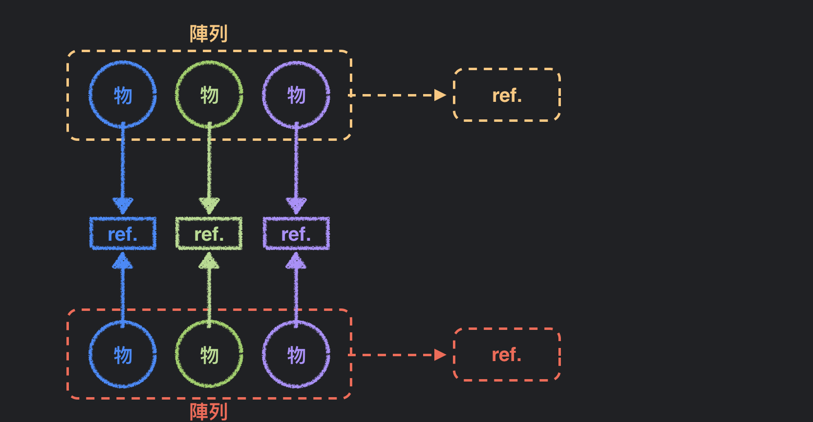

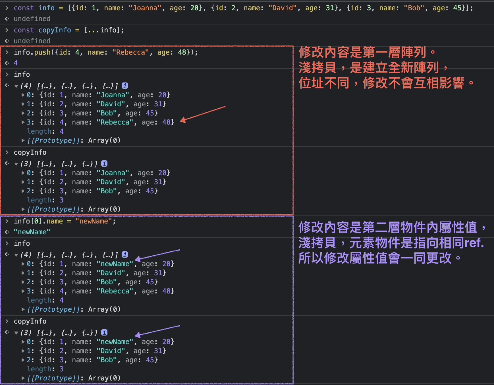

</details>

<details>
  <summary>
    <strong><code>map((currentElement, index, targetArray) ⇒ {})</code></strong>
  </summary>

- 作用對象：陣列。
- 更新對象：**false**
- 作用：**(淺拷貝)** 依據作用陣列的每個元素，通過函式回傳值，包成新陣列。
- 回傳值：產生一新陣列，新陣列元素依 每個作用元素 通過 函式 的回傳值。
- 參數：
    - `currentElement` : 作用元素。
    - `index`*(optional)* :  作用元素的索引值。
    - `targetArray`*(optional)* :  作用陣列。

```js
    const prices = [100, 200, 300, 400];
    const tax = 0.3;
    const info = prices.map((item, index) => ({id: index, priceWithTax: item * tax}));
    /*
        [
            {id: 0, priceWithTax: 30},
            {id: 1, priceWithTax: 60},
            {id: 2, priceWithTax: 90},
            {id: 3, priceWithTax: 120},
        ]
    */
```

#### 元素為基礎型別，`copy by value`: 任一方改值，互不影響。 
```js
    const prices = [100, 200, 300, 400];
    const copyPrices = prices.map(item => item);

    prices.push(-999);
    consle.log(prices);     // [100, 200, 300, 400, -999]
    consle.log(copyPrices); // [100, 200, 300, 400]

    prices[0] = 1234;
    consle.log(prices);     // [1234, 200, 300, 400, -999]
    consle.log(copyPrices); // [100, 200, 300, 400]
```

#### 元素為物件型別，`shallow copy` 加上 `copy by reference` : 任一方改值，「第一層外」值彼此會受到影響。

第一層為新建的 陣列，修改值互不影響。（淺拷貝）
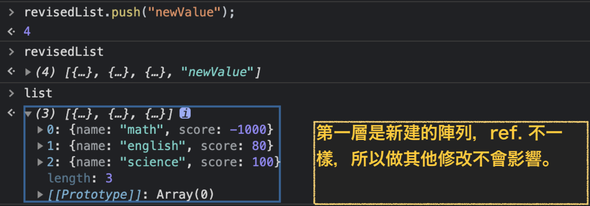

針對第一層外的物件型別資料修改，會一同更新。
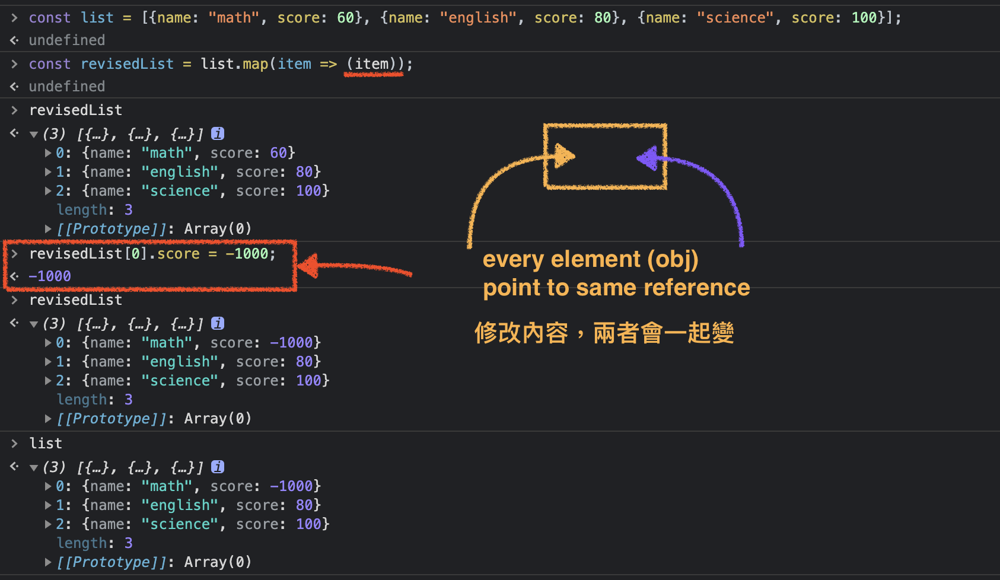

也可以替元素重新建立一新物件
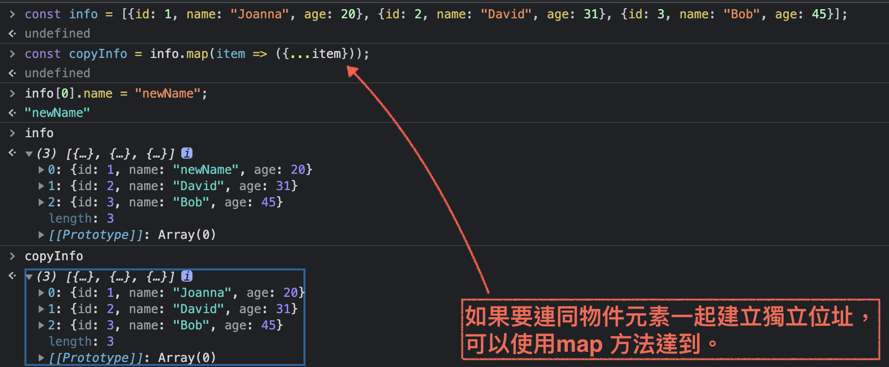

</details>


<details>
  <summary>
    <strong><code>slice(startIndex, before endIndex)</code></strong>
  </summary>

- 作用對象：陣列。
- 更新對象：**false**
- 作用：參考作用陣列內容，指定複製的元素。
- 回傳值：generate a new array based on target array
- 參數：
    - `startIndex` *(optional)*: 指定起始(含)作用元素，可為 正數 或 負數。
    - `endIndex` *(optional)*: 指定結束**(不含)**作用元素，可為 正數 或 負數。
    - `startIndex` 與 `endIndex` 需同時為 正數 或 負數，才具有效力。
    - 沒給參數的情況，會 淺拷貝 原陣列 ( different reference )

```js
    const  members = ["Joanna", "David", "Bob", "Yan"];
    const sliceMembers = members.slice(1, 3);
    console.log(sliceMembers); // ['David', 'Bob']
```

淺拷貝基礎型別，互不影響：
```js
    const nums = [3, 6, 4, 6, 2];
    const numberss = nums.slice();
    numberss[0] = -100; // [-100, 6, 4, 6, 2]
    console.log(nums);  // [3, 6, 4, 6, 2]
```

淺拷貝物件型別：修改第一層，互不影響。
```js
    const info = [ {id: 1, name: "Joanna"}, {id: 2, name: "David"}, {id: 3, name: "Bob"} ];
    const copyInfo = info.slice(1); // [{id: 2, name: "David"}, {id: 3, name: "Bob"}];

    copyInfo.push("Yan"); // [{id: 2, name: "David"}, {id: 3, name: "Bob"}, "Yan"];
```

淺拷貝物件型別：修改第一層以外，`pass by ref.`互相影響。
注意下面的code: `copyInfo`是從`info`第0個開始複製，故修改第0個後的ref. 才會跟著變動。
```js 
    const info = [ {id: 1, name: "Joanna"}, {id: 2, name: "David"}, {id: 3, name: "Bob"} ];
    const copyInfo = info.slice(1); // [{id: 2, name: "David"}, {id: 3, name: "Bob"}];

    info[0].name = "Jessica";
    console.log(info);     // [{id: 1, name: 'Jessica'}, {id: 2, name: 'David'}, {id: 3, name: 'Bob'}];
    console.log(copyInfo); // [{id: 2, name: "David"}, {id: 3, name: "Bob"}];

    info[1].name="Jimin";
    console.log(info);     // [{id: 1, name: 'Jessica'}, {id: 2, name: 'Jimin'}, {id: 3, name: 'Bob'}];
    console.log(copyInfo); // [{id: 2, name: 'Jimin'}, {id: 3, name: 'Bob'}];

```

</details>

<details>
  <summary>
    <strong><code>concat(item1, [item1, item2, ...])</code></strong>
  </summary>

- 作用對象：陣列。
- 更新對象：**false**
- 作用：在作用陣列後方，合併**指定陣列內的元素**。(接收陣列或元素，但只會加入元素)
- 參數： 一個或多個 (元素/陣列)。
- 回傳值：generate new array
- 補充：concat() 與 push() 差異
    1. concat() 接收 array或 element，push() 接收 element。
    2. concat() 回傳一新陣列，push() 回傳 新陣列長度。

```js
    const list = [1, 2, 3];
    const list1 = [4, 5];
    const list2 = [6, 7, 8];
    const total = list.concat(list1, list2); // [1, 2, 3, 4, 5, 6, 7, 8]

    total[0] = -300;
    console.log(total); // [-300, 2, 3, 4, 5, 6, 7, 8]
    console.log(list);  // [1, 2, 3]

```

```js
    const list = [1, 2, 3];
    const test = list.concat(-399, -899);

    console.log(test);  // [1, 2, 3, -399, -899]
```

</details>

<details>
  <summary>
    <strong><code>forEach((currentElement, index, targetArray) ⇒ {})</code></strong>
  </summary>

- 作用對象：陣列。
- 更新對象：**false**
- 作用：每一個作用元素都會經過函式，函式不會有回傳值。
- 回傳值：`undefined`。
- 參數：
    - `currentElement` : 作用元素。
    - `index` : (*optional)* 作用元素的索引值。
    - `targetArray` : (*optional)* 作用陣列。

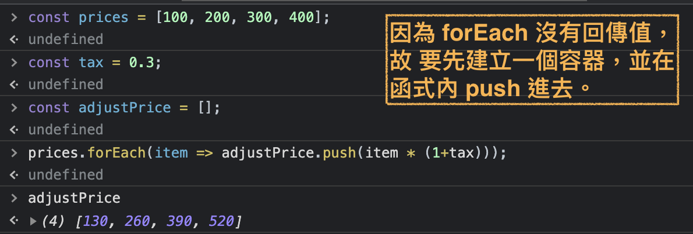
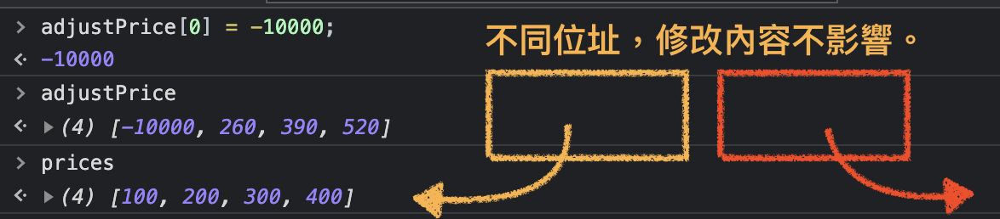
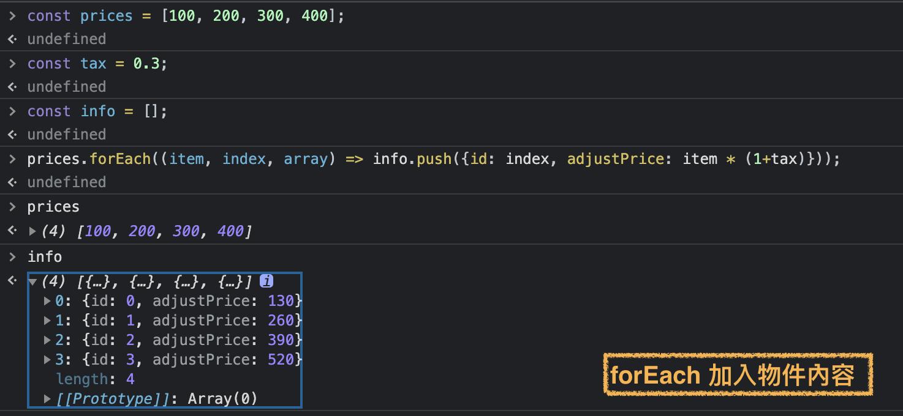

</details>

---

### Search Element in Array

|方法|用途|返回值|primitive|object|
|------|------|------|------|------|
|`indexOf(searchElement, startSearchIndex)`|從指定索引依序往下找尋第一個符合 `===` 查詢的元素索引|有找到第一個對應元素，回傳該元素 `index` ; 若沒有找到，回傳 `-1`|Ｏ|Ｘ|
|`lastIndexof(searchElement, startSearchIndexFromTheEnd)`|從指定索引為結束索引(含)，依序往前搜尋第一個符合的元素索引位置。|有找到**第一個**對應元素，回傳該元素 index ; 若沒有找到，回傳 `-1`|Ｏ|Ｘ|
|`findIndex((currentElement, index, targetArray) ⇒ {})`|找尋**第一個**符合測試函式的元素索引|**第一個**符合測試函式的**元素索引**，沒有符合則為 `-1`|Ｏ|Ｏ|
|`find((currentElement, index, targetArray) ⇒ {})`|找尋 **「第一個」**符合測試函式的元素|**「第一個」**符合測試函式的元素值，沒有符合則為 `undefined`|Ｏ|Ｏ|
|`filter((currentElement, index, targetArray) ⇒ {})`|篩選出所有通過測試函式的元素|一新陣列，內容為通過函式的所有元素|Ｏ|Ｏ|
|`include(primitiveValue, startSearchIndex)`|檢查 作用陣列是否有包含該值|boolean|Ｏ|Ｘ|
|`some((currentElement, index, targetArray) ⇒ {})`|透過測試函式檢查是否有符合條件的元素|boolean|Ｏ|Ｏ|
|`every((currentElement, index, targetArray) ⇒ {})`|透過測試函式檢查「每個元素」是否都有符合條件|boolean|Ｏ|Ｏ|


#### Return index of targetElement

<details>
  <summary>
    <strong><code>indexOf(searchElement, startSearchIndex)</code> : works on primitive</strong>
  </summary>

- 作用對象：陣列
- 更新對象：**false**
- 作用：從指定索引依序往下找尋 **「第一個」**符合 `===` 查詢的元素索引。
- 回傳值：有找到**第一個**對應元素，回傳該元素 index ; 若沒有找到，回傳 `-1`
- 參數：
    - `searchElement` ：查詢的值
    - `startSearchIndex` : 指定第幾個元素(含)開始搜尋

```js
    const nums = [1, 3, 5,6 ,7, 9];
    const targetIndex = nums.indexOf(6, 2);  // 從 nums 第2個index開始往下找第一個符合值為3的元素，並返回該元素index。

    console.log(targetIndex); // 3   
```

:::caution
補充：比對 基準 `===` (same type & same value)，故 `indexOf()` 只對基礎型別有效。
:::

</details>

<details>
  <summary>
    <strong><code>lastIndexof(searchElement, startSearchIndexFromTheEnd)</code> : works on primitive</strong>
  </summary>

- 作用對象 : 陣列
- 更新對象：**false**
- 作用：從指定索引為結束索引(含)，依序往前搜尋 **「第一個」**符合的元素索引位置。
- 回傳值：有找到 **「第一個」**對應元素，回傳該元素 index ; 若沒有找到，回傳 `-1`
- 參數：
    - `searchElement` ：查詢的值
    - `startSearchIndexFromTheEnd` : 指定第幾個元素(含)開始往前搜尋
- 補充：比對 基準 `===` (same type & same value)，故 `indexOf()` 只對基礎型別有效。

```js
    const nums = [1, 3, 5,6 ,7, 9];

    const targetIndex1 = nums.lastIndexOf(1, 1); // 從倒數第一個索引(含)開始往前找，找到第一個符合要求的元素，返回該元素索引。 
    const targetIndex2 = nums.lastIndexOf(9, 2); // 從倒數第二個索引(含)開始往前找，找到第一個符合要求的元素，返回該元素索引。 

    console.log(targetIndex1); // 0
    console.log(targetIndex2); // -1
```
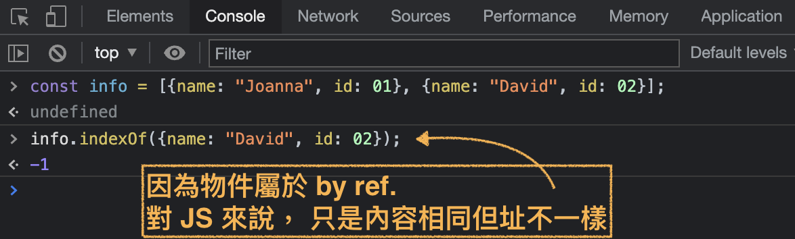

</details>

<details>
  <summary>
    <strong><code>findIndex((currentElement, index, targetArray) ⇒ {})</code> : work on primitive / object</strong>
  </summary>

- 作用對象：陣列。
- 更新對象：**false**
- 作用：找尋 **「第一個」**符合測試函式的元素索引。
- 回傳值：**「第一個」**符合測試函式的**元素索引**，沒有符合則為 `-1`。
- 參數：
    - `currentElement` : 作用元素。
    - `index` : (*optional)* 作用元素的索引值。
    - `targetArray` : (*optional)* 作用陣列。

```js
const members = [{id: 1, name: "Joanna"}, {id: 2, name: "David"}, {id: 3, name: "Bob"}];
members.findIndex((item) => item.name.length > 6); // -1
```

</details>

#### Return value of targetElement 

<details>
  <summary>
    <strong><code>find((currentElement, index, targetArray) ⇒ {})</code> : works on primitive / object ; return single element</strong>
  </summary>

- 作用對象：陣列。
- 更新對象：**false**
- 作用：找尋 **「第一個」**符合測試函式的元素。
- 回傳值：**「第一個」**符合測試函式的元素值，沒有符合則為 `undefined`。
- 參數：
    - `currentElement` : 作用元素。
    - `index` : (*optional)* 作用元素的索引值。
    - `targetArray` : (*optional)* 作用陣列。
- 補充：回傳值 與作用陣列是同一個 reference，故修改回傳值也會影響到原陣列。

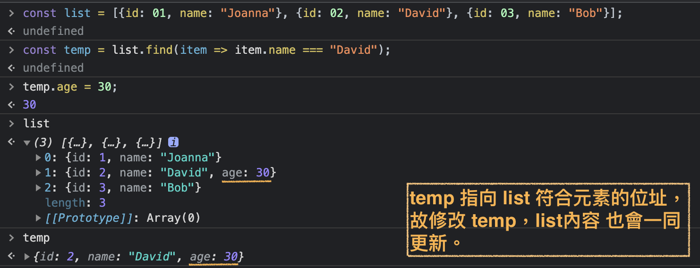
    
</details>

<details>
  <summary>
    <strong><code>filter((currentElement, index, targetArray) ⇒ {})</code> : works on primitive / object ; return an array with mutilple elements</strong>
  </summary>

- 作用對象：陣列
- 更新對象：**false**
- 作用：篩選出所有通過測試函式的元素。
- 回傳值：一新陣列，內容為通過函式的所有元素。
- 參數：
    - `currentElement` : 作用元素。
    - `index`*(optional)* :  作用元素的索引值。
    - `targetArray`*(optional)* :  作用陣列。

淺拷貝，元素為基礎型別，修改互不影響。
```js
    const prices = [230, 302, 400, 180, 200];
    const pricesOverTwoHundred = prices.filter(num => num>200); // [230, 302, 400]

    prices[0] = -10000;
    console.log(prices);  // [-10000, 302, 400, 180, 200] 
    console.log(pricesOverTwoHundred); // [230, 302, 400]
```

淺拷貝，元素為物件型別，第一層為新建陣列，修改互不影響。
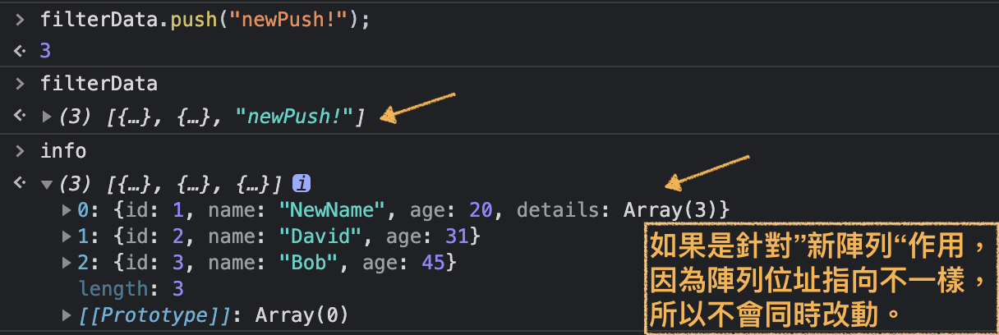

淺拷貝，元素為物件型別，第一層外修改會互相影響。
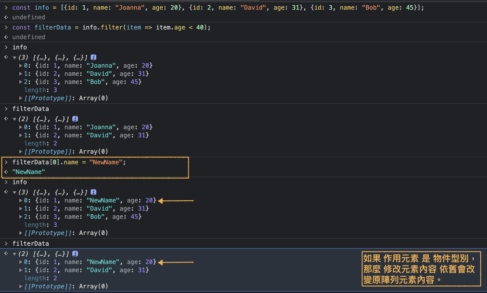

</details>

#### Return boolean of targetElement

<details>
  <summary>
    <strong><code>include(primitiveValue, startSearchIndex)</code> : works on primitive</strong>
  </summary>

- 作用對象：陣列。
- 更新對象：**false**
- 作用：檢查 作用陣列是否有包含該值。
- 回傳值：boolean
- 參數：
    - `primitiveValue` : 查詢的值(針對 基礎型別 檢查)。
    - `startSearchIndex` *(optional)*:  指定從第幾個元素開始檢查，可以是 正數 或 負數。

```js
    const nums = [3, 6, 4, 6, 2];
    nums.includes(7); // false
    nums.includes(6); // trus
```

</details>

<details>
  <summary>
    <strong><code>some((currentElement, index, targetArray) ⇒ {})</code> :  work on primitive / object</strong>
  </summary>

- 作用對象：陣列
- 更新對象：**false**
- 作用：透過測試函式檢查是否有符合條件的元素。
- 回傳值：boolean
- 參數：
    - `currentElement` : 作用元素。
    - `index` *(optional)* : 作用元素的索引值。
    - `targetArray` *(optional)*:  作用陣列。

```js
    const members = [{id: 1, name: "Joanna"}, {id: 2, name: "David"}, {id: 3, name: "Bob"}];
    members.some(item => item.name.length > 5); // true
```

</details>

<details>
  <summary>
    <strong><code>every((currentElement, index, targetArray) ⇒ {})</code> :  work on primitive / object</strong>
  </summary>

- 作用對象：陣列
- 更新對象：**false**
- 作用：透過測試函式檢查「每個元素」是否都有符合條件。
- 回傳值：boolean
- 參數：
    - `currentElement` : 作用元素。
    - `index` *(optional)*:  作用元素的索引值。
    - `targetArray` *(optional)*:  作用陣列。

```js
    const members = [{id: 1, name: "Joanna"}, {id: 2, name: "David"}, {id: 3, name: "Bob"}];
    members.every(item => item.name.length > 5); // false
```

</details>

---
### Sorter Element in Array

|方法|用途|返回值|會更新作用對象|補充|
|------|------|------|------|------|
|`sort(compareFunction)`|將作用陣列內的元素依函式或 unicode 排列|經過重新排列的原陣列|Ｏ|------|
|`reverse()`|將原陣列內元素，顛倒排列|反轉後的原陣列|Ｏ|------|

<details>
  <summary>
    <strong><code>sort(compareFunction)</code></strong>
  </summary>

- 作用對象：陣列。
- 更新對象：**true**
- 作用：將作用陣列內的元素依函式或 unicode 排列。
- 回傳值：經過重新排列的原陣列。
- 參數：
    - `compareFunction` *(optional)*:  ，通常會使用兩個參數(代表作用元素)，做比較。
    - 如果沒有使用函式做比較，排列方式會依照每個元素第一個字元做比較排列。

```js
    const nums = [100, -20, 34, -89, 18, 39];

    // 小到大
    nums.sort((a, b) => a-b); // [-89, -20, 18, 34, 39, 100]
    console.log(nums);        // [-89, -20, 18, 34, 39, 100]

    // 大到小
    nums.sort((a, b) => b-a); // [100, 39, 34, 18, -20, -89]
    console.log(nums);        // [100, 39, 34, 18, -20, -89]
```
沒有帶入`compareFunction`的情況：
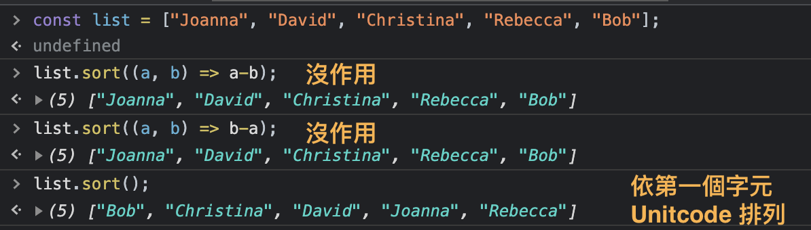

</details>

<details>
  <summary>
    <strong><code>reverse()</code></strong>
  </summary>

- 作用對象：陣列
- 更新對象：**true**
- 作用：將原陣列內元素，顛倒排列。
- 回傳值：反轉後的陣列。

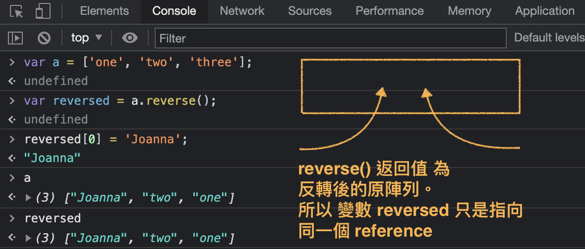

</details>

---

### Others


|方法|用途|返回值|會更新作用對象|補充|
|------|------|------|------|------|
|`reduce((preValue, curValue, curIndex, array) => { }, initValue)`|每個元素累加的方法|回傳累加結果|X|--|
|`join(“指定連接字元”)`|陣列元素轉成字串|字串|Ｘ|array to string|
|`split(“指定分裂的字元”, limit)`|字串轉成陣列|包含被分裂字串組成的陣列|X|string to array|

<details>
  <summary>
    <strong><code>reduce((previousValue, currentValue, currentIndex, array) => { }, initialValue)</code></strong>
  </summary>

- 作用對象：陣列。
- 更新對象：**false**
- 作用：將陣列元素累加在一起。
- 回傳值：累加在一起的值。
- 參數一：function
    - `previousValue` : 第一次為 `initialValue`，第二次之後 為 第一輪 累加值。
                        (如果沒有設定`initialValue`，`previousValue = array[0]`)
    - `currentValue` : 作用元素。
    - `currentIndex` : 目前作用元素索引。
    - `array` : 作用陣列。
- 參數二：
    - `initialValue` *(optional)*: 設定起始值。

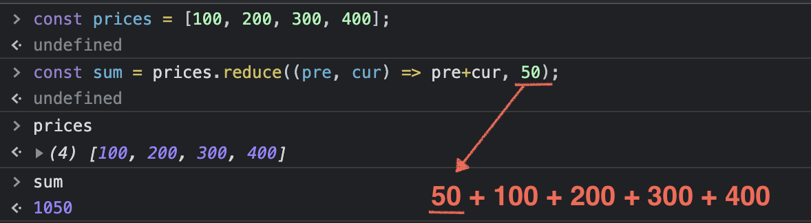
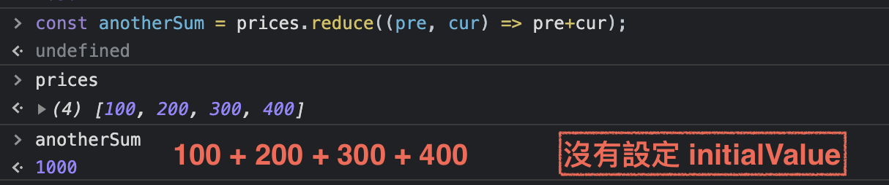
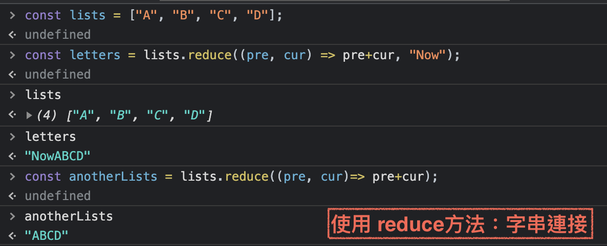
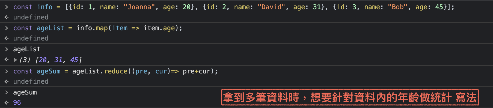

</details>

<details>
  <summary>
    <strong><code>join(“指定連接字元”)</code> : 連接</strong>
  </summary>

- 作用對象：陣列。
- 更新對象：**false**
- 作用：將陣列內的元素串接成一組字串。
- 回傳值：字串。
- 參數：
    - `“指定連接字元”` : 陣列元素之間用哪些字元做區隔串接。預設為 `“,”`。

```js
    const names = ["Joanna", "David", "Bob"];
    const transferString = names.join();

    console.log(names);          // ["Joanna", "David", "Bob"]
    console.log(transferString); // 'Joanna,David,Bob'
```

```js
    const nums = [3, 6, 4, 6, 2];
    nums.join("--");  // '3--6--4--6--2'
```

</details>

<details>
  <summary>
    <strong><code>split(“指定分裂的字元”, limit)</code> : 分裂</strong>
  </summary>

- 作用對象：字串
- 更新對象：
- 作用：將字串依照指定的字元做切斷，做為陣列內的元素。
- 返回值：包含被分裂字串組成的陣列。
- 參數：
    - `“指定分裂的字元”` : 作用字串要依哪個字符做區隔標準。
    - `limit` *(optional)*: 限制回傳陣列長度。

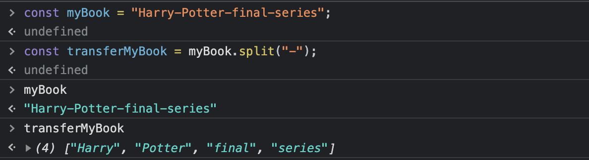
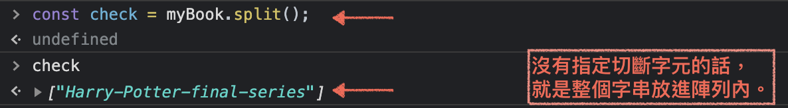
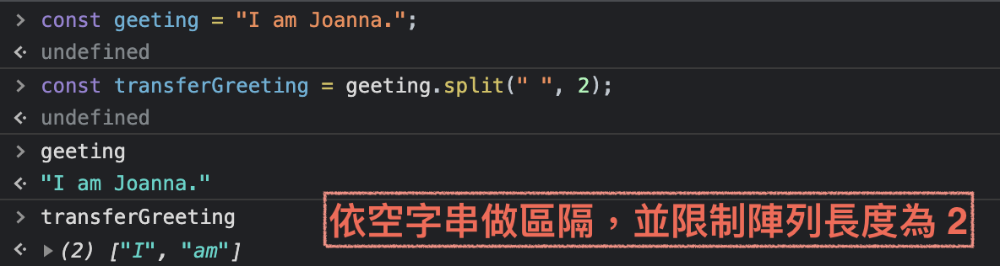

</details>

---

## function


---

## Q: 如何辨別基礎型別(Primitives)與物件型別(Object)?  
### 使用 `typeof` 判別型別(回傳值為 字串)

```
    typeof "文字";       //'string'
    typeof 345;          //'number'
    typeof Infinity;     //'number'
    typeof NaN;          //'number'
    typeof true;         //'boolean'
    typeof undefined;    //'undefined' 
    typeof { };          //'object'
    typeof [ ];          //'object'
        
    //例外
    typeof null;         //'object'     >>> 在設計JS出現的Bug，為避免影響已存在的程式碼，就沒做修正。
    typeof window.alert; //'function'

```


---
## shallow copy v.s. deep copy

---
## 參考資料

[筆記](https://www.notion.so/Summary-Object-6ca2286f85754d72a2095ac42a1998b4)
