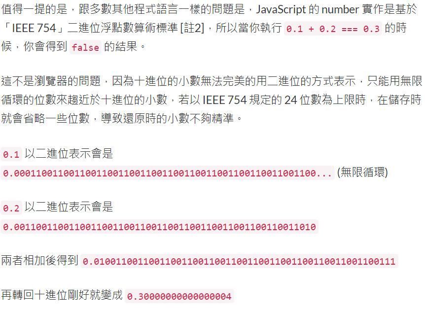

# 基礎型別(Primitives)

### string: `""` `''` `` `${variable}` ``
<details>
  <summary><strong>字串寫法</strong></summary>

- 表示方式 :
    - 雙引號 `"字串範圍"`
    - 單引號 `'字串範圍'`
    - 反引號 `` `字串範圍` ``
- 寫法注意 : 
    - (X) '字串'範圍' '
    - (O) "字串 '範圍' "
    - (X) 'Let's go! '
    - (O) "Let's go!"
    - (O) 'Let\'s go! '
- 單雙引號寫法
- 不同型別內容使用 + 串接
- 換行寫法加上`\`

</details>

<details>
  <summary><strong>template literal</strong></summary>

- 優點 : 程式碼簡潔，易讀性高，運用更有彈性。
- 使用反引號標示 `` `字串範圍` ``
- 內嵌變數進字串 `` `${variable}` ``
- 內嵌運算式進字串 `` `${1+2}` ``

</details>

#### 字串＋變數寫法：

一般寫法
```js
    const name = "Joanna";
    const greeting = "I am " + name + "."; // I am Joanna.
```

template literal
```js
    const name = "Joanna";
    const greeting = `I am ${name}.` // I am Joanna.
```

#### 換行寫法：

一般寫法
```js
    const str = "這是第一行\
                 這是第二行\
                 這是第三行";
```

template literal
```js
    const str = `這是第一行
                 這是第二行
                 這是第三行`;
```
---

### number: 整數 (Integers)、浮點數(floats)、無限大 (± Infinity)、NaN (Not a Number)

<details>
  <summary><strong>整數(Integers)</strong></summary>

- 正數
- 負數

</details>

<details>
  <summary><strong>浮點數(floats)</strong></summary>

- `0.1+0.2 === 0.3  // false`
- IEEE 754 二進位浮點數，將十進位數轉成二進位無法整除。
<br/>
[資料來源](https://ithelp.ithome.com.tw/articles/10190873)

</details>

<details>
  <summary><strong>無限大 (± Infinity)</strong></summary>

- 任何正數 / 0 = + Infinity
- 任何負數 / 0 = - Infinity

</details>

<details>
  <summary><strong>NaN (Not a Number)</strong></summary>

### Q : 什麼情況會成為`NaN`?   
- 0 / 0
- ± Infinity / ± Infinity
- `NaN` 與任何數字搭上，結果都是 `NaN` 
- `NaN` 不等於任何數，甚至包含自己
```
    NaN === NaN // false
```

### Q : 如何檢查變數是否為NaN?    
#### 使用 `isNaN(value);`

```
    isNaN(123);      //false
    isNaN(2.1314);   //false
    isNaN("123")     //false   >>> 因為字串 "123" 可以透過隱含的 Number() 轉型成數字
    isNaN(NaN)       //true
```

:::warning
    (X) a === NaN  // NaN不等於任何數字，甚至是自己，此辨別方式不適當。
:::

</details>

---

### boolean
- `true` `false`
- **truthy value**、**falsy value**
    使用 `Boolean()` 做判別:
    ```js
        Boolean("true")     // true
        Boolean("false")    // true
        Boolean([])         // true
        Boolean({})         // true
        Boolean("")         // false *
        Boolean(0)          // false *
        Boolean(undefined)  // false *
        Boolean(null)       // false *
        Boolean(NaN)        // false *
    ```

    if-else 寫法
    ```js 
        if(condition){
            // 當 條件成立：condition 為 true 或 truthy value，執行動作
        }else{
            // 當 條件成立：condition 為 false 或 falsy value，執行動作
        }
    ```

    三元運算子
    ```js 
        condition ? true : false
    ```

<table>
    <tr>
        <th width="255">邏輯運算子</th>
        <th>描述</th>
        <th>如果條件成立，返回</th>
    </tr>
    <tr>
        <td><code>conditionA && conditionB</code></td>
        <td>兩者皆為 true(truthy value)，或 兩者皆為 false(falsy value)</td>
        <td><code>conditionB</code></td>
    </tr>
    <tr>
        <td><code>conditionA || conditionB</code></td>
        <td>一個true(truthy value)，一個false(falsy value)</td>
        <td>
            <ul>
                <li>如果 conditionA == true(truthy value)，conditionB不檢查，返回<code>conditionA</code></li>
                <li>
                    如果 conditionA == false(falsy value)，conditionB == true(truthy value)，返回<code>conditionB</code>
                </li>
            </ul>
        </td>
    </tr>
    <tr>
        <td><code>!condition</code></td>
        <td><code>!</code> 代表反轉，true(truthy value) 轉成 false(falsy value)，返之亦然。</td>
        <td>
            <ul>
                <li> <code>!true == false</code></li>
                <li><code>!false == true</code></li>
            </ul>
        </td>
    </tr>
    <tr>
        <td><code>!!condition</code></td>
        <td>將 truthy value 轉成 true，將 falsy value 轉成 false</td>
        <td>
            <ul>
                <li><code>!!truthy value == true</code></li>
                <li><code>!!falsy value == false</code></li>
            </ul>
        </td>
    </tr>
</table>

:::note
除了 空字串`""`、`0`、`undefined`、`null`、`NaN` 五種情況是 falthy value，多數情況為 truthy value。
:::

### `undefined`
- 定義一變數，但未給變數值。
```
    let name;
```

### `null`
- 定義一變數，並給予變數值為 `null`。
```
    let name = null;
```

### `undefined` 與 `null` 比較
```js
    /* 差異 */
    Number(undefined); // NaN
    Number(null);      // 0

    /* 相同 */
    Boolean(undefined); // false
    Boolean(null);      // false
```

### 補充：
[如何辨別基礎型別primitives與物件型別object?](./js_object#q-如何辨別基礎型別primitives與物件型別object)

---

## 參考資源
