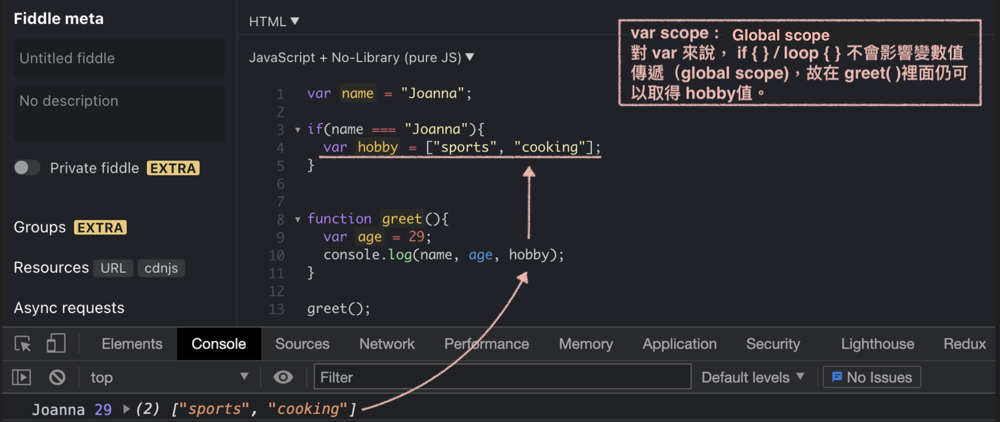
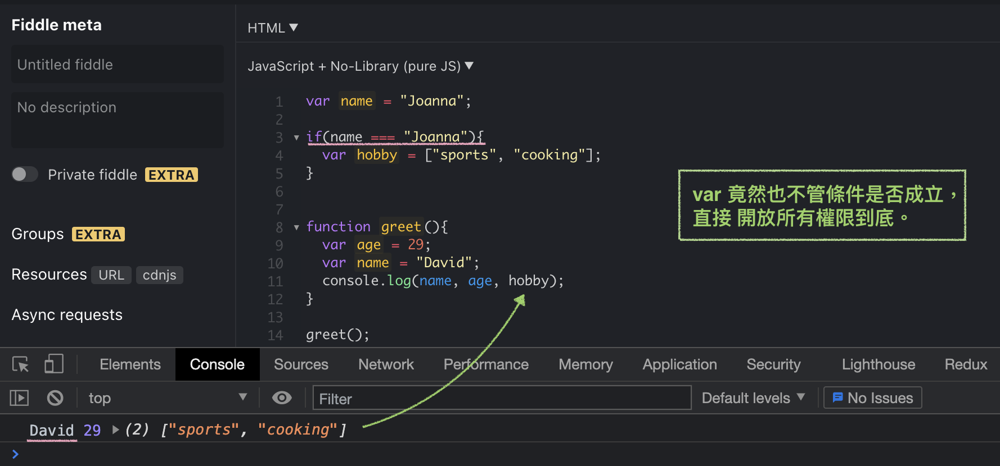
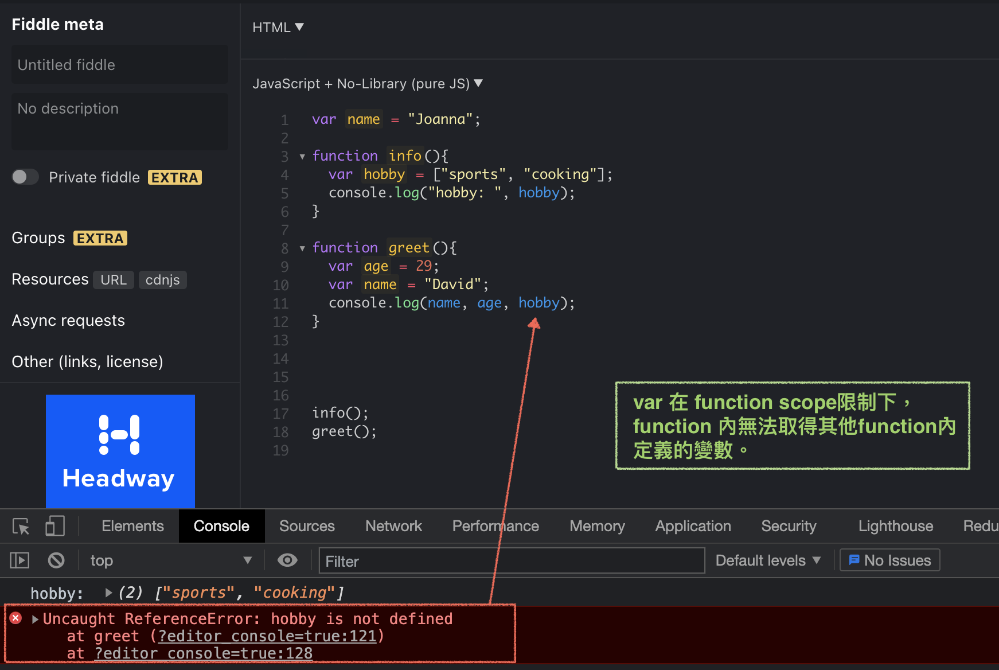
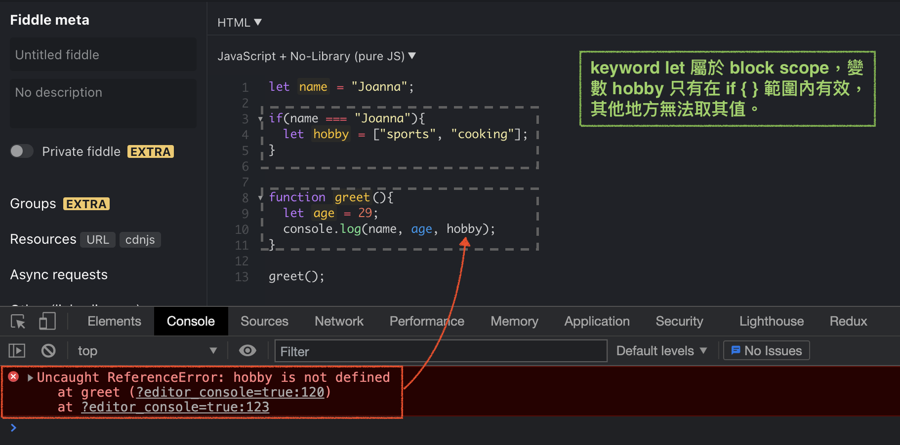
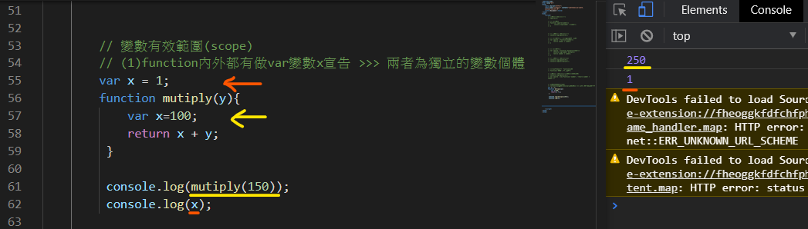
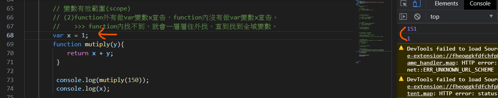
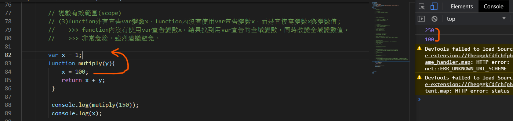
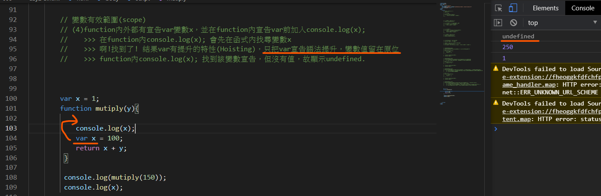

# scope And hoisting
## scope
### global scope
- 全域變數（任何地方都可以取得或修改該變數）
- global scope 的威力，以 `var` 舉例
    - 可以在任何地方取值，包含 `if-else`
    
    - `if-else`的判斷式也不管
    

### block scope
- 以`{}`作為有效範圍，像是 function、`if-else`。
- block scope 的威力，以 `let` 舉例
    
- let - block scope : function / loop / if statement (界線明確，有助於寫出 clean code)
    

---

## hoisting
### `var` `let` `const` hoisting
- Hoisting is JavaScript's default behavior of moving declarations to the top.
- 宣告變數在取值之後，JS會找到有效作用域內的宣告變數，把宣告的動作抬升至取值之前，但變數值留在原地。

### function hoisting
- function hoisting 會將整個 function(包含執行動作)，都抬升至呼叫該function之前
- funciton 無論寫在呼叫該function前或後，都不會影響函式執行。

:::info Shadowed Variables
> 1. **It's not allowed co-existing same variable name in the same lavel or same scope.**
> 2. Same variable in different scope : It creates a new variable on a different scope - this variables does not overwrite or remove the global variable by the way. JavaScript does something which is called "**shadowing**".
> 3. Firstly, it prevents inner scope to access variables defined in the outer scope. 
Secondly, it prevents inner scope to modify or reassign variables defined in the outer scope.
> - [Understanding ‘Variable Shadowing’ with JavaScript](https://mayuminishimoto.medium.com/understanding-variable-shadowing-with-javascript-58fc108c8f03)
:::

---
### `var` `let` `const`

|變數宣告|scope       |說明                   |hoisting|補充 |
|-------|------------|----------------------|----|----|
|`var`  |global scope|定義變數，相同作用範圍內，可以重複宣告，變數也可以重新賦值| hoisted to the top of the block, and initialized.|缺點：<br />如果在程式碼中間不小心改到全域變數造成bug，要查錯會很困難。|
|`let`  |block scope |定義變數，相同作用範圍內，**不可以**重複宣告，變數可以重新賦值| hoisted to the top of the block, but not initialized.(TDZ)|ES6。<br />使用 `let` 替代 `var`，後續維護查錯會容易許多。|
|`const`|block scope |定義常數，變數值不能修改  | hoisted to the top of the block, but not initialized.(TDZ)|ES6。<br />常數宣告一定要賦值。|


<details>
  <summary>
    <strong><code>var</code></strong>
  </summary>

#### 定義變數，相同作用範圍內，可以重複宣告，變數也可以重新賦值。

```js
    // 相同作用範圍內，可以重複宣告
    var name = "Joanna";
    var name = "David";

    console.log(name); // David
```

```js
    // 重複宣告
    var name = "Joanna";
    name = "Outer and reAssign";

    function sayName(){
        name = "Inside function"

        console.log(name); // "Inside function"
        alert(name);
    }

    console.log(name);     // "Outer and reAssign"
```

```js

    var name = "Joanna";    // -----> global scope

    function greeting(){
        var name = "David"; // -----> block scope

        return `Hi, ${name}.`;
    }

    console.log(greeting()); // Hi, David.
    console.log(name);       // Joanna
```

---

### 使用 `var` 危險的原因
宣告`var`可能會遇到幾種情況：
#### 情況一 : function內外都有宣告var變數x  
-  兩者為獨立的變數個體。



#### 情況二 :  function外有宣告var變數x 與 function內沒有宣告var變數x 
- function內找不到該變數，會一層層往外找，直到全域變數。
- function可以往外找已宣告變數，但外層無法往function內取得內部變數。



#### 情況三 : function外有宣告var變數x，function內沒有使用var宣告變數x，而是重新賦值;   
- 因為 function內沒有使用var宣告變數x，結果往外找到有使用var宣告的全域變數，**結果也同時改變全域變數值**。
- 非常危險，強烈建議避免。



#### 情況四 : function內外都有宣告var變數x，並在function內宣告var前加入console.log(x);
1. 在function內console.log(x); 會先在函式內找尋變數x
2. 啊!找到了! 結果var有變數提升的特性(Hoisting)，只把var宣告語法提升，變數值留在原位。
3. function內console.log(x); 找到該變數宣告，但沒有值，故顯示undefined.

- 因為var有變數提升的特性，故強烈建議會用到的變數都放在scope最上面宣告完成後再使用。
- 或者改用let宣告變數，let沒有變數提升的特性。(但宣告還是要寫在執行指令前面，不然還是一樣顯示Uncaught ReferenceError.)
- 只要變數有被宣告，使用的時候就不會有錯誤，否則會顯示ReferenceError.(撰寫時顯示錯誤，可以有效在上線前除錯)



</details>

<details>
  <summary>
    <strong><code>let</code></strong>
  </summary>

#### 定義變數，相同作用範圍內，**不可以**重複宣告，變數可以重新賦值

```js
    // (Ｏ) 變數可以重新賦值
    let name = "Joanna";
    name = "David";
```

```js
    // (X) 不可以重複宣告
    let name = "Joanna";
    let name = "David";
```
:::warning 錯誤顯示如下
Uncaught SyntaxError: Identifier 'name' has already been declared 
:::

---

#### 情況一 : function內外都有let宣告變數number 
-  兩者為獨立的變數個體。

```js
    let number = 10;       // -----> global scope

    function add(num){
        let number = -310; // -----> block scope
        
        return  number + num;
    }

    console.log(add(30));  // -280
    console.log("outer number:", number); // 10
```

#### 情況二 : function外有let宣告變數number 與 function內沒有let宣告變數number   
- function 內找不到，就是往外來用。

```js
    let number = 10;    // -----> global scope

    function add(num){
       return  number + num;
    }

    console.log(add(30)); // 40
```

#### 情況三 : function外有let宣告變數number，function內沒有使用let宣告變數number，而是重新賦值;  
- 因為 `let` 接受重新賦值的特性，所以在 function 內重新賦值，會影響的全域變數。
- 非常危險，強烈建議避免。

```js
    let number = 10;    // -----> global scope

    function add(num){
        number = -200;
        return  number + num;
    }

    console.log(add(30)); // 40
    console.log("outer number:", number); // -200
```

#### 情況四 : function內外都有宣告let宣告變數number，並在function內宣告let前加入console.log(number);
- `let` hoisting不會針對提升變數做 initialized，所以在 hoisting declare variable 到 變數值之間，會形成TDZ（Temper Dead Zone），因為取不到值而產生error.

```js
    let number = 10;       // -----> global scope

    function add(num){
        console.log("before block scope assign: ", number);
        let number = -310;
        
        return  number + num;
    }

    console.log(add(30));
    console.log("outer number:", number); 
```

</details>

---

## 參考資源
- [hoisting from w3schools](https://www.w3schools.com/js/js_hoisting.asp)
- [0 陷阱！0 誤解！8 天重新認識 JavaScript！](https://www.books.com.tw/products/0010832387)
- [重新認識 JavaScript: Day 10 函式 Functions 的基本概念](https://ithelp.ithome.com.tw/articles/10191549c)
