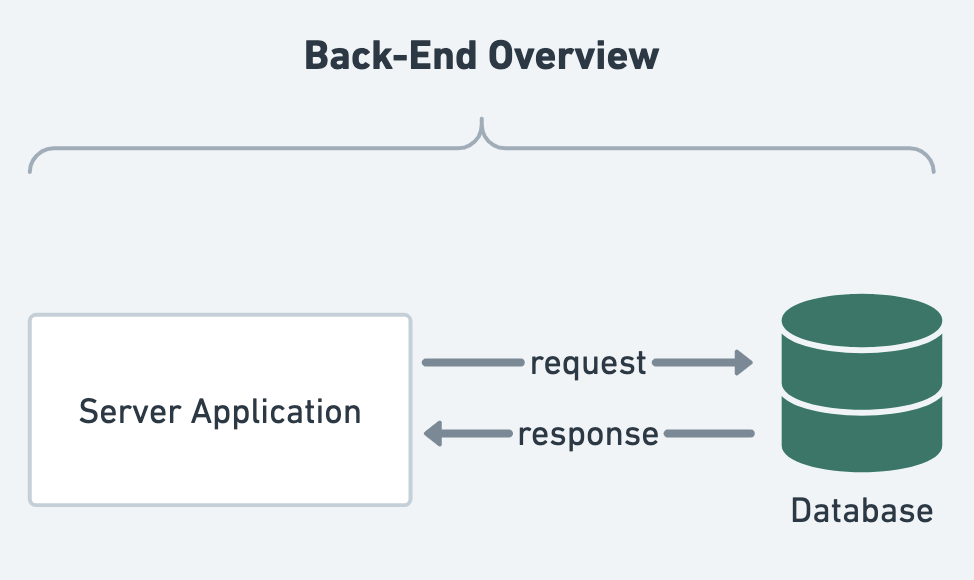

# MongoDB Intro


## Back End Concept
#### 後端撰寫 Server 應用程式，與 資料庫 互動，兩者 是分開的。
- Server 要與 資料庫 互動，要先啟動資料庫。




---
## Database, Schema, Model, Collection, Document
- Database: 相當於 Execl 的檔案名稱。
- Schema: 定義文件的型別與驗證條件。
- Model: 依據 Schema 產生的實例，對應到指定 Collection。用於 操作 CRUD 資料（Document）的方法。
  - `mongoose.model("ModelName", <Schema>);`
- Collection: 儲存 資料（Document）的 容器，相當於 Execl 的頁籤。
- Document: 相當於 Execl 上輸入的一筆資料。


---
TBD

```js title="req.url 並使用 GET 方法，回傳從 MongoDB 撈到的資料"

app.get("/", async (req: Request, res: Response) => {
  const headers = {
    "Access-Control-Allow-Headers": "Content-Type, Authorization, Content-Length, X-Requested-With",
    "Access-Control-Allow-Origin": "*",
    "Access-Control-Allow-Methods": "GET, PUT, POST, PATCH, DELETE, OPTIONS",
    "Content-Type": "application/json",
  };

  if (req.url === "/" && req.method === "GET") {
    const members = await Member.find();
    res.writeHead(200, headers);
    res.write(
      JSON.stringify({
        status: "success",
        members,
      }),
    );
  }
  res.end();
});

app.listen(8080, "localhost", () => {
  console.log("Server is running again!");
});

```


```js title="新增資料方法一"
// Create an instance
const testData = new Member({
  email: "test2@gmail.com",
  name: "Joanna",
  password: "password",
});
Add instance to DB
testData
  .save()
  .then(() => {
    console.log("新增資料庫成功！");
  })
  .catch((error) => {
    console.log("新增資料庫失敗！", error);
  });
```


```js title="新增資料方法二"
Member.create({
  id: "Joanna",
  email: "test223333sss@gmail.com",
  name: "JoannaOO",
  password: "passwordOO",
})
  .then(() => {
    console.log("寫入資料庫成功！");
  })
  .catch((err) => {
    console.log("寫入資料庫失敗！", err);
  });
```

---

TBD

由套件 `Express-Generator` 自動產生一基本 MVC 架構 的 Server。(這個套件有獲得官方推薦)
- [Express-Generator](https://ithelp.ithome.com.tw/articles/10191816)