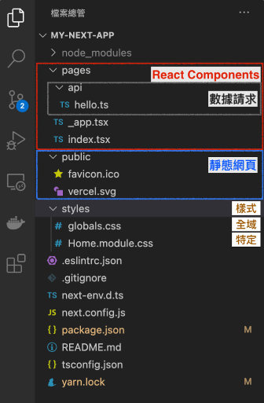
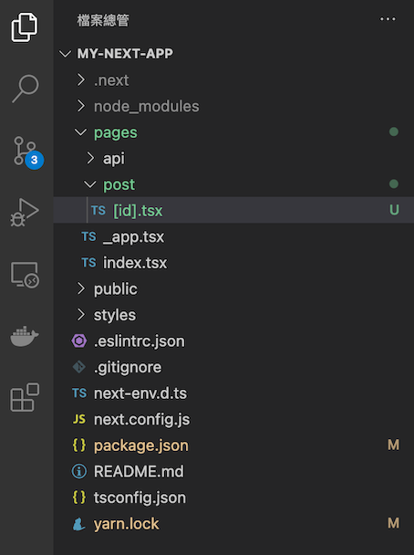
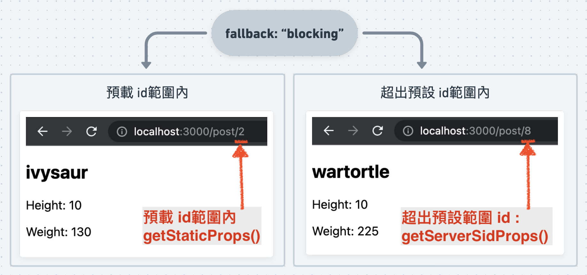
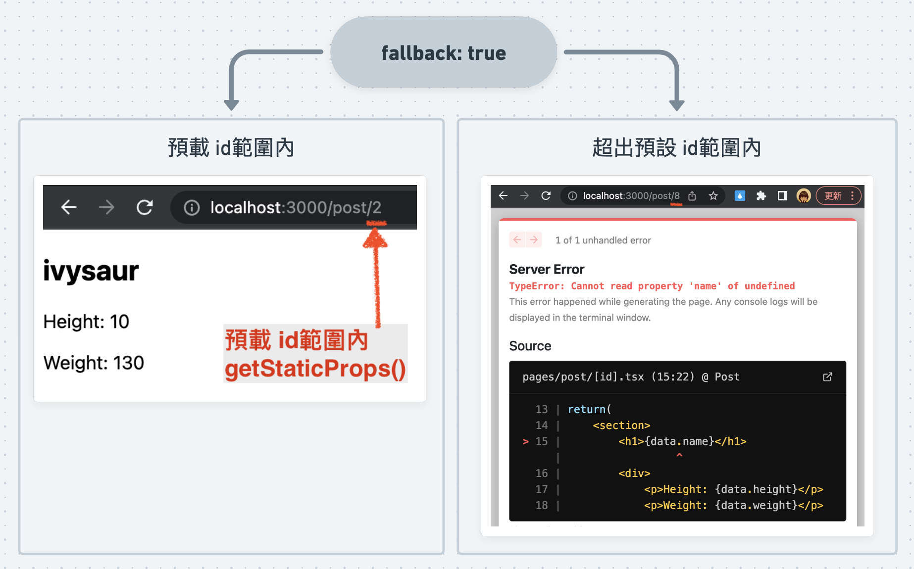
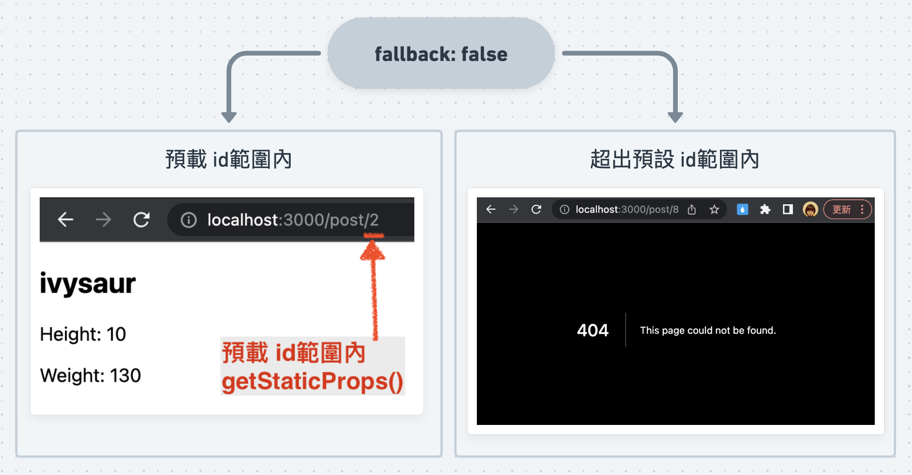
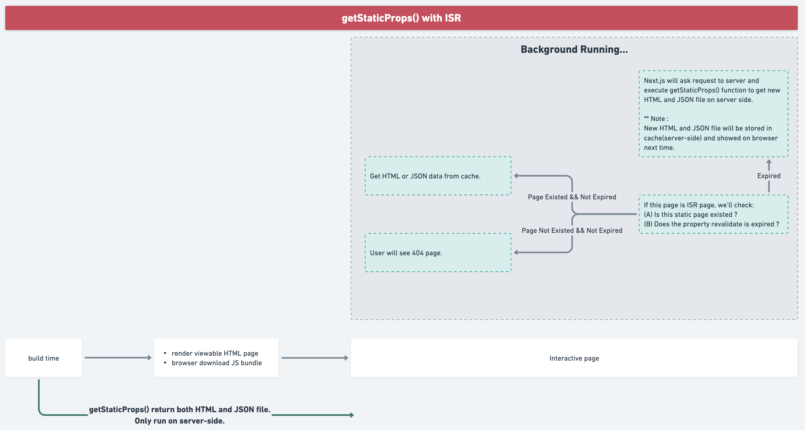

# `Intro`


## 用來解決什麼問題？
- 解決 React SEO 的問題。
- React 專注 UI，Next 專注建置與優化。
- Next 包含 Route setting、data fetching
---

## What is Next.js ?
:::note 

### Next.js is a React framework that gives you building blocks to create web applications.
By framework, we mean **Next.js handles the tooling and configuration needed for React, 
and provides additional structure, features, and optimizations for your application.**
- [資料來源：官網](https://nextjs.org/learn/foundations/about-nextjs/what-is-nextjs)
:::

---
### React: Client-Side Rendering
- Render web by browser
- 解析網頁順序：<br/>
    `send request to server/server response` --> `HTML loading` --> `載入 JS` --> `render web`
- 造成問題：<br/>
（一）一切要等 JS bundle 預載好，效能較不好 (User friendly bad)<br/>
（二）爬蟲沒有東西爬，SEO 不會好 (所有資料都要去 server 拿)。<br/>
（三）圖案檔案優化要自行設定。

[資料來源](https://laptrinhx.com/client-side-rendering-vs-server-side-rendering-which-one-is-better-44494895)


### Next: 支援 SSR、SSG、CSR
- `SSR` 解析網頁順序： <br/>
    `send request to server/server response complete HTML`  --> `pre-render default web/載入 JS` --> `render web`
- `SSR` 解決 `React` 問題：**改變渲染順序**<br/>
（一）可以決定哪些內容先 pre-render 或 提供靜態網頁 (User friendly better)<br/>
（二）爬蟲有東西爬，SEO 較佳。<br/>
（三）圖案檔案優化 有提供自動化解決方案。

[資料來源](https://laptrinhx.com/client-side-rendering-vs-server-side-rendering-which-one-is-better-44494895)

---
### 補充整理: CSR vs. SSR vs. SSG
|--|全名|props|cons|備註|
|--|--|--|--|--|
|CSR|Client-Side Rendering |第一次載入 JS bundle 較慢，之後的頁面瀏覽較快。                         |不利SEO 與 效能                            |--|
|SSR|Server-Side Rendering |SEO與效能 較 CSR 佳。 <br/>`server response dynamically generated HTML/CSS/JS`|每頁都由 Server render, server loading 重。|需搭配 `動態 sitemap、robots.txt`幫助 SEO|
|SSG|Static-Side Generation|**在 build 時就產生資料，預載速度最快。**`server response complete static HTML/CSS/JS`|只適合**大部分靜態**的網頁使用，常變更建議用SSR。|爬蟲可以爬，但不適合內容變動快速的網站。|

---
### Next.js 支援：CSR / SSR / SSG

|方法                       |運行時機 與 內容                                                                                                                 |範例|
|--|--|--|
|`getStaticProps (SSG)`    |在 build 的時候抓取資料。                                                                                                         |[範例](#getserversideprops-ssr-範例)|
|`getStaticPaths (SSG)`    |在 build 的時候抓取預處理的動態範圍。 <br/> 例：URL 動態id。範圍 id = 1 ~ 10 先預載資料，<br/>範圍之外回到 `getServerSideProps()` 取值。   |[範例](#getstaticprops-ssg--getstaticpaths-ssg-範例)|
|`getServerSideProps (SSR)`|在 client send request 時，server-side 執行。                                                                                    |[範例](#getstaticprops-ssg--getstaticpaths-ssg-範例)|

---
### Next 資料結構


---
### 靜態路徑 與 動態路徑
- 資料夾路徑 = URL， 動態變數 對應指定資料。

:::note
Each page is associated with a route based on its file name.
:::

- 靜態路徑：[`http://localhost:3000/`](http://localhost:3000/) 對應到 資料夾結構 `pages/index.tsx`
- 動態路徑：[`http://localhost:3000/post/2`](http://localhost:3000/post/2) 對應到 資料夾結構 `pages/post/[id].tsx`



```tsx title="./pages/post/[id].tsx"
    import { useRouter } from 'next/router'

    const Post = () => {
        const router = useRouter() // 取得 URL 內容
        const {id} = router.query

        return(
            <h1>PostId: {id}</h1>
        )
    }

    export default Post
```
---
### getServerSideProps (SSR) 範例
#### 在每次send request 的時候運行。
#### 要特別留意：哪些程式碼 是在 Client-Side 執行，哪寫在 Server-Side 執行。
_example.png)

```tsx title="./pages/post/[id].tsx"
    import { GetServerSideProps } from 'next'

    interface ResponseType {
        id: number;
        name: string;
        height: number;
        weight: number;
    }

    // Client-Side executuon when user calls request.
    const Post = ({data}:{data: ResponseType}) => {

        return(
            <section>
                <h1>{data.name}</h1>
                <div>
                    <p>Height: {data.height}</p>
                    <p>Weight: {data.weight}</p>
                </div>
            </section>
        )
    }

    export default Post;


    // Server-Side executuon when user calls request.
    export const getServerSideProps: GetServerSideProps = async (context) => {
        const { id } = context.query // 取得 URL 上變動的 id
        const res = await fetch(`https://pokeapi.co/api/v2/pokemon/${id}/`).then((data) => data.json())

        return {
            props: {data: res}
        }
    }
```

:::caution
- `getServerSideProps` only runs on server-side and never runs on the browser.
- `getServerSideProps` can only be exported from a page. You can’t export it from non-page files.
- Note that you must export `getServerSideProps` as a standalone function — it will not work if you add `getServerSideProps` as a property of the page component.
- You should use `getServerSideProps` **only if you need to render a page whose data must be fetched at request time**. If you do not need to render the data during the request, then you should consider fetching data on the client side or `getStaticProps`.
- If an error is thrown inside `getServerSideProps`, it will show the pages/500.js file.


- [Next.js 官網](https://nextjs.org/docs/basic-features/data-fetching/get-server-side-props#when-does-getserversideprops-run)

---

<details>
  <summary><strong>Q: `getServerSideProps()` 是server side 執行，執行時機是 build 的時候嗎 ?</strong></summary>
    A: `getServerSideProps()` 不是在 build 時執行，而是在每次 client 端 request 時都會執行。
</details>
<details>
  <summary><strong>Q: `getServerSideProps()` 跟在 client side call API 有什麼差別？</strong></summary>
    A: 
    - 執行位置：`getServerSideProps()` 是在 server side 執行，而在 client side 呼叫 API 則是在 client side 執行。

    - 效能：由於 `getServerSideProps()` 是在 server side 執行，因此可以利用 server side 的計算資源和 caching，較能提高效能。而在 client side 呼叫 API 則需要等待 server 回應，並可能需要考慮跨域等問題。

    - SEO：由於 `getServerSideProps()` 是在 server side 執行，因此 server side render 出來的頁面是具有完整 HTML 內容的，對 SEO 較為友善。而在 client side 呼叫 API，需要先 render 出頁面，再透過 JavaScript 加載資料，對 SEO 不太友善。

    總體來說，`getServerSideProps()` 在某些情況下比在 client side 呼叫 API 更有優勢，尤其是對於需要 SEO、效能和安全性的應用。
</details>
<details>
  <summary><strong>Q: 如果說 `getServerSideProps()` 執行時機是在 client 觸發 request 執行，那 google 爬蟲也無法事先知道頁面內容，怎麼幫助 SEO ?</strong></summary>
    A: <br />
    <p>
        當使用 getServerSideProps() 時，頁面的 HTML 內容確實是在 server side render 時生成的，而且只有在 client side request 時才會生成。
        <strong>因此，當 Google 爬蟲訪問您的網站時，它不會看到與 client side request 時相同的 HTML 內容，這對於 SEO 不利。</strong>
    </p>
    <p>
        為了解決這個問題，Next.js 提供了一個名為 getStaticProps() 的方法，它會在 build 時就生成 HTML 內容，並將其存儲在靜態文件中，這樣 Google 爬蟲訪問您的網站時就可以看到完整的 HTML 內容，從而提高 SEO。但是需要注意的是，<strong>getStaticProps() 只適用於靜態網頁或者是不需要每次都動態生成的頁面。</strong>
    </p>
    
    如果您需要使用 getServerSideProps()，建議可以使用額外的技術來優化 SEO，例如使用<strong>動態 sitemap、robots.txt 等技術，從而讓 Google 爬蟲更好地理解您的網站。</strong>
</details>

- by ChatGPT
:::

---
### `getStaticProps (SSG)` + `getStaticPaths (SSG)` 範例
:::success getStaticProps()
#### `getStaticProps()` : 在 Server-Side call API，但不知道 使用者 會指向哪個 id（動態）
:::
:::info getStaticPaths()
#### `getStaticPaths()` : 
- 預先設定 載入id 範圍 給 `getStaticProps()` call API ; 
- 範圍之外的三種模式:
    - `"blocking"`: 交給 `getServerSideProps()` 執行即時 call API。
    - `true` :
    - `false`:
:::


```tsx title="./pages/post/[id].tsx"
    import { GetStaticPaths, GetStaticProps } from 'next'

    interface ResponseType {
        id: number;
        name: string;
        height: number;
        weight: number;
    }

    // Client-Side executuon
    const Post = ({data}:{data: ResponseType}) => {

        return(
            <section>
                <h1>{data.name}</h1>
                <div>
                    <p>Height: {data.height}</p>
                    <p>Weight: {data.weight}</p>
                </div>
            </section>
        )
    }
    export default Post;

    // highlight-start
    // Server-Side Build
    export const getStaticProps: GetStaticProps = async (context) => {
        const params = context.params
        const res = await fetch(`https://pokeapi.co/api/v2/pokemon/${params?.id||""}/`).then((data) => data.json())

        return {
            props: {data: res},
            revalidate: 10 // **** ? *****
        }
    }

    // Server-Side Build
    export const getStaticPaths: GetStaticPaths = async () => {
        const defaultParams = [1, 2, 3, 4, 5] // 預載 id 範圍 1~5 的資料
        
        return {
            paths: defaultParams.map((id: number) => ({params: {id: id + ""}})),
            fallback: "blocking"
        }
    }
    // highlight-end
```

### getStaticPaths() 回傳型別
```tsx
    export type GetStaticPathsResult<P extends ParsedUrlQuery = ParsedUrlQuery> = {
        paths: Array<string | { params: P; locale?: string }>
        // highlight-start
        fallback: boolean | 'blocking'
        // highlight-end
    }
```





---
### Incremental Static Regeneration (ISR)
- ISR 是 Next.js 中的一個功能，**它可以在 build 時生成靜態 HTML 內容，並在下一個的 request 時進行更新。**
- ISR 的目的是提**高靜態網頁的效能和即時性，而不需要經常重新 build 整個應用**。
- 要啟用 ISR，需要在 `getStaticProps()` 或 `getServerSideProps()` 中返回一個額外的屬性 `revalidate`，以指定多長時間需要重新生成內容。
- ISR 主要是為了 `getStaticProps()` 而設計的，但它也可以與 `getServerSideProps()` 一起使用。當使用 `getServerSideProps()` 時，Next.js 可以使用 ISR 來 cache 已經生成的 HTML 內容，並在下一次 request 時更新該內容，而不需要重新生成整個頁面。

:::note
When running locally with next dev, getStaticProps is invoked on every request. To verify your on-demand ISR configuration is correct, you will need to create a production build and start the production server.

If there is an error inside getStaticProps when handling background regeneration, or you manually throw an error, the last successfully generated page will continue to show.

- [Next.js 官網](https://nextjs.org/docs/basic-features/data-fetching/incremental-static-regeneration#on-demand-revalidation)
:::



---
### 參考資源
- [Day02 - 為什麼你需要 Next.js ?](https://ithelp.ithome.com.tw/articles/10265138)
<!-- - []() -->

