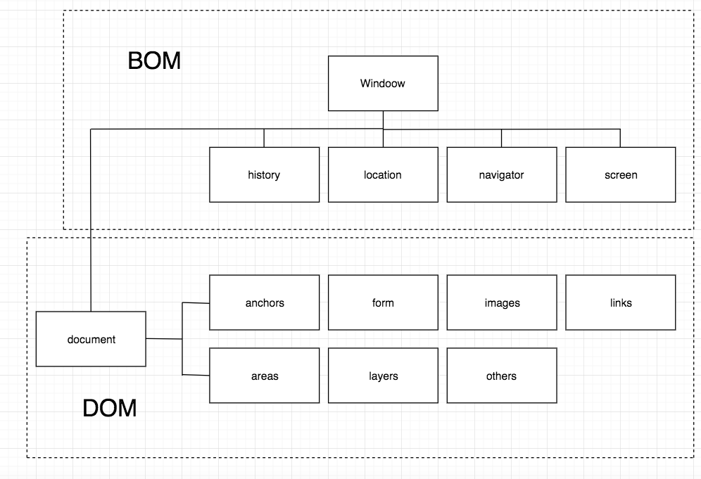
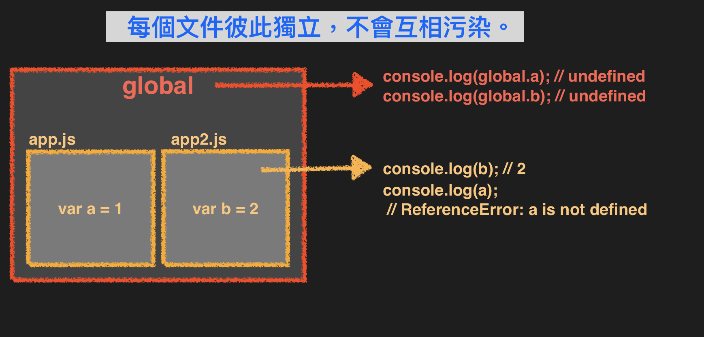
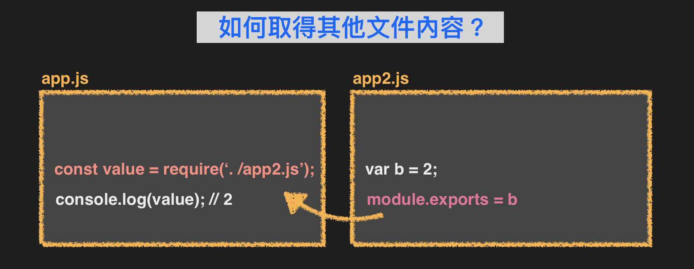
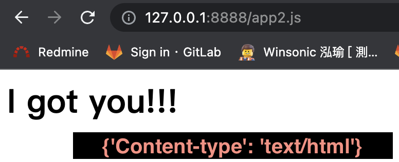
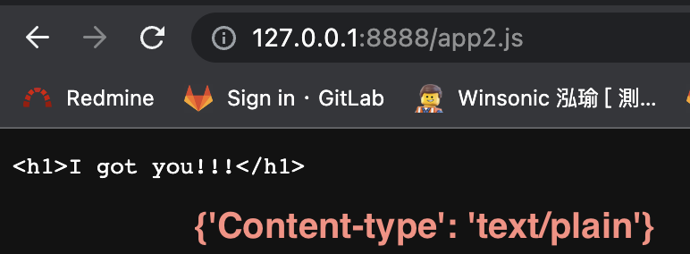

## What is V8 ?
- Javascript engine designed by Google. 
- Node.js follows V8 convention.
- With V8 engine, Node.js can execute Javascript on the browser behind the background.


## What's inside in Node.js?
#### According to [Node Github](https://github.com/nodejs/node) folder :

```
├──  deps: Dependencies
├──  src: Logic By C++
├──  lib: What Node.js provides functions and methods to users.

```

## How to execute your project by Node.js ?

#### STEP 1: Create a project folder 
#### STEP 2: Add `app.js` to your project with content `console.log("Hello Node!!!")`
#### STEP 3: Open by VScode
#### STEP 4: Execute `app.js` by Node.js with using terminal CLI

``` Folder Structure
    /practice_node_project
        /app.js
```

``` 
    my@mydeMacBook-Pro ~ % cd /Users/chenhuizhen/practice_node_project

    my@mydeMacBook-Pro practice_node_project % ls
    app.js

    my@cmydeMacBook-Pro practice_node_project % node app.js
    Hello Node!!!
```

---

## BOM vs DOM vs Node.js

|Comparison|BOM|DOM|Node.js|
|--|--|--|--|
|Definition|Brower Object Model<br/> Running on browser.|Document Object Model<br/>The html content object which browser parses.|Running on server.|
|Root Object Name|`window`<br/>represnet the browser window|--|`global`|
|繼承 `var a = 1`|同`window.a = 1`|--|`global.a = undefined` 沒有繼承，如果直接附值 `global.a = 1` 才有值。(每個檔案都是獨立模組，不會污染到 `global`)|
|details|`location` object: URL config; <br/> `screen` object: client-side browser sreen state; <br/>`history` object: store history(URL) list on current page; `navigator` object: contains information about the visitor's browser. (ex. `navigator.cookieEnabled`)<br/>|--|--|
|--|--|--|--|


[參考圖片來源](https://ithelp.ithome.com.tw/articles/10235079)

---

## Node.js 特性一：node文件彼此都是獨立模組(module)


## Node.js 特性二：`module.exports` 與 `require()`


:::info 匯出的其他寫法

```js
    module.exports = {
        content: "description",
        topic: "Node.js"
    }
```
等同於：
```js
    exports.content = "description"
    exports.topic = "Node.js"
```

印出內容：
`{ content: 'description', topic: 'Node.js' }`

---
**Q: 假設兩種寫法同時出現？**
```js
    module.exports = {
        content: "description",
        topic: "Node.js"
    }

    exports.content = "description2"
    exports.topic = "Node.js2"
```
印出內容：
`{ content: 'description2', topic: 'Node.js2' }`

*** # `module.exports` 會覆蓋掉 `exports.屬性名稱` 的寫法***
:::

---

## 開啟本地端 Server

```js
const http = require('http')

const server = http.createServer((req, res) => {
    res.writeHead(200, {'Content-type': 'text/plain'})
    res.write("<h1>I got you!!!</h1>")
    res.end()
})

server.listen(8888)
```
#### 紀錄
- 引入 `Node.js` 提供的模組 `http`
- 使用 `http.createServer()` 方法，開啟伺服器，參數為一 function。
- 該 function 有兩參數：`req` (Client-side),`res` (Server-side)。
- Server 結束回覆，要使用 `res.end()` 做結尾。
- 啟動 Server，要執行 `http.createServer(...).listen(8888)` 才算完成。
- `{'Content-type': 'OOO'}` 代表 Server 回傳的資料格式，瀏覽器會透過格式做不同的渲染處理。 

:::success `{'Content-type': 'OOO'}` 代表 Server 回傳的資料格式，瀏覽器會透過格式做不同的渲染處理。 
- #### `{'Content-type': 'text/plain'}` 瀏覽器渲染結果


---
- #### `{'Content-type': 'text/html'}` 瀏覽器渲染結果

:::

---
## Node : `__dirname` `__filename` `path`

- `__dirname` : 目前執行檔案的該**資料夾路徑**
- `__filename` : 目前執行檔案的該**檔案路徑**

資料夾結構：
```
- test
    - app.js
```

執行程式碼：
```js title="test/app.js"

__dirname: "/Users/chenhuizhen/practice_node_project/test"
__filename: "/Users/chenhuizhen/practice_node_project/test/app.js"

```

```js title="使用 Node.js 提供的 path 取得路徑資訊"
const path = require('path')

// 回傳指定路徑下的資料夾名稱：
console.log("🚀 path.dirname:", path.dirname('/level_1/level_2/file.js'))  
// 🚀 path.dirname: /level_1/level_2


// 回傳指定路徑下的檔案名稱：
console.log("🚀 path.basename:", path.basename('/level_1/level_2/file.js')) 
// 🚀 path.basename: file.js


// 回傳指定路徑下的檔案副檔名：
console.log("🚀 path.extname:", path.extname('/level_1/level_2/file.js'))   
// 🚀 path.extname: .js


// 回傳指定的合併路徑：
console.log("🚀 path.join:", path.join(__dirname,'123.js'))  
// 🚀 path.join: /Users/chenhuizhen/practice_node_project/test/123.js


// 回傳指定路徑的物件懶人包：
console.log("🚀 path.parse:", path.parse('/level_1/level_2/file.js'))  
// 🚀 path.parse: {root: '/', dir: '/level_1/level_2', base: 'file.js', ext: '.js', name: 'file'}

```

:::success `__dirname` 與 `path.diranme()` 差別？

||`__dirname`|`path.diranme()`|
|--|--|--|
|共同點|都是獲取當前頁面資料夾路徑。<br />返回的是指定路徑的目錄名稱，不包括檔案名稱。|
|差異點|一全局變量，任一檔案下皆可獲取，不需引入。|一函式，帶入路徑參數，須引入 `path` module。|

:::

---

## Postman 簡介
#### postman 是一個 測試 API 的 GUI 介面。


--- 
## Reference Sources:
- [BOM Browser Object Model](https://www.youtube.com/watch?v=kll5lN4Puhk)
- [DAY 2 BOM 、 DOM 是什麼？](https://ithelp.ithome.com.tw/articles/10235079)
- [[node] Path Module](https://pjchender.dev/nodejs/node-path/)
