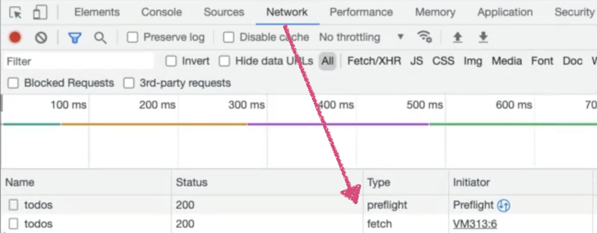
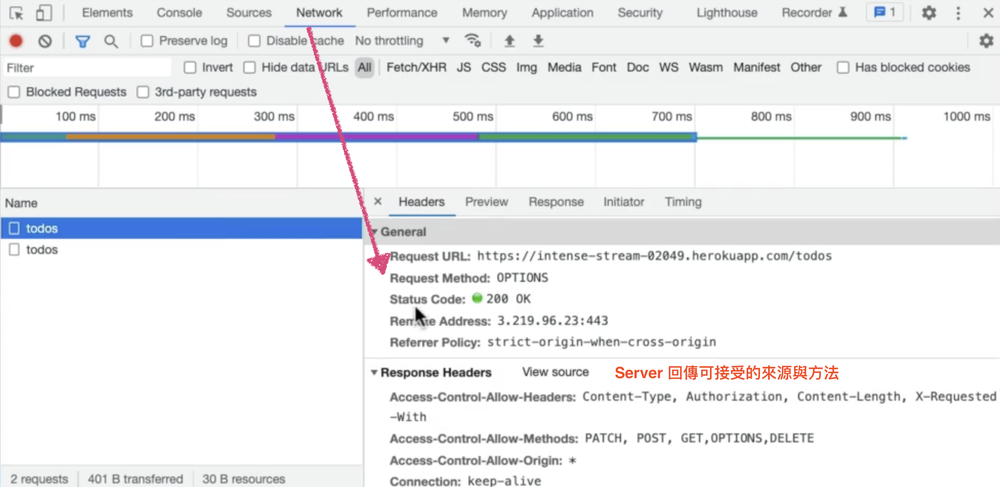

#### 前端在 Call API 時，明明只有向後端提出一次請求，但打開使用開發者工具查看 Network 執行紀錄時，有時候會發現有兩筆紀錄：
- Preflight Request（不是原本提出的請求，瀏覽器送的預檢請求）：使用 **Options Method**
- 前端提出的請求

---

## 什麼情況會出現 Preflight Request？
- 前後端網址在不同 Domain 上(IP address/跨網域)。
- 前後端 port 不同。
- 前後端 protocol 不同。
- 前端提出的請求是在 [不會有 Preflight Request](./node_preflight_request#什麼情況不會有-preflight-request) 情況之外。

**瀏覽器**會先 Call **Options API** 向 後端確認 是否允許接收請求。
    - 可以：才送前端提出的請求給到後端。
    - 不可以：回傳錯誤訊息。

*延伸：[網址的 Domain Name](/myWebsite/docs/record/record_URL_to_website#url-網址)*

---
## 什麼情況不會有 Preflight Request？

- HTTP 方法：
    - `GET` 請求
    - `HEAD` 請求：跟 GET 很像，但沒有 response body。
    - `POST` 請求
 
- Content-Type 標頭：
    - `Content-Type: application/x-www-form-urlencoded`
    - `Content-Type: multipart/form-data`
    - `Content-Type: text/plain`

**還有其他更詳細的細節：**
[MDN: 跨來源資源共用（CORS）/ Simple Request](https://developer.mozilla.org/zh-TW/docs/Web/HTTP/CORS#%E7%B0%A1%E5%96%AE%E8%AB%8B%E6%B1%82)

---

## 參考資源
- [MDN: 跨來源資源共用（CORS）](https://developer.mozilla.org/zh-TW/docs/Web/HTTP/CORS)
