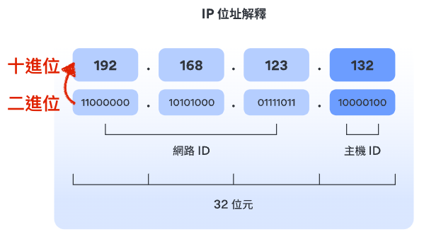

## 從點擊 LoginPage 到 首頁
（草稿）
1. 使用者輸入帳號、密碼
2. 
---

# TCP/IP 
 
[圖片來源](https://arch-long.cn/articles/network/OSI%E6%A8%A1%E5%9E%8BTCPIP%E5%8D%8F%E8%AE%AE%E6%A0%88.html)

## 網路訪問層 - Physical
#### 以太網路、WiFi

:::info <h2> 物理介質傳遞電信號（0、1）</h2>
  - 物理介質: 光纖、無線...
---
### 功能
1. 物理介質發送給目標主機。

2. 傳輸電信號01組成有意義的數據組

3. 一組數據就是一封包。

4. 封包內包含 來源MAC 地址、目標MAC地址。

5. 廣播封包給子網內所有主機，符合主機接收。（透過檢查首部中的目標MAC地址: 網卡廠商，唯一性）
:::

 
[圖片來源](http://www.cnt4all.com/2017/02/IEEE-802.3-LLC-frame-IEEE-802.3-SNAP-frame.html)

---
## 網路(互聯)層 - Network

:::info <h2>IP (Internet Protocol) : 網際網路協定</h2>

---
### 功能
#### (一) 定址(Addressing): 
  - 賦予網路裝置名稱或位址。
  - 用來辨認 來源主機(Host) 與 目標主機(Host) 是否在同個子網域。
  - 往上傳遞 TCP封包 或 UDP封包，往下傳遞至鏈接層給乙太網路。

#### (二) 路由 (Routing)：決定封包在網路之間的傳送路徑 。
:::

### 定址：IP位址
 
[圖片來源](https://nordvpn.com/zh-tw/blog/ziwanglu-zhezhao/)

### 路由

---
## 傳輸層 - Transport

---
## 應用層 - Application

---
## 參考資源
- [網路基礎 - TCP/IP](https://yakimhsu.com/project/project_w4_Network_TCP_IP.html)
- [OSI 模型、TCP/IP 协议栈](https://arch-long.cn/articles/network/OSI%E6%A8%A1%E5%9E%8BTCPIP%E5%8D%8F%E8%AE%AE%E6%A0%88.html)
- [Ethernet 網路 & 資料連結層PPT](https://slidesplayer.com/slide/14694635/)
- [網路概論 - IP 基礎與定址](http://www1.chihlee.edu.tw/teachers/chienhua/course/CN-2016S/CN-lecture03.pdf)
- [35张图详解路由器的40个常见问题](https://www.sdnlab.com/25499.html)
- [子網路遮罩介紹](https://www.youtube.com/watch?v=PApWx90wOfA)
- [子網路遮罩是什麼？](https://nordvpn.com/zh-tw/blog/ziwanglu-zhezhao/)
- [搞懂目錄位置 & 網路基礎概論](https://yakimhsu.com/project/project_w1_Networking_Introduction.html)
