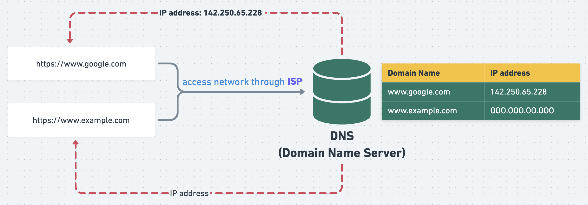

## 從點擊 LoginPage 到 首頁
（草稿）
1. 使用者輸入帳號、密碼
2. 

---

# TCP/IP 
 
[圖片來源](https://arch-long.cn/articles/network/OSI%E6%A8%A1%E5%9E%8BTCPIP%E5%8D%8F%E8%AE%AE%E6%A0%88.html)

## 物理層 - Physical / 網路存取層 - Network Access

:::info <h2> 物理介質傳遞電信號（0、1）</h2>
  - 物理介質: 光纖、無線...
  - #### 以太網路、WiFi
---
### 功能
1. 物理介質發送給目標主機。

2. 傳輸電信號01組成有意義的數據組。

3. 一組數據就是一封包。

4. 封包內包含 來源MAC地址、目標MAC地址。

5. 廣播封包給子網內所有主機，符合主機接收。（透過檢查首部中的目標MAC地址: 網卡廠商，唯一性）

 
[圖片來源](http://www.cnt4all.com/2017/02/IEEE-802.3-LLC-frame-IEEE-802.3-SNAP-frame.html)
:::

:::note <h2>數字：0 與 1 的世界</h2>
- 電腦運算的方式：非 0 即 1，一組會有八個單元(bits)，可以創造 256種排列。
    - 00000000
    - 00000001
    - 00000010
    - 00000011
    - ...
- #### 基礎單位：位元(bits)，`一組會有 8位元，8位元 (8 bits)= 1byte(一個位元組)` 。
:::

:::note <h2>MAC Address</h2>
- MAC Address = Media Access Control Address （媒體存取控制地址）。
- 又稱：「以太網路位址」(Ethernet Address)、「實體位址」（Physical Address）、「區域網路位址」（LAN Address）。
- 用來確認 網路裝置位置 的位址，每個網卡都有 唯一一個 MAC Address。
:::

---
## 網路(互聯)層 - Network

:::info <h2>IP (Internet Protocol) : 網際網路協定</h2>
- 網路交換封包的一種協定。
- `Network ID` + `Host ID`。
- 功能：定址(Addressing)、路由 (Routing)
---
### (一) 定址(Addressing): 
- 賦予網路裝置名稱或位址。
- 往上傳遞 TCP封包 或 UDP封包，往下傳遞至鏈接層給乙太網路。
- 用來辨認 來源主機(Host) 與 目標主機(Host) 是否在同個[子網域](#功能切割網路判斷目的地位置)。
  - 如果 來源主機(host) 與 目標主機(host) 的網路位址一樣，說明兩者在相同子網域上。
  - 如果 兩者在不同子網域上，就需要 **路由器** 幫忙。

 
[圖片來源](https://nordvpn.com/zh-tw/blog/ziwanglu-zhezhao/) 

### (二) 路由 (Routing)：決定封包在網路之間的傳送路徑 。

---
### IP類型
|名稱   |說明                                                                             |其他|
|------|---------------------------------------------------------------------------------|---|
|固定IP|IP位置固定。 適用公司企業網站、伺服器位置、列表機固定位置 等。                          |外網|
|浮動IP|每次連網的IP位置都不一樣：不容易受駭客鎖定、IP有限，釋出給需要使用的人。 適用一般家庭或個人。|外網|
|虛擬IP|外網無法連進來，內網IP可以重複。常用例如：`192.168`、`10.0`。                             |內網|

:::

:::note <h2>子網路遮罩 (Subnet Mask)</h2>
### 功能：切割網路、判斷目的地位置

---

:::

:::note <h2>域名 (Domain Name)</h2>
### 域名 是給人看的，IP address 是給電腦看的。
當我在點擊網址搜尋時，我要先到 DNS 查詢該網址的 IP位置，才知道要 目標主機(Host)確切位置。

---

 
[圖片來源](https://w3cschoool.com/what-is-domain)

|--|名稱|說明|其他|
|--|--|---|---|
|`http`、`https`|HyperText Transfer Protocol|通訊協定|SSL 憑證保護 Secure Sockets Layer|
|`www`          |Subdomain、Hostname (Third level domain)|子(次)網域、主機名稱|ex. `blog`|
|`google`       |SLD: Second Level Domain|自定義名稱，會影響SEO。|--|
|`com`          |TLD: Top Level Domain|標示網站的類型。 `com`代表 公司行號或營利單位。|`edu`代表 學校單位。 `gov`代表 政府機關。|

---
### DNS (Domain Name Space)
- 樹狀階層(hierarchy)架構

[圖片來源](https://www.seomining.com/web-technologies/module4/top-level-domains.php)

---
### DNS Cache
- 功能：
  #### 暫存最近造訪的網站IP位置，當每次輸入網址搜尋時，會先到 cache 查詢 有沒有對應 IP，有的話就不用再到 remote DNS 查詢，比較省時。
  > The DNS cache attempts to speed up the process even more by handling the name resolution of recently visited addresses before the request is sent out to the internet.

  > Before a browser issues its requests to the outside network, the computer intercepts each one and looks up the domain name in the DNS cache database. **The database contains a list of all recently accessed domain names and the addresses that DNS calculated for them the first time a request was made.**

- [什麼是 DNS 快取記憶體中毒？ | DNS 詐騙](https://www.cloudflare.com/zh-tw/learning/dns/dns-cache-poisoning/)
---

:::

:::tip <h2>port</h2>
### IP 相當於 「電話號碼」，port 相當於「分機號碼」。

---
#### 一台電腦對應一IP Address，如果我同時打開三個瀏覽器，並向Server送出請求。
#### Ｑ：Server 回傳 response，但電腦只有一IP Address，它要怎麼知道要資料分別回傳給哪一個瀏覽器？
#### Ａ：`IP Address：port`，透過 `port` 去辨認回應的指定端。

---
### 查詢電腦 IP by Mac Terminal
- `Curl ifconfig.me` : external IP address (which server response to the target IP address of my computer.)
- `ipconfig getifaddr en0` : This will return the IP address of your WiFi connection.
- `Ipconfig getifaddr en1` : The system will return the IP address for a wired Ethernet connection.
:::

---
## 傳輸層 - Transport

### TCP 三次握手

---
## 應用層 - Application

---

/TCP-IP.png?width=2640&name=TCP-IP.png)

---
## 參考資源
- [網路基礎 - TCP/IP](https://yakimhsu.com/project/project_w4_Network_TCP_IP.html)
- [OSI 模型、TCP/IP 协议栈](https://arch-long.cn/articles/network/OSI%E6%A8%A1%E5%9E%8BTCPIP%E5%8D%8F%E8%AE%AE%E6%A0%88.html)
- [Ethernet 網路 & 資料連結層PPT](https://slidesplayer.com/slide/14694635/)
- [網路概論 - IP 基礎與定址](http://www1.chihlee.edu.tw/teachers/chienhua/course/CN-2016S/CN-lecture03.pdf)
- [35张图详解路由器的40个常见问题](https://www.sdnlab.com/25499.html)
- [子網路遮罩介紹](https://www.youtube.com/watch?v=PApWx90wOfA)
- [子網路遮罩是什麼？](https://nordvpn.com/zh-tw/blog/ziwanglu-zhezhao/)
- [搞懂目錄位置 & 網路基礎概論](https://yakimhsu.com/project/project_w1_Networking_Introduction.html)
- [從傳紙條輕鬆學習基本網路概念](https://hulitw.medium.com/learning-tcp-ip-http-via-sending-letter-5d3299203660)
- [DNS Caching and How It Makes Your Internet Better](https://www.lifewire.com/what-is-a-dns-cache-817514)
- [What Is a Router and How Does It Work?](https://www.lifewire.com/what-is-a-router-2618162)
