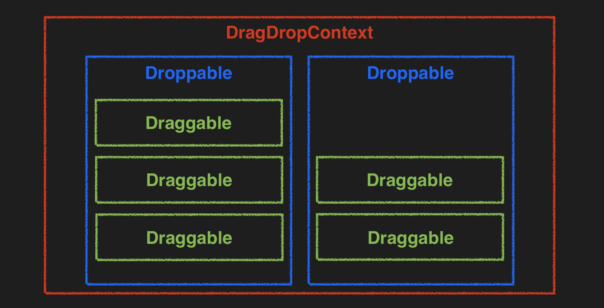

## Drag & Drop Concept in JS


---
## react-beautiful-dnd 組成要件


### (一) `DragDropContext`
Wrap components in drag and drop area, including: `Droppable` & `Draggable`.

<details>
  <summary><strong> DragDropContextProps 型別定義</strong></summary>

  ```typescript
  export interface DragDropContextProps {
      onBeforeCapture?(before: BeforeCapture): void;
      onBeforeDragStart?(initial: DragStart): void;
      onDragStart?(initial: DragStart, provided: ResponderProvided): void;
      onDragUpdate?(initial: DragUpdate, provided: ResponderProvided): void;
      // highlight-start 
      onDragEnd(result: DropResult, provided: ResponderProvided): void;
      // highlight-end 
      children: React.ReactNode | null;
      dragHandleUsageInstructions?: string | undefined;
      nonce?: string | undefined;
      enableDefaultSensors?: boolean | undefined;
      sensors?: Sensor[] | undefined;
  }
  ```
</details>

:::info required:
  - `onDragEnd(result: DropResult, provided: ResponderProvided): void;`
  - The responsibility of the onDragEnd is to synchronously update your state to reflect the drag and drop result. 
  - `result` 顯示參考：
  ```
  🚀 result:  {
      combine: null
      destination: {droppableId: 'filter', index: 0}
      draggableId: "currentResponsibleSales.startDate"
      mode: "FLUID"
      reason: "DROP"
      source: {index: 2, droppableId: 'unfilter'}
      type: "DEFAULT"
    }
  ```
:::


### (二) `Droppable`
#### 容器組件，承接 Draggable
<details>
  <summary><strong> DroppableProvided 型別定義</strong></summary>

  ```typescript
  export interface DroppableProvided {
    innerRef: (element: HTMLElement | null) => any;
    placeholder?: React.ReactElement<HTMLElement> | null | undefined;
    droppableProps: DroppableProvidedProps;
  }
  ```
</details>

<details>
  <summary><strong> DroppableProps 型別定義</strong></summary>

  ```typescript
  export interface DroppableProps {
      type?: TypeId | undefined;
      mode?: DroppableMode | undefined;
      isDropDisabled?: boolean | undefined;
      isCombineEnabled?: boolean | undefined;
      ignoreContainerClipping?: boolean | undefined;
      renderClone?: DraggableChildrenFn | undefined;
      getContainerForClone?: (() => React.ReactElement<HTMLElement>) | undefined;
      direction?: Direction | undefined; // 橫排、直排
      // highlight-start 
      droppableId: DroppableId;
      children(provided: DroppableProvided, snapshot: DroppableStateSnapshot): React.ReactElement<HTMLElement>;
      // highlight-end 
  }
  ```
</details>

:::info required:
#### Droppable
  - `key`: for React
  - `droppableId`: string，容器ID
  - `(provided): React.ReactElement<HTMLElement> => {...}` : children function<br/>
    - `react-beautiful-dnd` 提供回傳 ReactElement 的方法，使用者自定義 ReactElement 內容，children function return. 
    - `provided` 是一物件，包含`innerRef`、`droppableProps`、`placeholder`
  
---
#### 容器組件承接 children function 第一個參數 props `provided` 
  - `ref={provided.innerRef}`: 將自訂容器組件的DOM節點提供給 `react-beautiful-dnd` 參考。
  - `{...provided.droppableProps}`: 將`react-beautiful-dnd`資訊透過 props 傳給容器組件。
  - `{provided.placeholder}`: 拖曳元件時，空出一元件寬度。
:::

#### 結構圖
```js
  <Droppable
    key={}
    droppableId={}
  >
    {(provided) => (
      <容器組件 
        ref={provided.innerRef}
        {...provided.droppableProps}
      >
        // content in here
        {provided.placeholder}
      </容器組件>
    )}
  </Droppable>

```

### (三) `Droppable`
#### 拖曳元件
<details>
  <summary><strong> DroppableProps 型別定義</strong></summary>

```typescript
export type DraggableChildrenFn = (
  // highlight-start 
  provided: DraggableProvided,
  // highlight-end 
  snapshot: DraggableStateSnapshot,
  rubric: DraggableRubric,
) => React.ReactElement<HTMLElement>;

export interface DraggableProps {
    // highlight-start 
    draggableId: DraggableId;
    index: number;
    children: DraggableChildrenFn;
    // highlight-end 
    isDragDisabled?: boolean | undefined;
    disableInteractiveElementBlocking?: boolean | undefined;
    shouldRespectForcePress?: boolean | undefined;
}
```
</details>

:::info required:
  - `key`: for React
  - `draggableId`: string，每個拖曳元件ID<br/>
  - `index`: 拖曳元件位置(順序)
  - `(provided): React.ReactElement<HTMLElement> => {...}` : children function<br/>
    `react-beautiful-dnd` 提供回傳 ReactElement 的方法，使用者自定義 ReactElement 內容，children function return. 

  ---
  #### 拖曳組件承接 children function 參數 `provided`
  - `ref={provided.innerRef}`: 將拖曳組件的DOM節點提供給 `react-beautiful-dnd` 參考。
  - `{...provided.draggableProps}`: 將`react-beautiful-dnd`資訊透過 props 傳給拖曳組件。
  - `{...provided.dragHandleProps}`: 將 drag 途中資訊記錄起來，透過 props 傳給拖曳組件。         
  - [dragHandleProps](https://github.com/atlassian/react-beautiful-dnd/blob/master/docs/api/draggable.md#draghandleprops-type-information)
:::

---
## 實作
:::note GOAL
  製作共兩分類：已加入篩選、未加入篩選，點擊拖拉做分類。
:::

## 資料結構
#### 型別定義

```typescript type.ts
  export enum FilterConfig {
      FILTER = "filter",
      UNFILTER = "unfilter",
  };
 
  export interface GraggableStructure{
    sortData: {
        [key: string]: { id: string; name: string; }
    },
    groups: {
        [key: string]: { id: string; title: string; filterSortIds: string[]; }
    },
    groupsOrder: string[]
  }
```

```typescript initDragDopData.ts
const initDragAndDropData = {
    sortData: {
        "sortData-1" : { id: "sortData-1", name: "客戶編號" },
        "sortData-2" : { id: "sortData-2", name: "業務" },
        "sortData-3" : { id: "sortData-3", name: "開始日期" },
        "sortData-4" : { id: "sortData-4", name: "狀態" },
    },
    groups: {
        "filter" : {
            id: FilterConfig.FILTER, 
            title: "已加入篩選", 
            filterSortIds: []
        },
        "unfilter" : {
            id: FilterConfig.UNFILTER, 
            title: "未加入篩選", 
            filterSortIds: ["sortData-1", "sortData-2", "sortData-3", "sortData-4"]
        },
    },
    groupsOrder: [FilterConfig.FILTER, FilterConfig.UNFILTER]
}
```

#### 取資料的方式
```js
  initDragAndDropData.groupsOrder.map(order => {
    // To get target group
    const group = initDragAndDropData.groups[order];
    // To get target sortData
    const sortData = group.filterSortIds.map(sortId => initDragAndDropData.sortData[sortId])
  })
```

#### 更新拖拉資料 state
```js
  const handleDragEnd = (result: DropResult) => {
    const { source, destination } = result;
    const tempData: GraggableStructure = JSON.parse(JSON.stringify(data));

    const filterSortIds = tempData.groups[source.droppableId].filterSortIds;
    const [removed] = filterSortIds.splice(source.index, 1);
    filterSortIds.splice(destination.index, 0, removed);

    setData(tempData);
  }
```

---
## 遇到的問題
### 拖拉的過程，元件會先跑位，才回到正確位置
- [Items jumping when dropping on react beautiful dnd](https://stackoverflow.com/questions/59130533/items-jumping-when-dropping-on-react-beautiful-dnd)
- #### 解決方法：取消我元件設定的 transition css 

---
## DEMO
[DEMO 連結](https://codesandbox.io/embed/practice-react-beautiful-dnd-typescript-fi4yxz?fontsize=14&hidenavigation=1&theme=dark)

---
## 參考資源
- [react-beautiful-dnd](https://github.com/atlassian/react-beautiful-dnd)
- [React Beautiful Dnd 快速使用筆記](https://andyyou.github.io/2019/06/04/react-beautiful-dnd-quick-note/)
- [Drag and Drop in JS - W3 Schools](https://www.w3schools.com/html/tryit.asp?filename=tryhtml5_draganddrop2)
- [Drag and Drop functionality using react-beautiful-dnd](https://wearecommunity.io/communities/india-united-ui-community/articles/1242)
- [Scripted natural motion with react-beautiful-dnd](https://dev.to/raathigesh/scripted-natural-motion-with-react-beautiful-dnd-4ifj)
- [react-beautiful-dnd example](https://react-beautiful-dnd.netlify.app/?path=/story/multiple-horizontal-lists--stress-test)
- [react-beautiful-dnd tutorial video - egghead.io](https://egghead.io/lessons/react-customise-the-appearance-of-an-app-during-a-drag-using-react-beautiful-dnd-snapshot-values)
