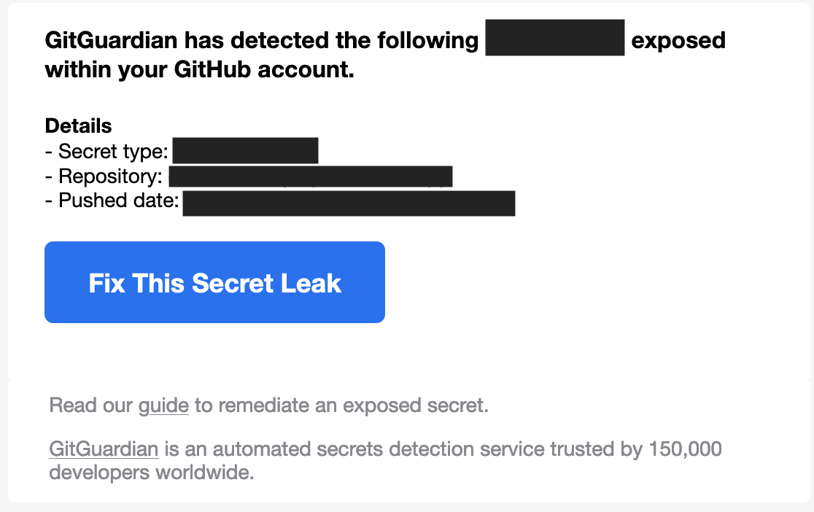

## 情境
使用 React 串接 OPEN SOURCE API，遇到 API 提供的 secret key，發現遇到以下問題：

### 錯誤寫法1：
之前還不知道環境變數這東西時，我真的直接把 API secret key上傳到 github，收到 github提醒:

### 錯誤寫法2：
1. 我使用 React建立專案
2. 建立 file 存取變數
2. 把該 file 放進 .gitignore
原本想說不會發佈到 github就沒事了，結果...

#### 會發生什麼問題？
:::warning
WARNING: Do not store any secrets (such as private API keys) in your React app!

Environment variables are embedded into the build, meaning anyone can view them by inspecting your app's files.
- [Adding Custom Environment Variables](https://create-react-app.dev/docs/adding-custom-environment-variables/#what-other-env-files-can-be-used)

Unfortunately, keeping any key in your React client, even if you are using gitignore and an .env file, is not secure.
You should really only save API keys or secrets in your backend such as Node / Express. You can have your client send a request to your backend API, which can then make the actual API call with the API key and send the data back to your client.
- [How do I hide API key in create-react-app?](https://stackoverflow.com/questions/48699820/how-do-i-hide-api-key-in-create-react-app)
:::

---

## `node.js`環境變數
(草稿)
<!-- 1. 專案會有 開發區\測試區\線上區，不同環境對應不同 資料庫、IP位置等。使用 環境變數 去帶入。 -->
2. `node.js` 提供:
  - `process`: `Node`一全域性變數。
  - `process.env`: 回傳一個包含用戶環境資訊的物件，也就是:當前專案執行環境的資訊。我們可以依照不同環境，帶入對應的變數資料。
3. 在根目錄建立不同檔案，代表不同環境對應:
  - `.env`: 默認配置。
  - `.env.dev`: 開發配置。
  - `.env.prod`: 生產配置。
4. `.env`內紀錄的配置不適合上傳至開放空間，故會放置在 `.gitignore`，讓資訊留在本機端。（換句話說，敏感資訊也可以透過這樣的方式進行保護）

:::note
The environment variables allow you to store API keys and other configuration secrets independently from your main codebase and separate from your git repository so they never get checked in anywhere.
- [How to use Environment Variables in NodeJs with Express and Dotenv](https://www.mickpatterson.com.au/blog/how-to-use-environment-variables-in-nodejs-with-express-and-dotenv/)
:::

## 什麼時候會用到環境變數？
1. 專案會有 開發區\測試區\線上區，可以用來區分環境對應的環境變數。
2. 使用 環境變數 統一參數設定: 不同環境對應不同 資料庫、IP位置、port、帳戶、密碼等。
3. 敏感資訊、不得外流的資料: API secret key

---

## 實作解法
#### 想法：
- 將 API secret key 存在 `.env` file
- 使用 express.js 建立 server，透過 `process.env.變數` 取得資料 (Sever-side)
- 使用 express 建立 API，成功回傳就傳送 `process.env.變數` 
- client-side 透過 call api 取得 API secret key (Client-side)
- `.env` file 放置在 `.gitignore`，避免上傳曝光 

1. install dotenv package
2. build `.env` file in the root
3. write something {varible}...
4. require("dotenv").config()
5. use `process.env.{varible}` to get value which in the `.env` file record

---

## 參考資源
- [process.env](https://nodejs.org/api/process.html#processenv)
- [Adding Custom Environment Variables](https://create-react-app.dev/docs/adding-custom-environment-variables)
- [Environment Variables in Client-Side](https://medium.com/@ai.ashkan9473/environment-variables-in-client-side-6a6ff51c6085)
- [How to access .env variables from client side JS](https://forum.freecodecamp.org/t/how-to-access-env-variables-from-client-side-js/331308)
- [[筆記] 認識 OAuth 2.0：一次了解各角色、各類型流程的差異](https://medium.com/%E9%BA%A5%E5%85%8B%E7%9A%84%E5%8D%8A%E8%B7%AF%E5%87%BA%E5%AE%B6%E7%AD%86%E8%A8%98/%E7%AD%86%E8%A8%98-%E8%AA%8D%E8%AD%98-oauth-2-0-%E4%B8%80%E6%AC%A1%E4%BA%86%E8%A7%A3%E5%90%84%E8%A7%92%E8%89%B2-%E5%90%84%E9%A1%9E%E5%9E%8B%E6%B5%81%E7%A8%8B%E7%9A%84%E5%B7%AE%E7%95%B0-c42da83a6015)
