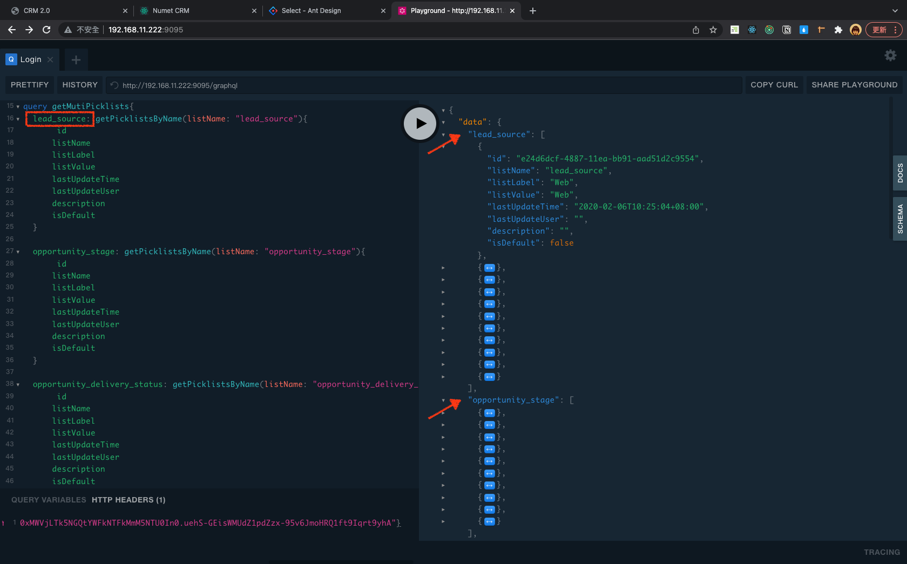
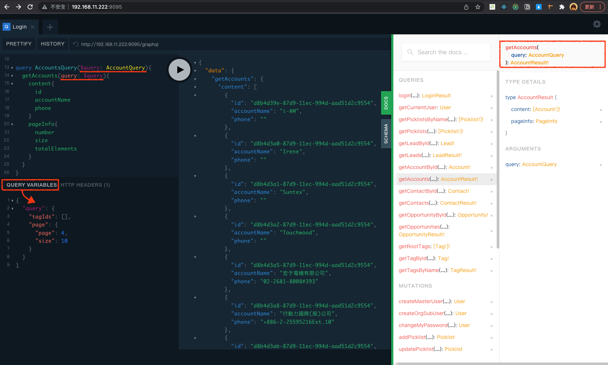

#### HTTP HEADERS

```
    {"Authorization": "Bearer token位置"}
```

#### QUERY VARIABLES
```
    {
        "query": {
            "tagIds": [],
            "page": {
            "page": 4,
            "size": 10
            }
        }
    }
```

#### Query

```
query GetAccountsQuery{
  getAccounts(query:{page:{page:0, size: 10}, tagIds: []}){
    content{
      id
      accountName
      accountOwner{
        name
        email
        description
      }
    },
    pageInfo{
      size
      number
      totalPages
      totalElements
    }
  }
}

```

```
query AccountsQuery($query: AccountQuery){
  getAccounts(query: $query){
    content{
      id
      accountName
      phone
    }
    pageInfo{
      number
      size
      totalElements
    }
  }
}

```




#### mutation

```
    mutation CreateOpportunityQuery{
        createOpportunity(input:{
            opportunityName:"測試",  
            nextStep:"下一步",
            orderNumber:"123456789", 
            mainCompetitors:"competitor",
            currentGenerators:"poppy",  
            trackingNumber:"938498",
            deliveryStatusId:"e24d6de1-4887-11ea-bb91-aad51d2c9554",  
            opportunitySourceId:"e24d6dd4-4887-11ea-bb91-aad51d2c9554",
            accountId:"d8b4d36b-87d9-11ec-994d-aad51d2c9554",  
            typeId:"e24d6df1-4887-11ea-bb91-aad51d2c9554",  
            stageId:"e24d6de9-4887-11ea-bb91-aad51d2c9554",  
            closeDate:"2022-03-30T03:15:34.184Z",
            probability:33,
            amount:220,
            description:"描述描述描述" 
        }) 
        {
            id
        }
    } 
```


### query lots in one time

```
query PickListsByName{
  getPicklistsByName(listName: "account_type"){
		id
    organizationId
  }
}
```

reply:
```
{
  "data": {
    "getPicklistsByName": [
      {
        "id": "e24d6da6-4887-11ea-bb91-aad51d2c9554",
        "organizationId": "e24c4dfe-4887-11ea-bb91-aad51d2c9554"
      },
      {
        "id": "e24d6da7-4887-11ea-bb91-aad51d2c9554",
        "organizationId": "e24c4dfe-4887-11ea-bb91-aad51d2c9554"
      },
      {
        "id": "e24d6da8-4887-11ea-bb91-aad51d2c9554",
        "organizationId": "e24c4dfe-4887-11ea-bb91-aad51d2c9554"
      },
      {
        "id": "e24d6da9-4887-11ea-bb91-aad51d2c9554",
        "organizationId": "e24c4dfe-4887-11ea-bb91-aad51d2c9554"
      },
      {
        "id": "e24d6daa-4887-11ea-bb91-aad51d2c9554",
        "organizationId": "e24c4dfe-4887-11ea-bb91-aad51d2c9554"
      },
      {
        "id": "e24d6dab-4887-11ea-bb91-aad51d2c9554",
        "organizationId": "e24c4dfe-4887-11ea-bb91-aad51d2c9554"
      },
      {
        "id": "e24d6dac-4887-11ea-bb91-aad51d2c9554",
        "organizationId": "e24c4dfe-4887-11ea-bb91-aad51d2c9554"
      }
    ]
  }
}

```

query lots:

```
  query PickListsByName{
    account_type: getPicklistsByName(listName: "account_type"){
      id
      listValue
    }
    
    customer_priority: getPicklistsByName(listName: "customer_priority"){
      id
      listValue
    }
    
    industry: getPicklistsByName(listName: "industry"){
      id
      listValue
    }
  }
```

reply:
```
{
  "data": {
    "account_type": [
      {
        "id": "e24d6da6-4887-11ea-bb91-aad51d2c9554",
        "listValue": "Prospect"
      },
      {
        "id": "e24d6da7-4887-11ea-bb91-aad51d2c9554",
        "listValue": "Customer - Direct"
      },
    ],
    "customer_priority": [
      {
        "id": "e24d6dad-4887-11ea-bb91-aad51d2c9554",
        "listValue": "High"
      },
      {
        "id": "e24d6dae-4887-11ea-bb91-aad51d2c9554",
        "listValue": "Low"
      },
      {
        "id": "e24d6daf-4887-11ea-bb91-aad51d2c9554",
        "listValue": "Medium"
      }
    ],
    "industry": [
      {
        "id": "e24d6db0-4887-11ea-bb91-aad51d2c9554",
        "listValue": "Agriculture"
      },
      {
        "id": "e24d6db1-4887-11ea-bb91-aad51d2c9554",
        "listValue": "Apparel"
      },
    ]
  }
}
```

重複寫法可改成 `fragment`：

```
  fragment responseData on 回傳的物件型別{
    id
    listValue
  }

  query PickListsByName{
    account_type: getPicklistsByName(listName: "account_type"){
      ...responseData
    }
    
    customer_priority: getPicklistsByName(listName: "customer_priority"){
      ...responseData
    }
    
    industry: getPicklistsByName(listName: "industry"){
      ...responseData
    }
  }
```




---

## GrapgQL vs. RESTful API
- RESTful concention:
  - URL naming
  - status code

- GrapgQL: 

- [GraphQL vs REST APIs | What’s the Best Kind of API?](https://codedamn.com/news/backend/graphql-vs-rest-apis-whats-the-best-kind-of-api)

---
## 參考資源
- [4 Simple Ways to Call a GraphQL API](https://www.apollographql.com/blog/graphql/examples/4-simple-ways-to-call-a-graphql-api/)

