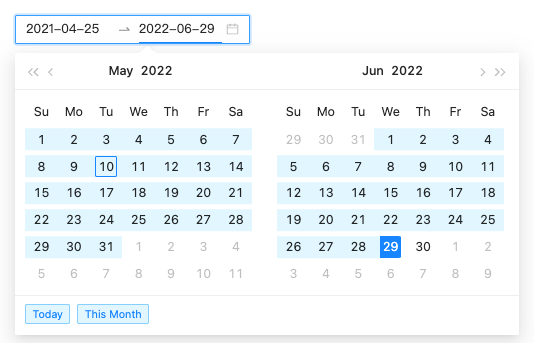
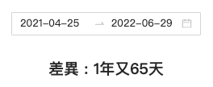

#### 紀錄一下 用 `moment.js` 計算時間差異，還有 `Javascript` 數字進位方法。
#### 使用 Library : [moment.js](https://momentjs.com/)

---
## 距離現在多久時間 (計算到日)

```js
    const targetTime = moment("2019-03-28");
    console.log("距今：", moment(targetTime, "YYYY-MM-DD").fromNow())
```
印出結果(這裡只顯示整數)

```
距今： 3 years ago 
```

---
## 距離現在的時間差 (計算到日)

<details>
  <summary><strong>moment 型別</strong></summary>

```typescript
  moment().diff(Moment|String|Number|Date|Array);
  moment().diff(Moment|String|Number|Date|Array, String);
  moment().diff(Moment|String|Number|Date|Array, String, Boolean);

  // 比較對象A的時間內容.diff(比較對象Ｂ的時間內容, 基礎時間單位, 是否精確至小數點): number;
```
</details>

```js
    const targetTime = moment("2019-03-28");
    const today = moment(moment().format("YYYY-MM-DD"));
    const diffFromNow = today.diff(targetTime);

    console.log("The diff. by milliseconds is: ", today.diff(targetTime));
    console.log("The diff. by years is: ", today.diff(targetTime, "years"));
    console.log("The diff. by years with float is: ", today.diff(targetTime, "years", true));
```
印出結果：
```
    The diff. by milliseconds is:  98409600000
    The diff. by years is:  3
    The diff. by years with float is:  3.1166666666666667
```

---
## 實務要求：顯示距今 OO年 OO天
### (一) Antd UI : 選擇時間範圍


```typescript
  const onChange = (date: moment.Moment[] | null, dateString: string[]) => {
    console.log("dateString: ", dateString); // ex: dateString:  (2) ["2021-04-25", "2022-06-29"]

    const before = moment(dateString[0]);
    const after = moment(dateString[1]);
    const totalDiffDay = after.diff(before, "days");
    const diffYears = totalDiffDay > 365 ? Math.floor(totalDiffDay / 365) : 0;

    setDiffDate({
      diffYears: diffYears,
      diffDays: totalDiffDay - diffYears * 365
    });
  };
```

```typescript
  <RangePicker
    ranges={{
        Today: [moment(), moment()],
        "This Month": [moment().startOf("month"), moment().endOf("month")]
    }}
    onChange={onChange}
  />
```
顯示效果：


### [ ✎ DEMO](https://codesandbox.io/s/practice-moment-js-diff-0ffnfr?file=/src/App.tsx)

### (二) 資料庫給一時間，計算距離今天多少天

```typescript
    const targetDate = moment("2019-03-28");
    const today = moment(moment().format("YYYY-MM-DD")); // 計算到日
    
    const diffFromNowByMs = today.diff(targetDate); // 單位：毫秒，紀錄在 data裡，顯示依需求再轉換單位。
```
```typescript
    // 顯示：OO年又OO月
    // 換算毫秒 >> 日：
    const transferMsToDays = row.diffFromNowByMs / 1000 / 60 / 60 / 24;
    const diffYears = (transferMsToDays > 365) ? Math.floor(transferMsToDays/365) : 0;
    const diffDays = transferMsToDays - diffYears * 365; // 扣除已算年的部分
```

### [ ✎ DEMO](https://codesandbox.io/s/practice-moment-js-diff-in-database-5p2h07?file=/src/App.tsx)

---
## 參考資料
- [Moment.js 計算兩個日期的年月日差異](https://yuan-0708.medium.com/moment-js-%E8%A8%88%E7%AE%97%E5%85%A9%E5%80%8B%E6%97%A5%E6%9C%9F%E7%9A%84%E5%B9%B4%E6%9C%88%E6%97%A5%E5%B7%AE%E7%95%B0-ac58c1245ecb)
- [diff()](http://momentjs.cn/docs/displaying/difference.html)