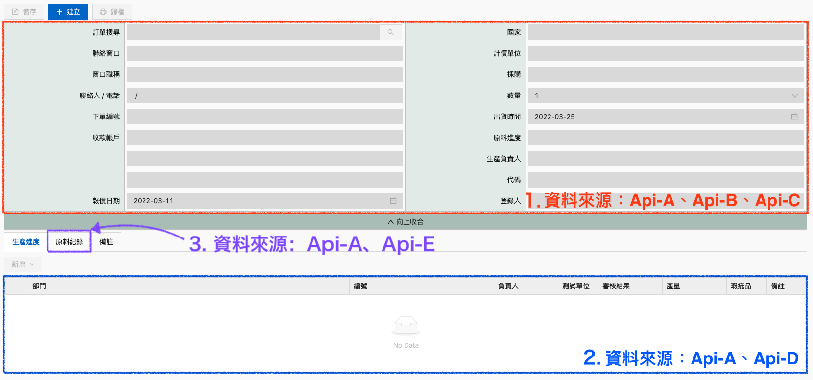

## 情境說明
版面資料來源1、2、3（如下圖），顯示資料需要call 多筆 API才能滿足所有顯示內容，共用資料來源為 API-A。

示意圖參考，內容與樣式皆為假資料

操作步驟如下：
1. 先 call API-A，拿到關聯的 customerID、productID、memberID
2. call API-B by customerID
3. call API-C、API-E by productID
4. call API-D by memberID
5. 使用 React 存取對應的資料 setState


使用 Typescript 做資料型別定義：
```typescript
  interface MainFormDataType{
    dataFromApiA: any[];
    dataFromApiB: any[];
    dataFromApiC: any[];
  }

  interface ProcessDataType{
    dataFromApiA: any[];
    dataFromApiD: any[];
  }

  interface MaterialRecordDataType{
    dataFromApiA: any[];
    dataFromApiE: any[];
  }
```

:::caution
  使用 Typescript 還是要盡量避免使用 型別 `any`，畢竟使用 Typescript 目的就是要建立明確的型別，以利後續維護。<br />
  這裡僅示意！
:::

使用 React 存取資料：分別為 mainFormData、processData、materialRecordData:
```jsx
  const [ mainFormData, setMainFormData ] = useState<MainFormDataType>([]);
  const [ processData, setProcessData ] = useState<ProcessDataType>([]);
  const [ materialRecordData, setMaterialRecordData ] = useState<MaterialRecordDataType>([]);
```

### 如果是使用 Promise 寫法：

```js
  API-A()
  .then(res => {
    /* Do something... */
    return res

  }).then(res => {
      API-B(res.customerID)
      .then(resByApiB => {
        /* Do something... */
      })

    return res
  }).then(res => {
      API-C(res.productID)
      .then(resByApiC => {
        /* Do something... */
      })
    
    return res
  }).then(res =>{
      API-D(res.memberID)
      .then(resByApiD => {
        /* Do something... */
      })
    
    return res
  }).then(res =>{
      API-E(res.productID)
      .then(resByApiE => {
        /* Do something... */
      })
  })
```
這樣寫的缺點：
1. 為了拿到API-A response，寫成巢狀寫法，看起來很難閱讀。
2. mainFormData、processData、materialRecordData 都需要 call 多個 api 才能補齊顯示需要的資料，但目前整串的寫法要拿到上層的 `res` 資料，要使用 `return res`，取值變得很麻煩。

---

改成 存取API-A response，把其他API 分開寫：
```js
  const [ resByApiA, setResByApiA ] = useState();

  API-A()
  .then(res => {
    setResByApiA(res);
  })

  useEffect(() => {    
    if(resByApiA.customerID){
        API-B(resByApiA.customerID)
        .then(resByApiB => {
          /* Do something... */
        })
    }

    if(resByApiA.productID){
        API-C(resByApiA.productID)
        .then(resByApiC => {
          /* Do something... */
        })

        API-E(resByApiA.productID)
        .then(resByApiE => {
          /* Do something... */
        })
    }

    if(resByApiA.memberID){
        API-D(resByApiA.memberID)
        .then(resByApiD => {
          /* Do something... */
        })
    }
  }, [resByApiA])


```
這樣寫的缺點：
1. call API-A 後 setState，但 setState 不是馬上改值，我無法確保state能在我預期的時間內執行，這樣就沒辦法確保資料即時顯示。（這是 React state的特性，與 promise本身無關）
2. 每個API 分開寫，不知道怎麼統一mainFormData、processData、materialRecordData 需要的資料？

---
### 如果是使用 `async-await` 寫法：
```js
  const gerData = async () => {
    try{
      const resByApiA = await API-A(); // 必須等待 API-A 成功回傳，才會進行下一行
      const resByApiB = await API-B(resByApiA.customerID);
      const resByApiC = await API-C(resByApiA.productID);
      const resByApiD = await API-D(resByApiA.memberID);
      const resByApiE = await API-E(resByApiA.productID);

      setMainFormData([{
        dataFromApiA: resByApiA,
        dataFromApiB: resByApiB,
        dataFromApiC: resByApiC
      }]);

      /* ... */

    }catch(err){
      console.log(err)
    }
  }
```

在這裡，可以很明顯看到 `async-await` 的優勢：
1. code 很容易閱讀，後續要維護也容易
2. 因為 `await` 的特性，我不用擔心沒拿到 API-A response，導致後面 API 出問題。
3. 合併多個 API response data，改成版面需要的資料規格也變得很容易。

---
## 參考資源
- [A Comparison Of async/await Versus then/catch](https://www.smashingmagazine.com/2020/11/comparison-async-await-versus-then-catch/)
- [Async/await](https://javascript.info/async-await)