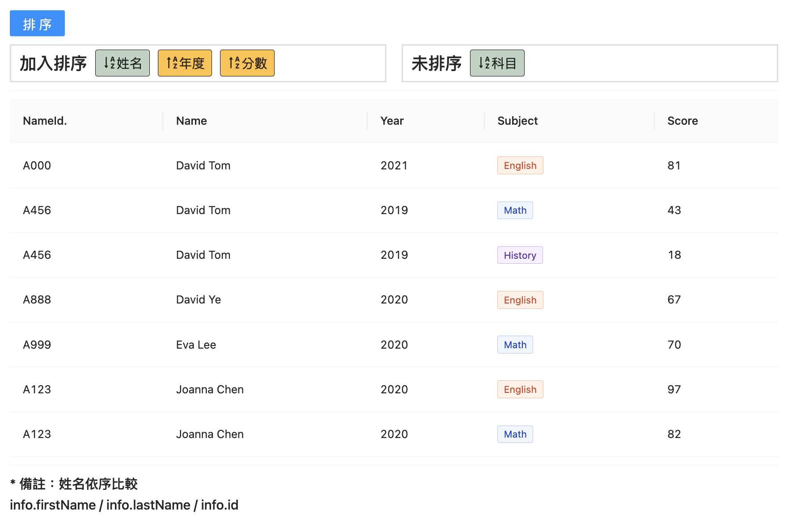
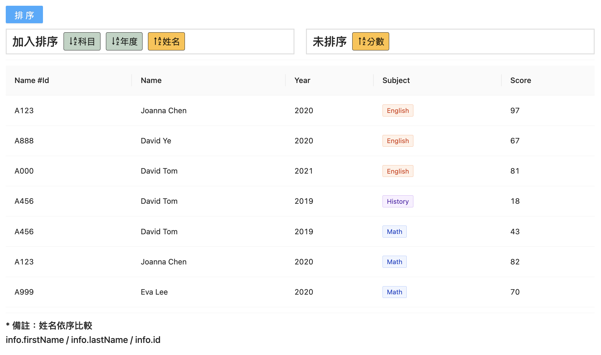

## 資料結構
<details>
  <summary><strong>DataType</strong></summary>

  ```typescript
    export interface DataType {
      id: number;
      info: { id: string; firstName: string; lastName: string };
      year: number;
      subject: { title: string; score: string };
    }
  ```
</details>

```typescript
export const rowData: DataType = [
  {
    id: 1,
    info: { id: "A123", firstName: "Joanna", lastName: "Chen" },
    year: 2020,
    subject: { title: "English", score: "97" }
  },
  {
    id: 2,
    info: { id: "A456", firstName: "David", lastName: "Tom" },
    year: 2019,
    subject: { title: "Math", score: "43" }
  },
  {
    id: 3,
    info: { id: "A456", firstName: "David", lastName: "Tom" },
    year: 2019,
    subject: { title: "History", score: "18" }
  },
  {
    id: 4,
    info: { id: "A123", firstName: "Joanna", lastName: "Chen" },
    year: 2020,
    subject: { title: "Math", score: "82" }
  },
  {
    id: 5,
    info: { id: "A000", firstName: "David", lastName: "Tom" },
    year: 2021,
    subject: { title: "English", score: "81" }
  },
  {
    id: 6,
    info: { id: "A888", firstName: "David", lastName: "Ye" },
    year: 2020,
    subject: { title: "English", score: "67" }
  },
  {
    id: 7,
    info: { id: "A999", firstName: "Eva", lastName: "Lee" },
    year: 2020,
    subject: { title: "Math", score: "70" }
  }
];
```
---

## 建立UI - 篩選選項：使用 [Drag & Drop](/docs/record/record_dragAndDrop)
#### 功能：篩選排列先後順序、選擇 ASC、DESC


## 實務上遇到的問題
### (一) 同名且同姓的人。篩選結果，兩人資料可能會混在一起！
#### ＊解決辦法： 在分類姓名時，還要加上「個人id」做識別。
  
  |順序|取值|說明|
  |--|--|--|
  |1.|`info.firstName`|--|
  |2.|`info.lastName`|如果`info.firstName`一樣，篩`info.lastName`|
  |3.|`info.id`|如果`info.firstName` `info.lastName` 一樣，篩`info.id`|

<details>
  <summary><strong>GraggableStructure</strong></summary>

  ```typescript
    export enum FilterConfig {
      FILTER = "filter",
      UNFILTER = "unfilter"
    }
    export enum SortConfig {
      ASC = "ASC",
      DESC = "DESC"
    }
    export interface SortDataType {
      id: string;
      name: string;
      sort: string;
    }

    export interface GraggableStructure {
      sortData: {
        [key: string]: SortDataType;
      };
      groups: {
        [key: string]: { id: string; title: string; filterSortIds: string[] };
      };
      groupsOrder: string[];
    }
  ```
</details>

<details>
  <summary><strong>dragDropData</strong></summary>

  ```typescript
    // 為了辨別同名同姓，加入個人id 識別
    export const personNameOrder = ["info.firstName", "info.lastName", "info.id"];

    /**
     * 篩選條件：
     * 姓名
     * 年度
     * 分數
     * 科目
     */

    export const initDragDropData: GraggableStructure = {
      sortData: {
        personName: { id: "personName", name: "姓名", sort: SortConfig.ASC },
        year: { id: "year", name: "年度", sort: SortConfig.DESC },
        "subject.score": {
          id: "subject.score",
          name: "分數",
          sort: SortConfig.DESC
        },
        "subject.title": { id: "subject.title", name: "科目", sort: SortConfig.ASC }
      },
      groups: {
        filter: {
          id: FilterConfig.FILTER,
          title: "加入排序",
          filterSortIds: []
        },
        unfilter: {
          id: FilterConfig.UNFILTER,
          title: "未排序",
          filterSortIds: ["personName", "year", "subject.score", "subject.title"]
        }
      },
      groupsOrder: [FilterConfig.FILTER, FilterConfig.UNFILTER]
    };
  ```
</details>

### (二) 使用 `sort((a, b) => {...})` 做排序時，要一次性將所有條件全部做完
> 假設目前排序條件：
> 1. 年度由低到高
> 2. id由小到大

<details>
  <summary><strong>正確寫法</strong></summary>

  ```js
    data.sort((a, b) => {
      return a.year - b.year || a.id - b.id
    })
    console.log(data)
  ```

  回傳內容：
  ```
    (6) [{…}, {…}, {…}, {…}, {…}, {…}]
    0: {id: 2, info: {…}, year: 2019, subject: {…}}
    1: {id: 1, info: {…}, year: 2020, subject: {…}}
    2: {id: 3, info: {…}, year: 2020, subject: {…}}
    3: {id: 5, info: {…}, year: 2020, subject: {…}}
    4: {id: 6, info: {…}, year: 2020, subject: {…}}
    5: {id: 4, info: {…}, year: 2021, subject: {…}}
  ```
</details>

<details>
  <summary><strong>錯誤寫法</strong></summary>

  ```js
    const fields = ["year", "id"];
    for(const condition of fields){
      data.sort((a, b) => a[condition] - b[condition]))
    }
    console.log(data)
  ```

  回傳內容：
  ```
    (6) [{…}, {…}, {…}, {…}, {…}, {…}]
    0: {id: 1, info: {…}, year: 2020, subject: {…}}
    1: {id: 2, info: {…}, year: 2019, subject: {…}}
    2: {id: 3, info: {…}, year: 2020, subject: {…}}
    3: {id: 4, info: {…}, year: 2021, subject: {…}}
    4: {id: 5, info: {…}, year: 2020, subject: {…}}
    5: {id: 6, info: {…}, year: 2020, subject: {…}}
  ```
  因為每一次都是重新排列，所以 `year`排序資料被 `id`排序資料覆蓋。
</details>


:::note
  #### ＊ASC:  由小到大
  #### ＊DESC: 由大到小
:::

---
## 目標顯示 1
依序
1. 姓名由A到Z
2. 年度由高到低
3. 分數由高到低

<details>
  <summary><strong>預期資料顯示結果</strong></summary>

```js
  const data = [
    {
      id: 4,
      info: { id: "A000", firstName: "David", lastName: "Tom" },
      year: 2021,
      subject: { title: "English", score: "81" }
    },
    {
      id: 2,
      info: { id: "A456", firstName: "David", lastName: "Tom" },
      year: 2019,
      subject: { title: "Math", score: "43" }
    },
    {
      id: 3,
      info: { id: "A456", firstName: "David", lastName: "Tom" },
      year: 2019,
      subject: { title: "History", score: "18" }
    },
    {
      id: 5,
      info: { id: "A888", firstName: "David", lastName: "Ye" },
      year: 2020,
      subject: { title: "English", score: "67" }
    },
    {
      id: 6,
      info: { id: "A999", firstName: "Eva", lastName: "Lee" },
      year: 2020,
      subject: { title: "Math", score: "70" }
    },
    {
      id: 1,
      info: { id: "A123", firstName: "Joanna", lastName: "Chen" },
      year: 2020,
      subject: { title: "English", score: "97" }
    },
    {
      id: 3,
      info: { id: "A123", firstName: "Joanna", lastName: "Chen" },
      year: 2020,
      subject: { title: "Math", score: "82" }
    },
  ];
```
</details>

### How to do that?
|順序|取值|說明|排序|
|--|--|--|--|
|1. 姓名由A到Z|`info.firstName`|--|ASC|
|--|`info.lastName`|如果`info.firstName`一樣，篩`info.lastName`|ASC|
|--|`info.id`|如果`info.firstName` `info.lastName` 一樣，篩`info.id`|ASC|
|2. 年度由高到低 |`year`|--|DESC|
|3. 分數由高到低|`subject.score`|--|DESC|

### (一) 先確認我們拿到的篩選內容：
```typescript
  const handleClick = (currentDragDropData: GraggableStructure) => {
    const copyDragDopData: GraggableStructure = JSON.parse(
      JSON.stringify(currentDragDropData)
    );
    const targetFilterSortIds: string[] = copyDragDopData.groups["filter"].filterSortIds;
    const sortData: SortDataType[] = targetFilterSortIds.map(sortId => copyDragDopData.sortData[sortId]);
    console.log("current filter value: ", sortData);
    // ...
  };
```
印出資料：
```js
  current filter value: [
    {
      // highlight-start
      id: "personName",
      // highlight-end
      name: "姓名",
      sort: "ASC",
    }, 
    {
      id: "year",
      name: "年度",
      sort: "DESC",
    }
  ];
```
我們發現：篩選內容有加入姓名(`id: "personName"`)，需另外帶入辨別順序：<br />
`const personNameOrder = ["info.firstName", "info.lastName", "info.id"];`

```typescript
  const handleClick = (currentDragDropData: GraggableStructure) => {
    // ...
    const filterData: SortDataType[] = [];
      targetFilterSortIds.forEach((sortId) => {
        // highlight-start
        if (sortId === "personName") {
          personNameOrder.forEach((item) => {
            const temp = { ...copyDragDopData.sortData["personName"] };
            temp.id = item;
            filterData.push(temp);
          });
          // highlight-end
        } else {
          filterData.push(copyDragDopData.sortData[sortId]);
        }
      });

      console.log("current filter value: ", filterData);
  }
```

印出資料(依序)：
```js
  current filter value: [
    {
      id: "info.firstName"
      name: "姓名",
      sort: "ASC",
    }, 
    {
      id: "info.lastName"
      name: "姓名",
      sort: "ASC",
    }, 
    {
      id: "info.id"
      name: "姓名",
      sort: "ASC",
    }, 
    {
      id: "year",
      name: "年度",
      sort: "DESC",
    }
  ];
```

### (二) 功能拆開：
- 判別 ASC、DESC

```typescript
  const compareSortValue = ( sort: string, valueA: string | number, valueB: string | number ): number => {
    if(valueA < valueB){
      return sort === "ASC" ? -1 : 1
    }

    if(valueA > valueB){
      return sort === "ASC" ? 1 : -1
    }

    return 0
  }
```

### (三) 我們會遇到兩個問題：

目前，我們知道要 依排序順序篩出，像是：
```js
  const tempData = [...data];
    tempData.sort((a, b) => {
      return compareSortValue("ASC" , a.info.firstName, b.info.firstName)
        || compareSortValue("ASC" , a.info.lastName, b.info.lastName)
        || compareSortValue("ASC" , a.info.id, b.info.id)
        || compareSortValue("DESC" , a.year, b.year)
    });

  setData(tempData);
```
> 但是，我們會遇到：
> #### Ｑ1. 不知道使用者會選擇哪些篩選項目，很顯然上面的方式是行不通的！
> #### Ｑ2. 我要怎麼把所有篩選條件一次帶入？

### Ｑ1：How to sort by multiple conditions w/ flexible way ?
如果我想建立共用的篩選條件 function，每次帶入的條件都不一樣，要怎麼做？
- 取得物件屬性值: 才能作比較(a, b)
- 透過 sortData 內 id:

```typescript
  const findTargetValue = (targetData: DataType, dataIndex: string[], currentValue: any) => {
    if (dataIndex.length === 0) {
      return currentValue;
    }

    const tempIndex = [...dataIndex];
    const property = tempIndex[0];
    const findValue = currentValue[property];
    tempIndex.splice(0, 1);

    return findTargetValue(targetData, tempIndex, findValue);
  };
```

假設我想取得 `subject.title` 的值：([參考上面](#一-先確認我們拿到的篩選內容))
```js
  const testData = {
    id: 1,
    info: { id: "A123", firstName: "Joanna", lastName: "Chen" },
    year: 2020,
    subject: { title: "English", score: "97" }
  };
  const dataIndex = ["subject", "title"];

  console.log("findTargetValue result: ", findTargetValue(testData, dataIndex, testData));
```

印出結果：
```js
  findTargetValue result: English
```

### Ｑ2：來解決第二個問題 <br />我們使用 `sort()` 還需要一次性把所有篩選項目比較完，才能得到正確結果。
```typescript
  // compareList: 一陣列，紀錄每個篩選條件的 id, sort, valueA, valueB。
  const compareFn = (compareList: CompareListType[]) => {
    if (compareList.length === 0) {
      return 0;
    }

    const tempSortList = [...compareList];
    const compareResult = compareSortValue(
      tempSortList[0].sort,
      tempSortList[0].valueA,
      tempSortList[0].valueB
    );
    if (compareResult !== 0) {
      return compareResult;
    } else {
      tempSortList.splice(0, 1);
      return compareFn(tempSortList);
    }
  };
```

帶入篩選條件：
```typescript
  const handleSortByConditions = (data: DataType[], filterData: SortDataType[]) => {
    const tempData = [...data];
    tempData.sort((a, b) => {
      const compareList = [];
      for (const condition of filterData) {
        const { id, sort } = condition;
        const dataIndex = id.split(".");
        const valueA = findTargetValue(a, dataIndex, a);
        const valueB = findTargetValue(b, dataIndex, b);

        compareList.push({ id, sort, valueA, valueB });
      }

      return compareFn(compareList); // return compare Result in one time
    });

    setData(tempData);
  };
```

效果符合預期：<br />


## DEMO
#### [ ✎ DEMO](https://codesandbox.io/s/practice-sort-by-multiple-conditions-w-flexible-way-0dgg7k?file=/Demo/index.js)

---
## 目標顯示 2
依序
1. 科目由A到Z
2. 年度由低到高
3. 名字由Z到A

<details>
  <summary><strong>預期資料顯示結果</strong></summary>

```js
  const data = [
    {
      id: 1,
      info: { id: "A123", firstName: "Joanna", lastName: "Chen" },
      year: 2020,
      subject: { title: "English", score: "97" }
    },
    {
      id: 5,
      info: { id: "A888", firstName: "David", lastName: "Ye" },
      year: 2020,
      subject: { title: "English", score: "67" }
    },
    {
      id: 4,
      info: { id: "A000", firstName: "David", lastName: "Tom" },
      year: 2021,
      subject: { title: "English", score: "81" }
    },
    {
      id: 3,
      info: { id: "A456", firstName: "David", lastName: "Tom" },
      year: 2019,
      subject: { title: "History", score: "18" }
    },
    {
      id: 2,
      info: { id: "A456", firstName: "David", lastName: "Tom" },
      year: 2019,
      subject: { title: "Math", score: "43" }
    },
    {
      id: 3,
      info: { id: "A123", firstName: "Joanna", lastName: "Chen" },
      year: 2020,
      subject: { title: "Math", score: "82" }
    },
    {
      id: 6,
      info: { id: "A999", firstName: "Eva", lastName: "Lee" },
      year: 2020,
      subject: { title: "Math", score: "70" }
    },
  ];
```
</details>

效果符合預期：<br />


---
## 參考資源
- [JS: Sort an Array of Objects on multiple columns/keys](https://dev.to/markbdsouza/js-sort-an-array-of-objects-on-multiple-columns-keys-2bj1)
- [Sorting an array by multiple criteria with vanilla JavaScript](https://gomakethings.com/sorting-an-array-by-multiple-criteria-with-vanilla-javascript/)
- [Node.js的Array.sort](https://medium.com/@mr.whatever/node-js%E7%9A%84array-sort-75a13076318c)
- [请教一个算法问题，数组分组排序](https://segmentfault.com/q/1010000007600522)

- [How to sort an array of objects by multiple fields?](https://stackoverflow.com/questions/6913512/how-to-sort-an-array-of-objects-by-multiple-fields)
- [How to order a JSON object by two keys?](https://stackoverflow.com/questions/3230028/how-to-order-a-json-object-by-two-keys/3230748#3230748)
- [localeCompare()的用法](https://medium.com/appxtech/localecompare-%E7%9A%84%E7%94%A8%E6%B3%95-6be2ab8401ad)
