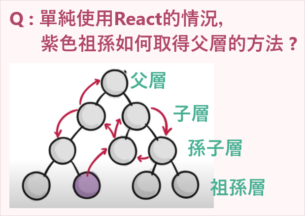
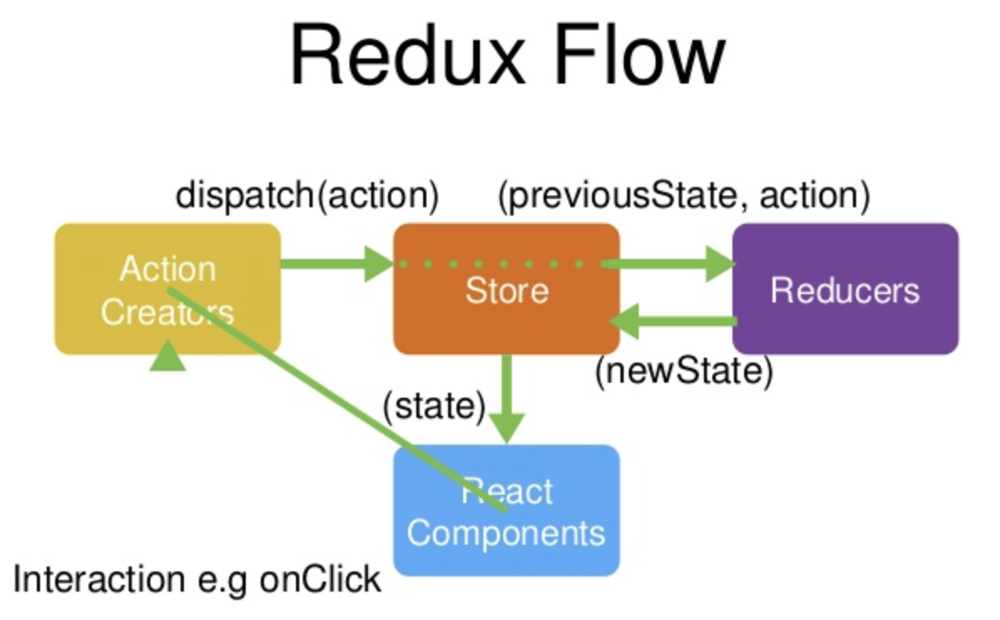

# Redux Intro
在談 Redux 之前，來補充 React 特性：
#### React元件組聯繫方式：父元件透過屬性向子元件傳值，子元件透過方法去調用父元件並修改state。
<details>
  <summary><strong>如何溝通 ?</strong></summary>

  - 父層向子層溝通 :
    - 在父層的子元件標籤內寫入屬性與值
    - 子層透過props接收到父層傳下的內容
  - 子層向父層溝通 :
    - 在父層的子元件標籤內寫入屬性與值 ( 父層定義好的方法 )
    - 子層透過props接收到父層傳下的方法，間接呼叫父層方法做事

</details>

#### 單向數據流
- 父元件可以傳值給子元件
- 子元件 **「不可以」** 直接修改父元件傳來的值 **(read only)**
- 如果子元件想要改變state，即透過父元件定義好的方法，間接操作state。

<details>
  <summary><strong>為什麼這樣設計 ?</strong></summary>

  - 開發不容易出錯
  - state查錯來源單一

  舉例 : 一父元件擁有10個子元件，父層傳state每個子元件，如果子元件可以修改state，一旦要查state bug，就必須每個子元件都查，維護不易。

</details>

---

回來正題：
### Ｑ： Redux 用來解決什麼問題？
在大型專案項目中使用 React，會遇到以下問題：


- 祖孫要調用父層方法: 祖孫 → 孫子 → 子層 → 父層
- 父層傳更新state給祖孫: 父層 → 子層 → 孫子 → 祖孫

假設父層下有 100個 子元件，第80個子元件需要父層的 `state`、`setState`，中間的子元件都不會用到，但為了給第80個子元件必須要傳下去。假設中間有出問題，就要所有傳遞的子元件都翻一輪...

#### 為了解決上面的問題，而產生 Redux：建立公用資料，任一子元件有需求，直接到公用資料拿，不用穿越好幾個元件。
:::caution
  但不要完全丟棄 `props`，把所有資料都丟進 Redux!
  我們只針對幾乎每個 component 都會用到的，像是：使用者登入資訊、UI主題色，或是有多國語言翻譯的網頁等等，把這些資料放到 Global scope。
:::

---
## 前置準備
```
  yarn add redux
```

### 資料夾結構
```
  └── src
      ├── store
      │    └── index.js
      │
      ├── reducer
      │    └──index.js
      │
      ├── common
      │    ├── actionCreator.js
      │    ├── actionTypes.js
      │    └── ...
      │
      ├── components
      │    ├── component.js
      │    └── ...
      └── ...
```

## Redux 概念
[圖片來源](https://www.youtube.com/watch?v=-aHvIoMxASk&list=PL9nxfq1tlKKnza3MPogWqaYIPtdW_G2lF&index=29)

|                    |扮演的角色                          |負責內容                                                       |說明               |
|--------------------|----------------------------------|--------------------------------------------------------------|------------------|
|`store`             |管理員                             |負責管理共用資料 與 傳遞 `preState`、`action` 給 `reducer`         |[說明](#store)    |
|`reducer`           |管理員的電腦                        |依照指令執行動作(`actiion.type`)，回傳**更新後的`state`**給`store`  |[說明](#reducer)  |
|`action`            |使用者想要做的事                     |一物件，內容包含：`{type: 指令, payload: 新的值}`                  |[說明](#action)   |
|`store.dispatch()`  |使用者傳送給管理員的動作              |--                                                             |[說明](#dispatch) |
|`store.subscribe()` |子元件訂閱 `store` 的動作            |有訂閱該共用資料的子元件，都會一併做更新。                            |[說明](#subscribe)|


### `store`
> 給圖書管管理員(store)配置一台電腦(reducer)。

- 使用 `createStore`方法，建立一 `store`（唯一），參數帶入 `reducer`

```js title="src/store/index.js"
  import { createStore } from 'redux';
  import reducer from '../reducer';

  const store = createStore(reducer);
  export default store;
```

### `action`
> 我來到圖書館來借書，書名叫：哈利波特(action)。

```js title="src/components/component.js"
  const action = {
    type: "borrow_a_book",
    payload: {name: "Harry Poter", status: "borrowed"}
  }
```

### action creator function
- action creator function: generate actions 
- 每次執行動作都要產生一action，寫成函式帶入指令與值。

```js title="src/common/actionCreator.js"
  const actionCreator = (type, payload) => {
    return({ type, payload })
  }

```

### `store.dispatch()`
> 我告訴管理員(store)：「我想借書，書名叫：哈利波特」(action)。 <br />
> 管理員輸入資料進電腦(reducer)，發現 哈利波特 目前在館內 (preState)，點擊借書按鈕(action)。

```js title="src/components/component.js"
  store.dispatch(action);
```

### `reducer`
> 電腦(reducer)執行借書動作，修改哈利波特的藏書狀態：在館內 --> 已借出。

:::info
- `store` 無法更新值，只有 `reducer`可以。
- `reducer` 必須是 **pure function**，以確保所有的變更I/O 一致。
- `state` 第一次帶入預設值 `initialState`，後續為 `store` 帶來的 `preState`。
- 依指令做事
  - **不能直接改 `state`，所以要 deep copy 一份，改拷貝的值。**
  - 回傳更新的值。
:::

```js title="src/reducer/index.js"
  import reducer from '../reducer';

  const initialState = {
    name: "",
    status: ""
  }

  const reducer = (state = initialState, action) => {
    // 依指令做事
    switch(action.type){
      case 指令1: 
        // 不能直接改 state，所以要 copy一份，改copy的值

        // 回傳更新的值
      break;

      case "borrow_a_book": 
        const copyState = JSON.parse(JSON.stringify(state));
        copyState.status = action.status;

        return copyState;
      ...

      default:
        return state;
    }
  }
```

### build constant type
- `reducer` 會先過濾 `action.type` 才執行動作，重複寫指令過程如果寫錯，IDE也不會報錯，要查錯無從查起。
- 使用常數存取指令，一來減少重複輸入錯誤，二來常數寫錯IDE會報錯提醒。

```js title="src/common/actionTypes.js"
  export const BORROW_A_BOOK = "borrow_a_book";
```

```js title="src/components/component.js"
  import { BORROW_A_BOOK } from '../common/actionTypes.js'

  const action = {
    // highlight-start
    type: BORROW_A_BOOK,
    // highlight-end  
    payload: {name: "Harry Poter", status: "borrowed"}
  }
```

```js title="src/reducer/index.js"
  import reducer from '../reducer';
  import { BORROW_A_BOOK } from '../common/actionTypes.js'

  const initialState = {
    name: "",
    status: ""
  }

  const reducer = (state = initialState, action) => {
    // 依指令做事
    switch(action.type){
      // highlight-start
      case BORROW_A_BOOK: 
      // highlight-end  
        const copyState = JSON.parse(JSON.stringify(state));
        copyState.status = action.status;

        return copyState;
      ...

      default:
        return state;
    }
  }
```

### `store.subscribe()`
> 有借書證的人，都可以有收到圖書管最新通知

- 使用 `store.getState()` 方法: 子元件取得 `store` 共用資料

```js title="src/components/component.js"
  import store from '../store'

  export function Component(){
    const commonData = store.getState(); // 用 getState()方法取值
    ...
  }
```
- 使用訂閱制 `subscribe()`: `store` 共用資料有更新，子元件會收到通知。
- `subscribe(listener)`: 當子元件收到共用資料更新，會觸發執行 `listener`

```js title="src/components/component.js"
  import store from '../store'

  export function Component(){
    const [ data, setData ] = useState(store.getState()); // 用 getState()方法取值

    store.subscribe(() => {
      setData(store.getState()); // 重新取得值，並更新元件內state
    })
  }
```

## 異步處理 (待整理)


---
## 參考資源
- [Redux Fundamentals / Redux Overview](https://redux.js.org/tutorials/fundamentals/part-1-overview)
- [Youtube: React 16.x教程 系列](https://www.youtube.com/watch?v=ZXg4W7qm-uw&list=PL9nxfq1tlKKnza3MPogWqaYIPtdW_G2lF)
- [Prop Drilling](https://kentcdodds.com/blog/prop-drilling)
- [從 props drilling 到 useContext ](https://saffranblog.coderbridge.io/2021/02/25/react-context/)
- [使用 Immer 优化 Reducer](https://hentaimiao.me/frontEnd/react/react04.html#javascript-%E7%9A%84%E4%B8%8D%E5%8F%AF%E5%8F%98%E6%80%A7%E5%8F%8A%E5%85%B6%E9%87%8D%E8%A6%81%E6%80%A7)
- [[React] useContext 概念篇](https://ithelp.ithome.com.tw/articles/10273899)
