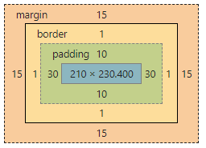
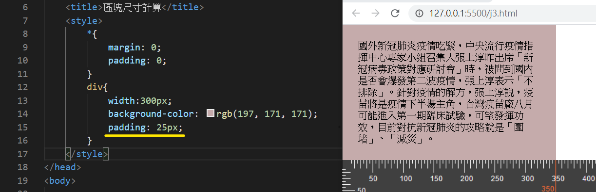
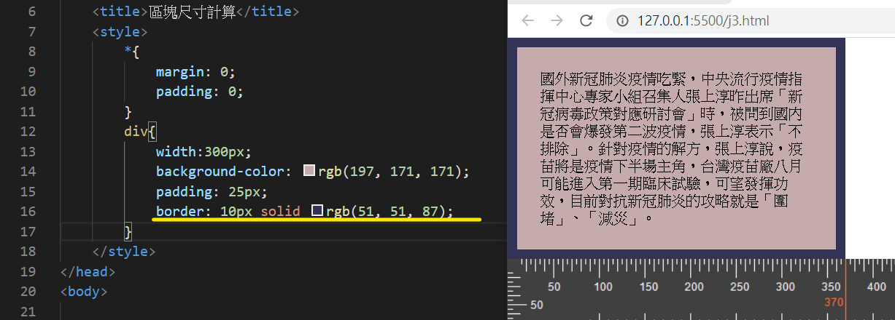
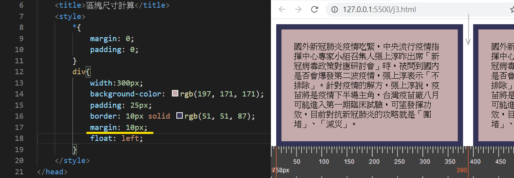
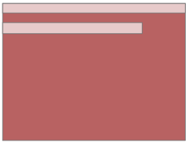
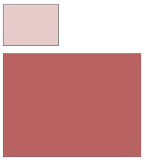
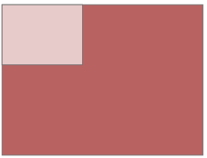
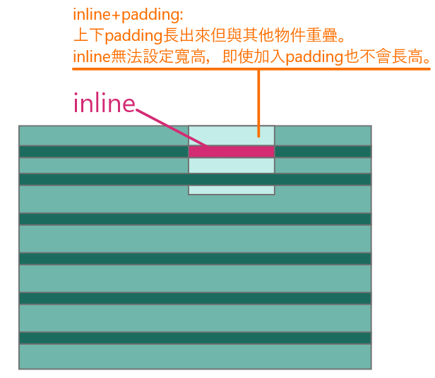

# 區塊尺寸計算
### block物件的寬度 = block物件 + `margin` + `padding` + `border`。

從 Google 點擊開發者工具，可以看到區塊尺寸計算方式：<br/>



:::note 
- [# block 與 inline、inline-block 的差異？](#補充block-與-inlineinline-block-的差異)
:::

---
## 盒模型

|類型|盒模型計算方式|`box-sizing` 支持|補充|
|--|--|--|--|
|`content-box`|內容物本身|Ｏ|--|
|`padding-box`|內容物本身 + `padding`|Ｏ|--|
|`border-box`|內容物本身 + `padding` + `border`|Ｏ|在計算 RWD 排版時常使用。|
|`margin-box`|內容物本身 + `padding` + `border` + `margin`|Ｘ|`margin` 為物件與物件之間的距離。|

#### 練習: 設定基礎物件 `content-box`
```css title="style.css" 
    div{
        width: 300px;
    }
```
```html title="index.html" 
    <body>
        <div>
            ...
        </div>
    </body>
```

### `padding-box`
#### 物件寬度計算 : 內容物本身 + `padding` = 300px + (25x2)px = 350px 


### `border-box`
#### 物件寬度計算 : 內容物本身 + `padding` + `border` = 300px + (25x2)px + (10x2)px = 370px


### `margin-box`
#### 物件寬度計算 : 內容物本身 + `padding` + `border` + `margin` = 300px + (25x2)px + (10x2)px + (10x2)px = 390px


---

## 補充：block 與 inline、inline-block 的差異？
<div markdown="block" class="table-wrapper">

|類型|圖示|特性|關鍵字|`margin`|`padding`|舉例|
|--|--|--|--|--|--|--|
|`inline`||- 跟大家排在一起<br/> - 不能設定寬度<br/> - 不能設定高度|水<br/>排排站|Ｏ|X(會重疊) |`span` `a` `img`|
|`block`||- 可以設定寬度<br/> - 可以設定高度|冰塊<br/>佔位哥|Ｏ|Ｏ|`h1~h6` `div` `p` `section` `ul` `li`|
|`inline-block`||- 跟大家排在一起<br/> - 可以設定寬度<br/> - 可以設定高度|冰沙|Ｏ|Ｏ|--|

</div>

#### `inline` 物件加入 `padding` 會有重疊:



---

## 參考資源
- https://www.youtube.com/watch?v=TtvQsVjt9t8&list=PLqivELodHt3iL9PgGHg0_EF86FwdiqCre&index=9
