# FlexBox 

```html title="index.html"
  <body>
    <div class="item">
      <p class="content">
        ...
      </p>
    </div>
    <div class="item">
      <p class="content">
        ...
      </p>
    </div>
    ...
  </body>
```

## flex特性
### 1. 預設不換行
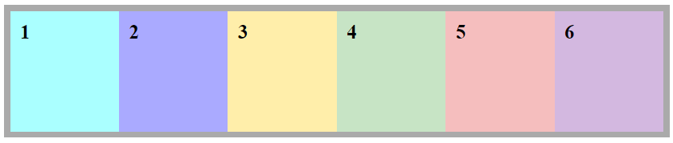
### 2. 要換行
- 父層CSS設定

```css title="style.css"
  .item{
    flex-wrap: wrap;
  }
```

- 換行依據父子層寬度設定

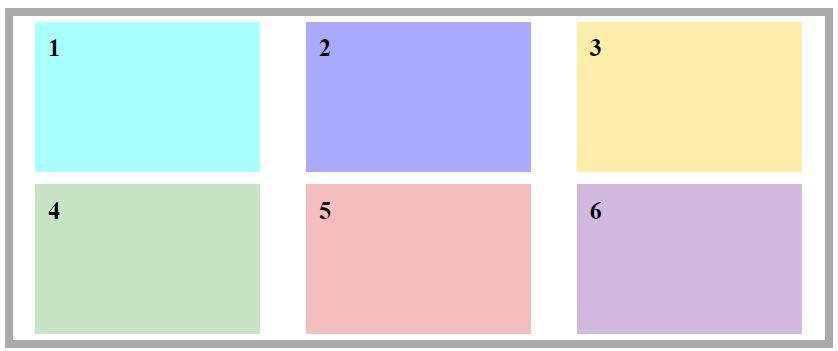

### 3. 子層物件不論內容物，統一等高。
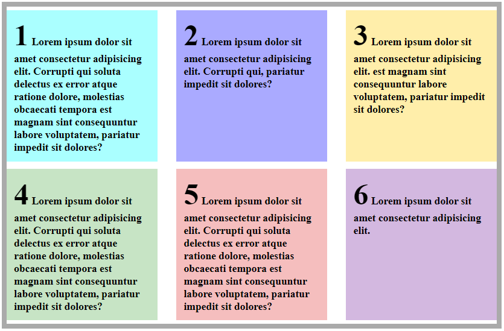

---
## 主軸、次軸
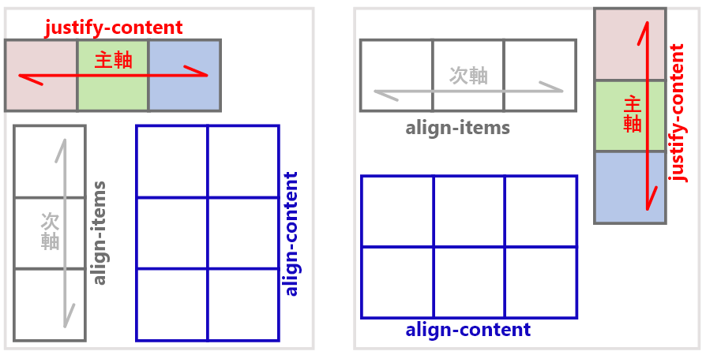

### 1. 確認主軸為row 或 column。
- 操作資料流對齊屬性 `justify-content`
### 2. 相對於主軸的交叉軸，即為次軸。
- 操作資料流對齊屬性(多行物件) `align-content`
- 操作資料流對齊屬性(單行物件) `align-items`

---
## 資料流方向
### 1. 父層CSS設定主軸方向

```css title="style.css"
  .item{
    flex-direction: row;    /* 水平方向: 預設方向由左至右。 */
    flex-direction: column; /* 垂直方向: 預設方向由上至下。 */
  }
```

### 2. 資料流反轉(對齊方向+物件順序)
- 父層CSS設定主軸方向與物件順序
- 預設對齊方向也改變

```css
  .item{
    flex-direction: row-reverse;    /* 水平方向: (預設)左 >> 右 (現在)右 >> 左 */
    justify-content: flex-start;     /* 水平方向: (預設)靠左 -- (現在)靠右 */
  }
```

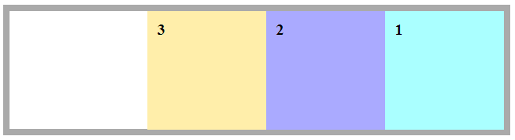

```css
  .item{
    flex-direction: column-reverse; /* 垂直方向: (預設)上 >> 下 (現在)下 >> 上 */
    justify-content: column-reverse; /* 垂直方向: (預設)靠上 -- (現在)靠下 */
  }
```

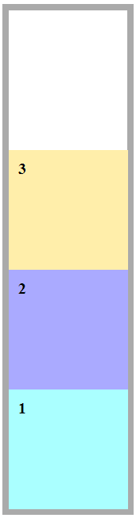

---
## 資料流向對齊(父層CSS設定)

|`justify-content: flex-start`|`justify-content: center`|`justify-content: flex-end`|
|--|--|--|
||||
|主軸流向靠左 - 預設值|主軸流向置中|主軸流向靠右|
||||
|主軸流向靠上 - 預設值|主軸流向置中|主軸流向靠下|

---
## 剩餘空間分配(父層CSS設定)

|當父層存在剩餘空間|`justify-content: space-around`|`justify-content: space-between`|
|--|--|--|
|--|層剩餘空間平均分配(=子層物件左右外距一致)|子層物件靠齊父層左右兩側後，剩餘空間平均分配|
|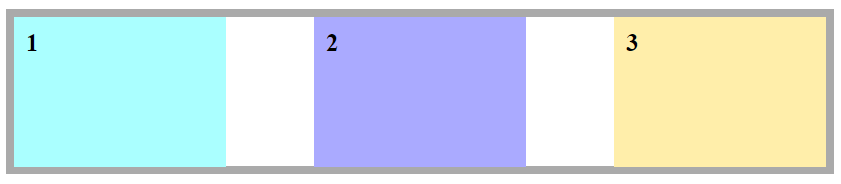|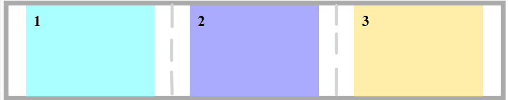||
|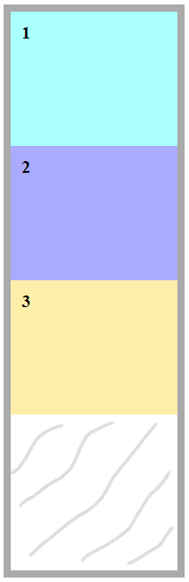|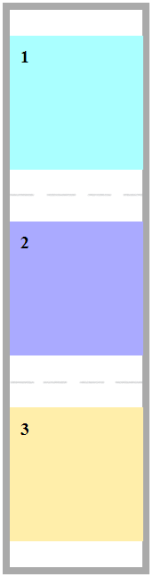|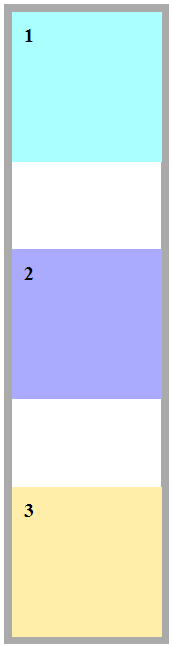|

---
## 主次軸對齊與變化
<div markdown="block" class="table-axis">

|主軸＋父層高度設定|主軸＋次軸多行 `align-content`|主軸＋次軸單行 `align-items`|
|--|--|--|
|在只有主軸的情況下，**父層若有設定高度**，子層會全部填滿為一致高度。|加入次軸對齊(多行)設定後，子層高度依對齊方向擠，並與內容物撐出統一高度。|因為`align-items`是針對單行物件|
|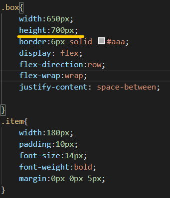|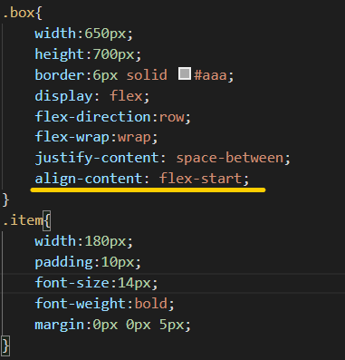|--|
|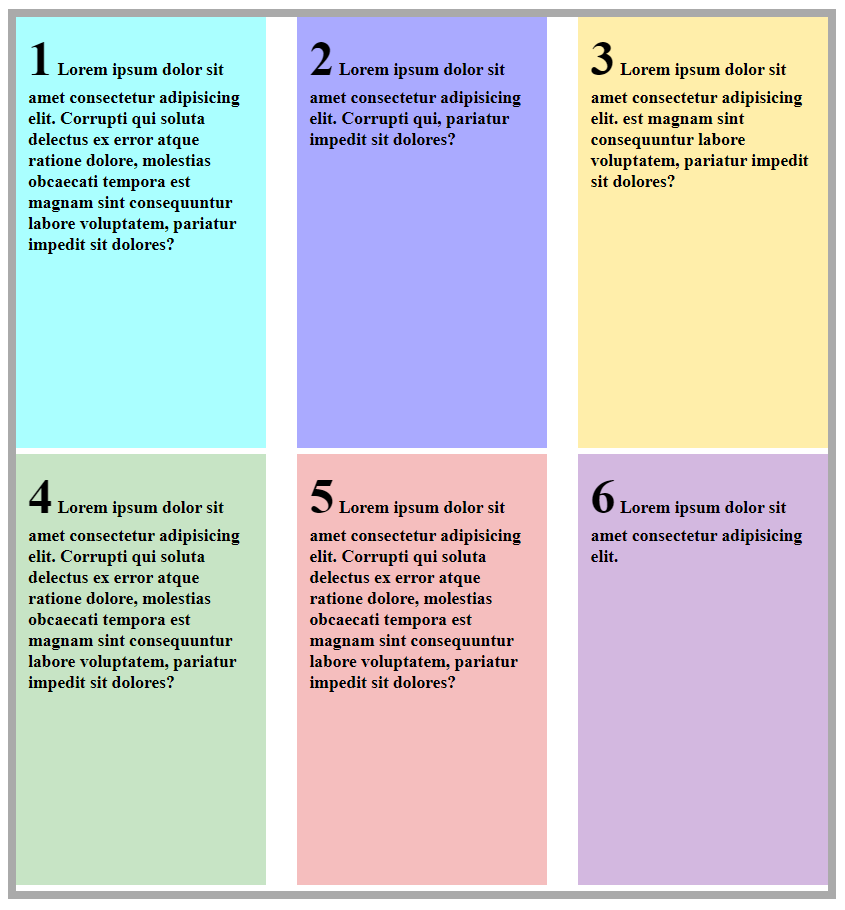|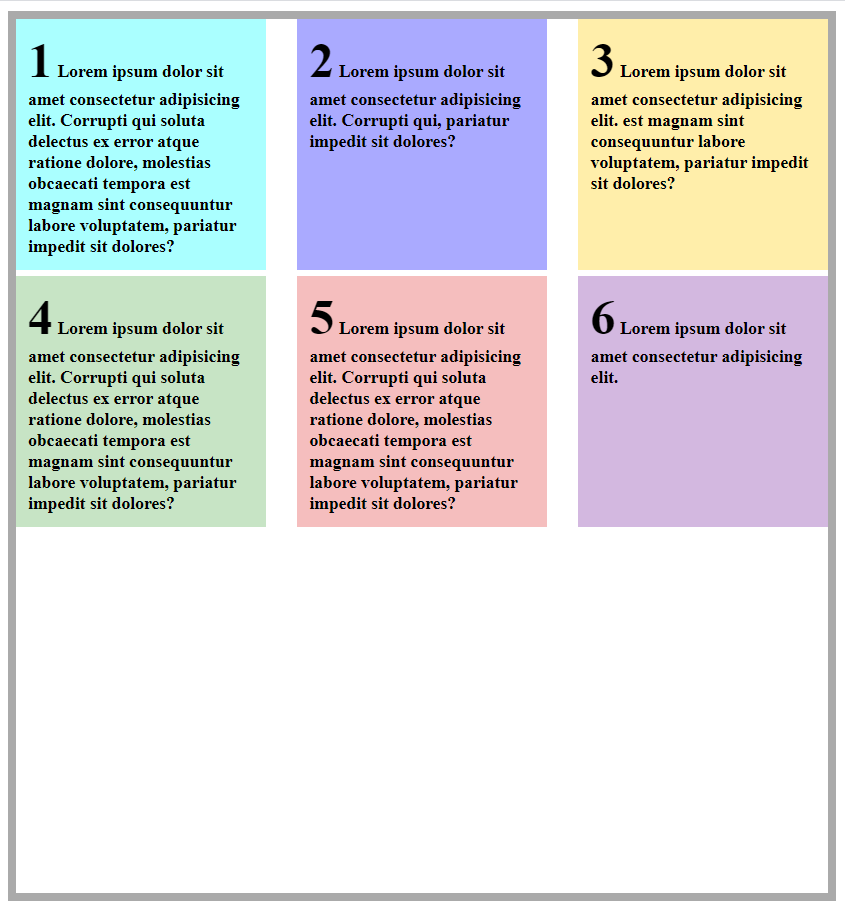|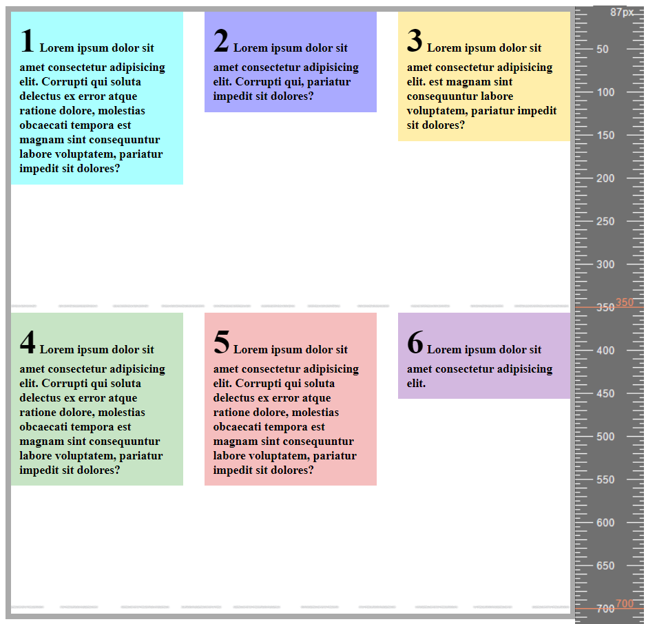|
|--|--|子層折兩行，依父層高度700/2=350px 為單行對齊高度位置，並以個別物件內容物撐出高度。<br/> 如果要統一高度可設: <br/> `align-items: stretch;`|
|--|多行次軸對齊<br/> - 靠上 `align-content: flex-start;`<br/> - 置中 `align-content: center;`<br/> - 靠下 `align-content: flex-end;`|單行次軸對齊<br/> - 靠上 `align-items: flex-start;`<br/> - 置中 `align-items: center;`<br/> - 靠下 `align-items: flex-end;`|

</div>

---
## 針對子層個別做變化

<div markdown="block" class="table-axis">

|`align-self`|`order`|`flex-grow`|
|--|--|--|
|- 在父層主次軸設定置中<br/> - 在指定子層物件位置設定次軸對齊方向|- 在指定子層物件設定想要的順序|- 在子層物件設定想要的(row)寬度比例;(column)高度比例|
|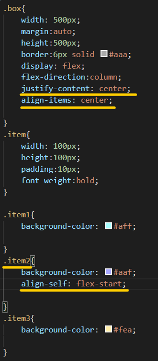|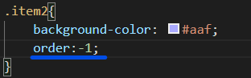|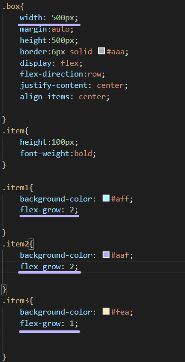|
||||
| - `align-self: flex-start;`<br/> - `align-self: center;`<br/> - `align-self: flex-end;`|`order: 數字`|`flex-grow: 數字`|

</div>

---

## 參考資源
-  https://www.youtube.com/watch?v=_nCBQ6AIzDU
