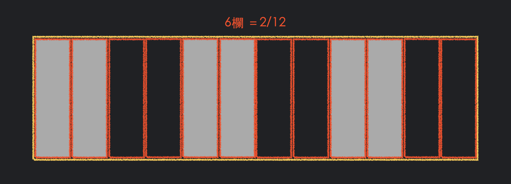

# 格線系統寫法
### 方法一
1. 定義好分欄容器寬度(RWD)，單位 `px`。
2. 定死內容寬度，單位 `px`。
3. 定死 `margin`，單位 `px`。
4. 透過分欄容器 設定 `display: flex;` `flex-wrap: wrap;` 來達到排版效果。
#### 缺點
- 分欄容器寬度 與 內容寬度 寫死，RWD 拖移效果比較硬(有斷點)。
- 內容寬度沒有隨裝置大小變化。

#### [ ✎ DEMO](https://codepen.io/chen-chens/pen/qBXOXxB)

---

### 方法二：`box-sizing: border-box;`
1. 定義好 分欄容器寬度 (RWD)，單位 `％`。
2. 分欄容器 : 使用 max-width: 1200px; 來達到1200px以下滿版，1200px含以上固定寬。
3. 資料容器依據 裝置尺寸顯示幾排，間距固定，`calc(50% - 20px)`。
4. 解決方法一的問題，間距固定，拖移視窗無縫式伸縮內容寬度。

#### [ ✎ DEMO](https://codepen.io/chen-chens/pen/JjyMWML)

---

### 方法三：`:root{ }`
1. 自定義變數，使用 `--變數名稱`
2. 取得變數 `var(--變數名稱)`
3. 將變數套入個定公式 `calc(100% - var(--columns) - var(--gap))`
4. 使用 `calc()` 計算，要計算到小數點後六位較精確。

#### [ ✎ DEMO](https://codepen.io/chen-chens/pen/xxLWQGM?editors=1100)

---

### 方法四：定義好 **分欄容器** 與 **資料容器**，分欄容器 定義好 `padding`。

1. 區塊容器：設好裝置大小 + flexBox。
2. 分欄容器：專門用來調節欄寬。`border-box` + 間隔 `padding` 創造固定間距的效果，搭配 寬度(百分比)。
3. 內容容器：專助於設定內容的部分。

#### [ ✎ DEMO](https://codepen.io/chen-chens/pen/KKvLROL)

---

### 方法五：將大部分常用的欄數分割出來。
- 常用欄數：１、２、３、４、６。
- 找出公因數 12，進行欄位分割。




#### 針對不同欄數需要的寬度，用 class 分出來。

```css title="style.css"
  /* 選取屬性為 class，名稱為有 'col-'字樣的選取器 */
  [class*= 'col-']{
    box-sizing: border-box;
    padding: 0 10px;
  }

  .col-1{ width: 8.333333%; }
  .col-2{ width: 16.666666%; }
  .col-3{ width: 25%; }
  .col-4{ width: 33.333333%; }
  .col-5{ width: 41.666666%; }
  .col-6{ width: 50%; }
  .col-7{ width: 58.333333%; }
  .col-8{ width: 66.666666%; }
  .col-9{ width: 75%; }
  .col-10{ width: 83.333333%; }
  .col-11{ width: 91.666666%; }
  .col-12{ width: 100%; }
```

#### [ ✎ DEMO](https://codepen.io/chen-chens/pen/yLodbyW)

#### 針對不同螢幕裝置，帶入不同的所屬 class，達到 RWD 的效果。

```css title="style.css"
  .col{ 
    width:100%; 
  }

  /* medium device */
  @media screen and (min-width: 768px){
    .col-md-1{ width: 8.333333%; }
    .col-md-2{ width: 16.666666%; }
    .col-md-3{ width: 25%; }
    .col-md-4{ width: 33.333333%; }
    .col-md-5{ width: 41.666666%; }
    .col-md-6{ width: 50%; }
    .col-md-7{ width: 58.333333%; }
    .col-md-8{ width: 66.666666%; }
    .col-md-9{ width: 75%; }
    .col-md-10{ width: 83.333333%; }
    .col-md-11{ width: 91.666666%; }
    .col-md-12{ width: 100%; }
  }

  /* large device */
  @media screen and (min-width: 1024px){
    .col-lg-1{ width: 8.333333%; }
    .col-lg-2{ width: 16.666666%; }
    .col-lg-3{ width: 25%; }
    .col-lg-4{ width: 33.333333%; }
    .col-lg-5{ width: 41.666666%; }
    .col-lg-6{ width: 50%; }
    .col-lg-7{ width: 58.333333%; }
    .col-lg-8{ width: 66.666666%; }
    .col-lg-9{ width: 75%; }
    .col-lg-10{ width: 83.333333%; }
    .col-lg-11{ width: 91.666666%; }
    .col-lg-12{ width: 100%; }
  }

  /* X-large device */
  @media screen and (min-width: 1200px){
    .col-xl-1{ width: 8.333333%; }
    .col-xl-2{ width: 16.666666%; }
    .col-xl-3{ width: 25%; }
    .col-xl-4{ width: 33.333333%; }
    .col-xl-5{ width: 41.666666%; }
    .col-xl-6{ width: 50%; }
    .col-xl-7{ width: 58.333333%; }
    .col-xl-8{ width: 66.666666%; }
    .col-xl-9{ width: 75%; }
    .col-xl-10{ width: 83.333333%; }
    .col-xl-11{ width: 91.666666%; }
    .col-xl-12{ width: 100%; }
  }
```

#### [ ✎ DEMO](https://codepen.io/chen-chens/pen/ExvqYvK)

---

### 方法六：巢狀隔線
方法五有個缺點，有些排版效果如下：

- **解決方法：**

- **新增不同功能的 class 名稱**


#### [ ✎ DEMO](https://codepen.io/chen-chens/pen/gOxVObq)

- **發現一個問題：巢狀隔線為了多分四欄，再加一 `row` 做分欄。**


- **因為 .col padding關係，巢狀多一 層.col 導致版面左右不平衡。**


- **解決辦法：**
1. `.rol` 設定 margin 負值 去 抵銷 `.col` 的 padding
2. `.container` 設定 padding 去抵銷 `.rol` 的 margin


#### [ ✎ DEMO](https://codepen.io/chen-chens/pen/ExwNjgY)

---

### 方法七：適用內容物皆等寬的情況。
#### 透過以下ＣＳＳ方式，不管加入多少 子物件，永遠等寬。

- 優點：在等寬的條件下，寫法更簡潔直覺。
- 缺點：目前無法換行。

#### [ ✎ DEMO](https://codepen.io/chen-chens/pen/abLJMyv)

---
