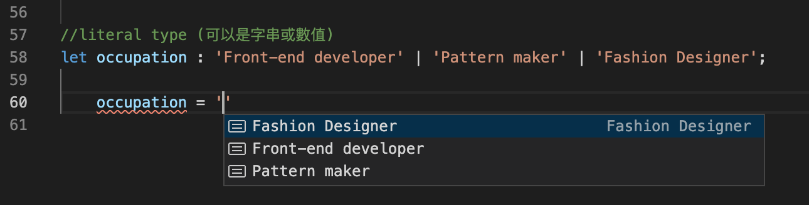
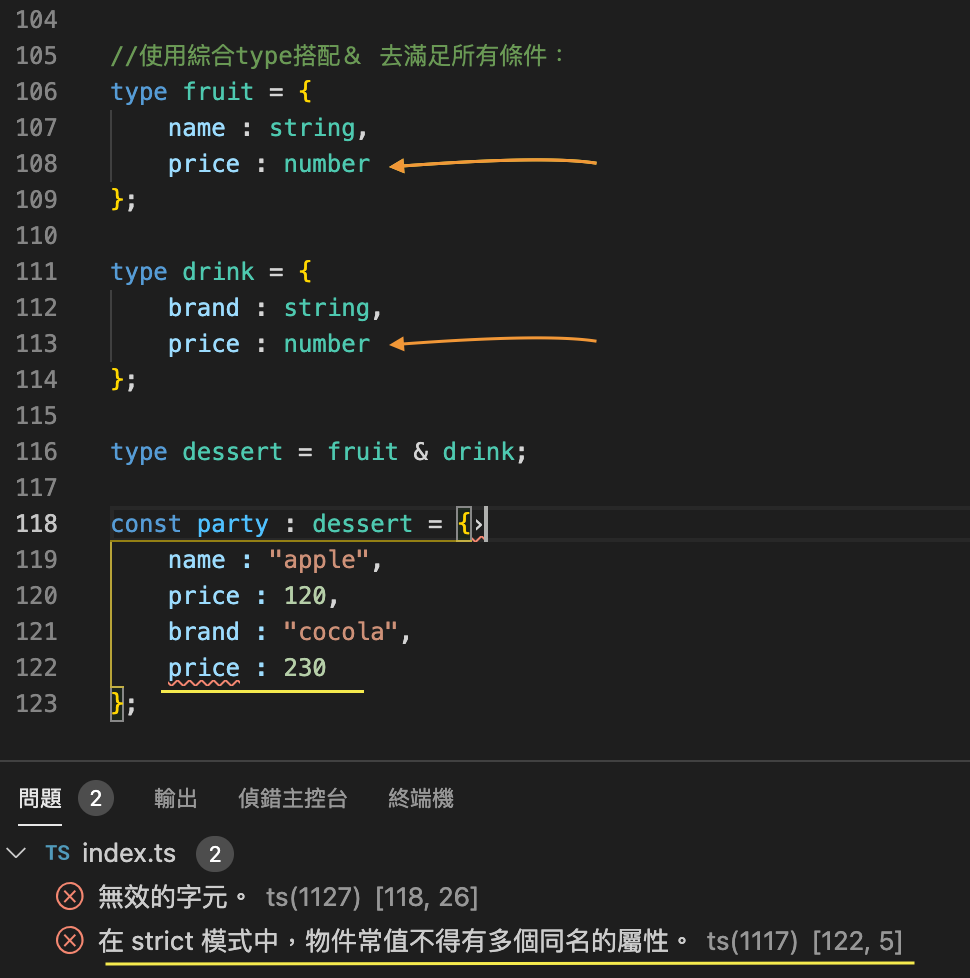
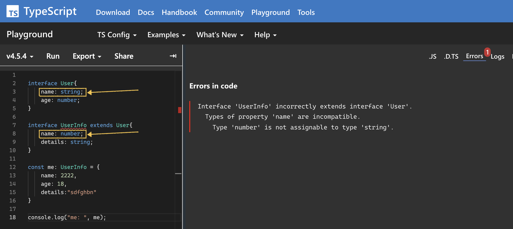

# React 中常用到的 TypeScript 的基本語法
:::info
> 在 TypeScript 中，開發者可以「主動」對變數定義型別，但若不去主動定義型別的話，TS 則會幫你「自動」推論這個變數的型別。
> 

> 不論有沒有主動定義變數型別，每個變數都將有其明確的型別，當程式執行中，型別有錯誤時就會提出警告。
>
:::

---
### 型別定義 與 附值
```tsx
  //定義型別 與 附值寫法 --  
  let check: string;
  check = 'Joanna';
  
  //定義型別 加 附值寫法 --  
  let num: number = 123;
```

### 物件型別定義
```tsx
  //物件寫法
  const object : {name: string, age: number} = {
    name : 'Joanna',
    age : 28
  };

  //物件寫法 -- 選填代號 ?:
  const object:{ name : string, age : number, occupation ?: string } = {
      name: 'Joanna',
      age: 28,
  }

  interface ObjType {
      name: string, 
      age: number
    }

  const obj:ObjType= {
    name: 'Joanna',
    age: 28
  }
```

### 陣列型別定義
    
```tsx
//陣列寫法 (所有元素皆為同種型別)
    //寫法一
    const arry: number[] = [2, 6, 4, 7];
    //寫法二 泛型 generic
    const stringArry: Array<string> = ['David', 'Tommy', 'Kenny', 'Query'];

//陣列寫法 (元素為不同型別)
    //寫法一
    const list : (string | number)[] = ['David', 'Tommy',22, 44];
    //寫法二 泛型 generic
    const memo : Array<string | number> = ['David', 'Tommy',22, 44];
```

### 函式型別定義
    
```tsx
//函式寫法
    //寫法一 (定義回傳值型別)
    const add = (num1: number, num2: number) : number => {
        return num1 + num2;
    }
    console.log(add(4,6));

    //寫法二 (無回傳值 void)
    const substract = (num1: number) : void => {
          console.log(num1);
    }

    //寫法三 (函式會中斷，不會全部執行 never)
    const stopIt = (text: string): never => {
        throw new Error('This is never');
    }

    //寫法四 (物件解構寫法)
    const obj = ({text, index} : {text: string, index: number}): string => {
        return `${index} is ${text}.`
    }

    //寫法五 (interface ＋ 物件解構寫法)
    interface BasicType {
      text: string;
      index: number;
    }
    const obj = ({text, index} : BasicType): string => {
        return `${index} is ${text}.`
    }
```

---

### 使用 interface 集中管理參數型別寫法 :

```jsx

//Object Types
interface ContentType {
  description: string,
  price: number,
}

const content = (params: ContentType): string => `${params.description} ${params.price}`;

content({description:'Iphone is', price: 100})

/*
  (params: ContentType) 等同 
  (params: { description: string, price: number })
*/
```
---

### literal type
  - 可以直接在型別內給值，變數值便會限定在該條件內。
  - 通常會搭配 `｜` 使用

```tsx
//literal type (可以是字串或數值)
let occupation : 'Front-end developer' | 123 | 'Fashion Designer';

    occupation = 123
```


### Type Alias（型別化名）
- 用途：抽出公用的型別定義，存入變數，方便重複使用。

<details>
  <summary><strong>寫法一</strong></summary>

```tsx
    //將共用型別定義抽出，重複使用，方便管理
    type BookAlias = {
        name : string,
        price : number
    };
    
    const book1 : BookAlias = {
        name : 'Harry Poter',
        price : 350
    };
    
    const book2 : BookAlias = {
        name : 'Lion',
        price : 400
    };
```

</details>

<details>
  <summary><strong>寫法二 （ 使用 union <code>|</code> ）</strong></summary>

```tsx
    //使用綜合type搭配｜ 去滿足整體條件：
    
    type BookType = {
        author: string,
        price : number
    };
    
    type DeviceType = {
        name : string,
        release : number
    };
    
    type Product = BookType | DeviceType;
    
    const buss : Product = {
        author : 'J.K Rowing',
        price : 350
    };
```

</details>

<details>
  <summary><strong>寫法三 （ 使用 intersection <code>&</code>)</strong></summary>

```tsx
  // 使用綜合type搭配＆ 去滿足所有條件：
    
  type Fruit = {
      name : string,
      price : number
  };
  
  type Drink = {
      brand : string,
      alcohol : boolean
  };
  
  type Dessert = Fruit & Drink;
  
  const party : Dessert = {
      name : "apple",
      price : 120,
      brand : "cocola",
      alcohol : false
  };
```

:::warning 特別留意，使用＆滿足條件時，屬性名稱不可重複。

:::

</details>

---

### interface (使用介面)
- 用途：大多適用於 1+1+使用者自訂額外條件.

<details>
  <summary><strong>寫法一</strong></summary>

```tsx
  //可以達到與type alias 一樣的效果。

  interface BookInterface {
      name: string,
      price: number
  };

  const book4 : BookInterface = {
      name : 'book name',
      price: 100,
  }
```

</details>

<details>
  <summary><strong>寫法二</strong></summary>

```tsx
  // 1+1+使用者自訂額外條件

  interface BookInterface {
      name: string,
      price: number
  };

  interface BookProducer {
      brand: string,
      release: number
  };

  interface BookDetail extends BookInterface, BookProducer{
      totalPage: number,
      sign: boolean
  }

  const book3 : BookDetail = {
      name : 'book name',
      price: 100,
      brand: 'public',
      release: 2010,
      totalPage: 330,
      sign: true
  }
```
:::warning 特別留意：`interface` 不能覆蓋 `extends` 原有的的型別設定。 

:::

</details>  

---
## 參考資源
- [[掘竅] 了解這些，更快掌握 TypeScript 在 React 中的使用（Using TypeScript in React）](https://pjchender.blogspot.com/2020/07/typescript-react-using-typescript-in.html)

